# 自动安装app

此处整理用wda通过AppStore自动安装iOS的app的完整过程。

-》iPhone中用AppStore自动安装iOS的app的全过程

详见：

【已解决】iOS自动抓包app：iPhone中通过AppStore自动安装iOS的app

> #### info:: 公共函数
>
> 下面函数中用到的公共函数，比如：
> 
> * `get_cmd_lines`
> * `multipleRetry`
> * `findElement`
> * `findAndClickElement`
> 
> 详见其他部分：
> 
> * [常用代码段](https://book.crifan.com/books/ios_automation_facebook_wda/website/common_code)
> * [元素处理](https://book.crifan.com/books/ios_automation_facebook_wda/website/common_code/element_process.html#findandclickbuttonelementbysoup)

## 过程

对应着的界面分别是：

启动AppStore后的，本身默认进入了Search的tab页：

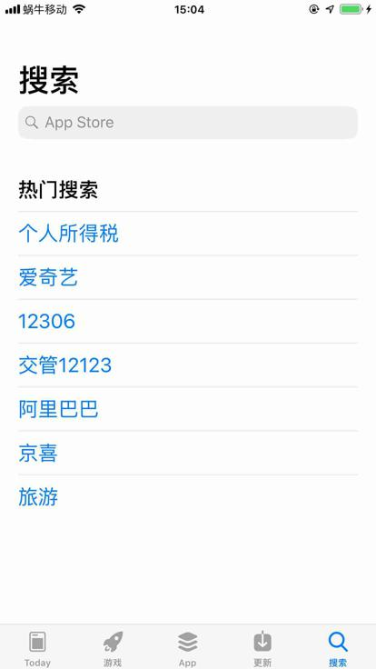

当然，代码中防止不是默认搜索Tab，也用代码去切换到此tab页了。

然后再去点击搜索框，输入要搜索的app名字：

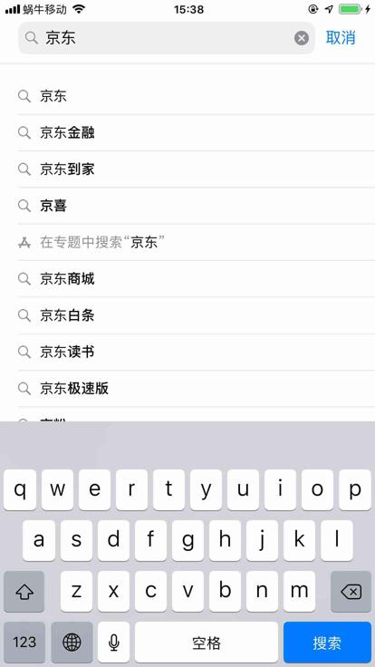

点击搜索后，进入搜索结果列表页：


然后找到列表页中第一个匹配的后，点击进入 app下载详情页：

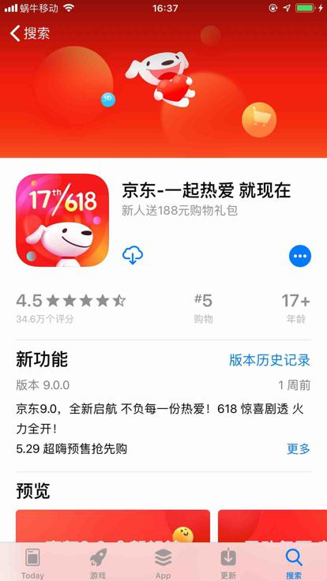

注意：

此处的图标是 云朵☁️中间有个🔽向下的箭头 表示 **重新下载**

意味着你的apple账号所登录过的iPhone中之前别处已经下载过该app了

如果是全新的没有下载过的app，则前面按钮显示的是**获取**

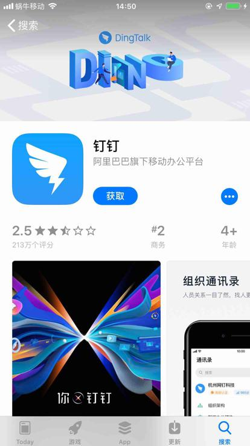

另外：

如果是付费的app，则显示的是金额：

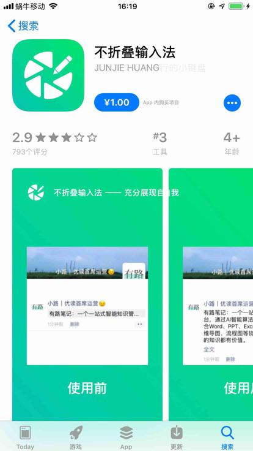

对此：代码中，检测到是付费后，提示 不支持。

除非真的打算付费，否则点击后，弹框购买：

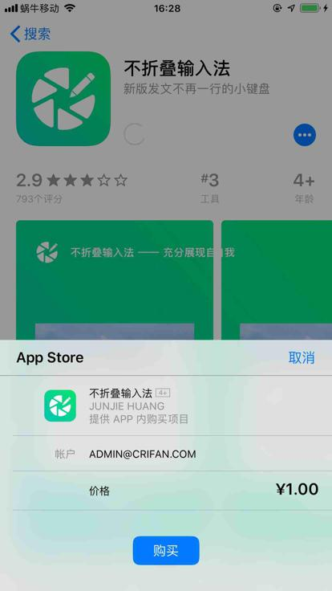

点击购买后，会真的扣费的。

点击下载按钮后：

情况1：对于 （之前已下载过的app）重新下载，则无弹框

往往会出现加载中：

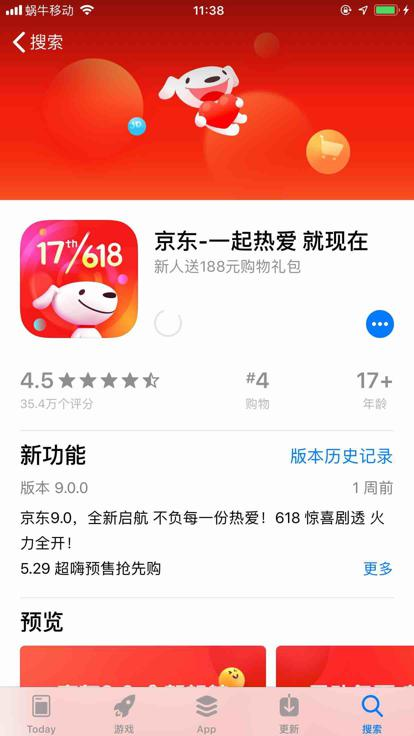

情况2：对于 （全新app）获取，会弹框 安装

（借用别的app的弹框 展示）

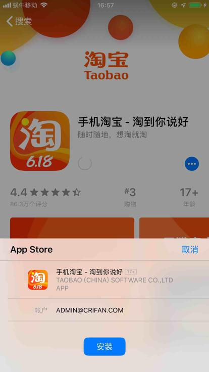

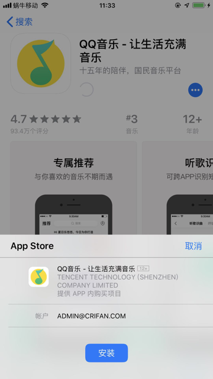

点击安装，弹框会提示 完成：

（其他app的截图）

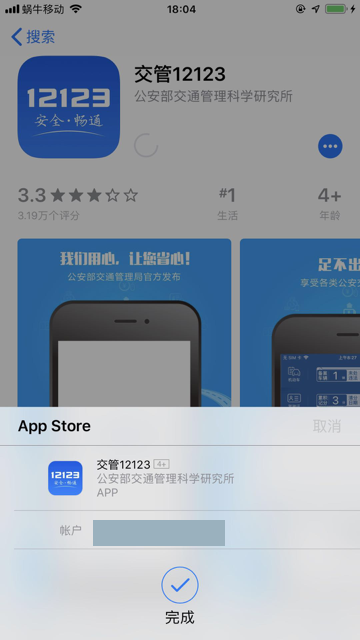

之后就是下载过程了：

正在下载 其中圆圈⭕️会有个蓝色进度条：


解释：

此处通过调试log日志：

```bash
[200608 14:22:43][DevicesMethods.py 1645] start get iOS page source
[200608 14:22:44][DevicesMethods.py 1658] Cost 1.57 seconds to get iOS page source
[200608 14:22:45][DevicesMethods.py 2238] Downloading 京东 progress: 0%
[200608 14:22:45][DevicesMethods.py 1645] start get iOS page source
[200608 14:22:45][DevicesMethods.py 1658] Cost 0.73 seconds to get iOS page source
[200608 14:22:45][DevicesMethods.py 2238] Downloading 京东 progress: 1%
[200608 14:22:45][DevicesMethods.py 1645] start get iOS page source
[200608 14:22:46][DevicesMethods.py 1658] Cost 0.74 seconds to get iOS page source
[200608 14:22:46][DevicesMethods.py 2238] Downloading 京东 progress: 4%
[200608 14:22:46][DevicesMethods.py 1645] start get iOS page source
[200608 14:22:47][DevicesMethods.py 1658] Cost 0.85 seconds to get iOS page source
[200608 14:22:47][DevicesMethods.py 2238] Downloading 京东 progress: 7%
[200608 14:22:47][DevicesMethods.py 1645] start get iOS page source
[200608 14:22:48][DevicesMethods.py 1658] Cost 0.80 seconds to get iOS page source
[200608 14:22:48][DevicesMethods.py 2238] Downloading 京东 progress: 9%
[200608 14:22:48][DevicesMethods.py 1645] start get iOS page source
[200608 14:22:48][DevicesMethods.py 1658] Cost 0.76 seconds to get iOS page source
[200608 14:22:48][DevicesMethods.py 2238] Downloading 京东 progress: 10%
[200608 14:22:48][DevicesMethods.py 1645] start get iOS page source
[200608 14:22:49][DevicesMethods.py 1658] Cost 0.78 seconds to get iOS page source
[200608 14:22:49][DevicesMethods.py 2238] Downloading 京东 progress: 14%
。。。
[200608 14:23:08][DevicesMethods.py 2238] Downloading 京东 progress: 60%
[200608 14:23:08][DevicesMethods.py 1645] start get iOS page source
[200608 14:23:09][DevicesMethods.py 1658] Cost 0.70 seconds to get iOS page source
[200608 14:23:09][DevicesMethods.py 2238] Downloading 京东 progress: 76%
```

多次调试发现：

在下载的进度超过76%之后，感觉内部就进入了 自动安装 过程

等安装完毕后，进度立刻就是100%，按钮变成 后续的 打开，表示安装完成了

-》即，推断是整体进度：

* 0~76%：下载进度
* 76%之后：安装进度
    * 但是不会显示，会从76%直接跳到 打开
        * 表示安装完毕

最终安装完成后，显示`打开`：

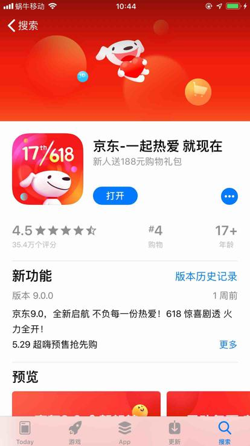

如果点击打开，即可启动app。

最后附上，部分测试后的iOS的app安装后桌面图标：

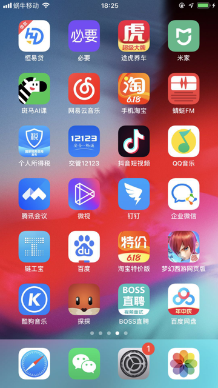

详见：

【已解决】iOS自动化：通过AppStore自动下载和安装iOS的app京东

## 代码

### install_app_iOS 安装iOS的app

文件：`src/common/DevicesMethods.py`

```python
def install_app_iOS(self, item, packages=None):
    """install iOS app
        if install ok, update bundleId for input item
        not install if found already installed
    """
    isInstallOk = False
    appInfo = None

    # {'account': 'bb62512466_米家', 'bundleId': 'com.xiaomi.mihome', 'name': '米家', 'version': '4.30.2.0'}
    appName = item["name"]

    # for debug
    # appName = "京东"
    # appName = "斑马AI课"

    # check if already installed
    appInfo = self.getInstalledAppInfo(appName=appName)
    if appInfo:
        isInstallOk = True
        logging.warning("Not install %s for already installed %s", appName, appInfo)
    else:
        # auto install app from AppStore
        isInstallOk, respInfo = self.iOSinstallAppFromAppStore(appName)
        logging.debug("appName=%s -> isInstallOk=%s, respInfo=%s", appName, isInstallOk, appInfo)
        # {'bundleId': 'com.fenbi.ape.zebstrika', 'name': '斑马AI课', 'version': '221'}
        if isInstallOk:
            appInfo = respInfo
        else:
            errMsg = respInfo
            logging.error("Fail to auto install iOS app %s, reason: %s", appName, errMsg)

    if appInfo:
        # update bundle id
        installedBundleId = appInfo["bundleId"] # 'com.360buy.jdmobile', 'com.fenbi.ape.zebstrika'
        item["bundleId"] = installedBundleId
    return isInstallOk
```

### iOSinstallAppFromAppStore 从AppStore中自动安装iOS的app

```python
def iOSinstallAppFromAppStore(self, appName):
    """Install iOS app from AppStore

    Args:
        appName (str): app name
    Returns:
        bool, dict/str
            bool: installed ok or not
                if true:
                    dict: installed app info
                if false:
                    str: fail reason error message
    Raises:
    """
    isInstallOk = False
    respInfo = None

    iOS_AppId_AppStore = "com.apple.AppStore"
    appStoreSession = self.wdaClient.session(iOS_AppId_AppStore)
    logging.debug("appStoreSession=%s" % appStoreSession)

    isSwitchOk = CommonUtils.multipleRetry(
        {"functionCallback": self.switchToAppStoreSearchTab},
        maxRetryNum = 10,
        sleepInterval = 0.5,
    )
    if not isSwitchOk:
        respInfo = "Fail to switch to Search tab of AppStore"
        return isInstallOk, respInfo

    """
        <XCUIElementTypeOther type="XCUIElementTypeOther" enabled="true" visible="true" x="0" y="116" width="414" height="52">
            <XCUIElementTypeSearchField type="XCUIElementTypeSearchField" name="App Store" label="App Store" enabled="true" visible="true" x="20" y="117" width="374" height="36"/>
        </XCUIElementTypeOther>
    """
    searchInputQuery = {"type":"XCUIElementTypeSearchField", "name":"App Store"}
    isInputOk = CommonUtils.multipleRetry(
        {
            "functionCallback": self.wait_element_setText,
            "functionParaDict": {
                "locator": searchInputQuery,
                "text": appName,
            }
        }
    )
    if not isInputOk:
        respInfo = "Fail to input app name %s into search field" % appName
        return isInstallOk, respInfo

    isSearchOk = self.search_iOS(wait=0.2)
    if not isSearchOk:
        respInfo = "Fail to find and click Search button to trigger search for %s" % appName
        return isInstallOk, respInfo

    # Special: try add some wait time to avoid some special case:
    # for 个人所得税 search result page, found and click 个人所得税, but sometime actually not into detail page
    time.sleep(0.5)
    isIntoDetailOk = CommonUtils.multipleRetry(
        {
            "functionCallback": self.appStoreSearchResultIntoDetail,
            "functionParaDict": {
                "appName": appName,
            }
        },
        maxRetryNum = 10,
        sleepInterval = 0.5,
    )
    if not isIntoDetailOk:
        respInfo = "Fail to into app detail page for %s" % appName
        return isInstallOk, respInfo
    # Special: try add some wait time to avoid some special case:
    # for 个人所得税 search result page, found and click 个人所得税, but sometime actually not into detail page
    time.sleep(0.2)

    detectRoundNum = 0
    while True:
        detectRoundNum += 1
        logging.info("%s try auto install, round [%d] %s", "-"*20, detectRoundNum, "-"*20)

        # foundOpen = False
        # isDownloading = False
        # isLoading = False
        # foundAndClickedPopupInstall = False
        # foundAndClickedDownload = False

        # isDownloading, curProgress = self.appStoreDownloadingProgress()
        # logging.info("isDownloading=%s, curProgress=%s", isDownloading, curProgress)
        isDownloading = self.appStoreDownloading()
        logging.info("isDownloading=%s", isDownloading)
        if isDownloading:
            # downloadingWaitTime = 0.5
            downloadingWaitTime = 1.0
            time.sleep(downloadingWaitTime)
            logging.info("Is downloading, wait %s seconds", downloadingWaitTime)
            continue

        foundOpen = self.appStoreCheckOpen()
        logging.info("foundOpen=%s", foundOpen)
        if foundOpen:
            logging.info("Found 打开 -> means %s is installed", appName)
            break

        isLoading = self.appStoreLoading()
        logging.info("isLoading=%s", isLoading)
        if isLoading:
            # loadingWaitTime = 0.2
            loadingWaitTime = 0.5
            time.sleep(loadingWaitTime)
            logging.info("Is loading, wait %s seconds", loadingWaitTime)
            continue

        foundAndClickedDownload, downloadButtonName = self.appStoreStartDownload(isShowErrWhenNotFound=False)
        logging.info("foundAndClickedDownload=%s, downloadButtonName=%s", foundAndClickedDownload, downloadButtonName)
        if foundAndClickedDownload:
            logging.info("Found and clicked button %s to start download", downloadButtonName)
        else:
            foundMoneyButton, moneyButtonName = self.appStoreBuyAppMoneyButton()
            if foundMoneyButton:
                respInfo = "Not support auto install %s for need pay money %s" % (appName, moneyButtonName)
                return isInstallOk, respInfo

        foundAndClickedPopupInstall = self.appStoreClickPopupInstall()
        logging.info("foundAndClickedPopupInstall=%s", foundAndClickedPopupInstall)
        if foundAndClickedPopupInstall:
            popupInstallWaitTime = 0.2
            time.sleep(popupInstallWaitTime)
            logging.info("After click 安装 of popup, wait %s seconds", popupInstallWaitTime)

    logging.info("Install complete for %s", appName)
    installedAppInfo = self.getInstalledAppInfo(appName=appName)
    logging.info("installedAppInfo=%s", installedAppInfo)
    if not installedAppInfo:
        respInfo = "Fail to extract installed app info for %s" % appName
        return isInstallOk, respInfo

    isInstallOk = True
    respInfo = installedAppInfo
    logging.info("isInstallOk=%s, respInfo=%s", isInstallOk, respInfo)
    return isInstallOk, respInfo
```

其他相关函数：

### getInstalledAppInfo 获取已安装的app的信息

```python
def getInstalledAppInfo(self, appName=None, appBundleId=None):
    """find app info from app name or app bundle id

    Args:
        appName (str): iOS app name
        appBundleId (str): iOS app bundle id
    Returns:
        dict: 
            app info
                eg: {'bundleId': 'com.360buy.jdmobile', 'name': '京东', 'version': '9.0.0'}
            None if not found
    Raises:
    """
    appInfo = None
    installedAppList = self.get_iOS_installedAppList()
    for eachAppInfo in installedAppList:
        eachAppName = eachAppInfo["name"]
        eachAppBundleId = eachAppInfo["bundleId"]
        if appName:
            if eachAppName == appName:
                appInfo = eachAppInfo
                break

        if appBundleId:
            if eachAppBundleId == appBundleId:
                appInfo = eachAppInfo
                break

    return appInfo
```

### get_iOS_installedAppList 获取已安装app的列表信息

```python
def get_iOS_installedAppList(self):
    installedAppList = []
    listAppCmd = 'ideviceinstaller -l'
    appListStr = CommonUtils.get_cmd_lines(listAppCmd, text=True)
    logging.debug("appListStr=%s", appListStr)
    if appListStr:
        appRawList = appListStr.split("\n")
        """
            Total: 9 apps
            com.dianping.dpscope - 大众点评 10.27.10.21
            com.tencent.xin - 微信 7.0.12.33
            com.tencent.tiantianptu - 天天P图 603040
            com.didapinche.taxi - 嘀嗒出行 3
            com.luojilab.LuoJiFM-IOS - 得到 7.10.361
            com.suiyi.foodshop1 - 食行生鲜 49267
            com.alipay.iphoneclient - 支付宝 10.1.90.8000
            com.crifan.WebDriverAgentRunner.xctrunner - WebDriverAgentRunner-Runner 1
            com.xiaojukeji.didi - 滴滴出行 5.4.10.904142127
        """
        for eachAppStr in appRawList:
            eachAppStr = eachAppStr.strip()
            # foundApp = re.search("(?P<bundleId>com\.\S+)\s+-\s+(?P<name>\S+)\s+(?P<version>[\d\.]+)", eachAppStr)
            # rn.notes.best - 爱思极速版 11122019
            # foundApp = re.search("(?P<bundleId>[\w\.]+)\s+-\s+(?P<name>\S+)\s+(?P<version>[\d\.]+)", eachAppStr)
            # 'com.kingsoft.www.office.wpsoffice - WPS Office 10.11.076659'
            foundApp = re.search("(?P<bundleId>[\w\.]+)\s+-\s+(?P<name>[\S ]+)\s+(?P<version>[\d\.]+)", eachAppStr)
            if foundApp:
                bundleId = foundApp.group("bundleId") # 'com.dianping.dpscope'
                name = foundApp.group("name") # '大众点评'
                version = foundApp.group("version") # '10.27.10.21'
                curAppInfo = {
                    "bundleId": bundleId,
                    "name": name,
                    "version": version,
                }
                installedAppList.append(curAppInfo)
            else:
                # Total: 9 apps
                if eachAppStr and (not eachAppStr.startswith("Total:")):
                    logging.error("not match installed app item: %s", eachAppStr)
    logging.debug("installedAppList=%s", installedAppList)
    return installedAppList
```

### switchToAppStoreSearchTab 切换到AppStore的Search的tab页

```python
def switchToAppStoreSearchTab(self):
    """try find and click to switch to AppStore search tab"""
    isSwitchOk = False
    """
        AppStore 底部tab：
            <XCUIElementTypeTabBar type="XCUIElementTypeTabBar" enabled="true" visible="true" x="0" y="687" width="414" height="49">
                <XCUIElementTypeButton type="XCUIElementTypeButton" name="Today" label="Today" enabled="true" visible="true" x="2" y="688" width="80" height="48"/>
                <XCUIElementTypeButton type="XCUIElementTypeButton" name="游戏" label="游戏" enabled="true" visible="true" x="85" y="688" width="80" height="48"/>
                <XCUIElementTypeButton type="XCUIElementTypeButton" name="App" label="App" enabled="true" visible="true" x="168" y="688" width="78" height="48"/>
                <XCUIElementTypeButton type="XCUIElementTypeButton" name="更新" label="更新" enabled="true" visible="true" x="249" y="688" width="80" height="48"/>
                <XCUIElementTypeButton type="XCUIElementTypeButton" value="1" name="搜索" label="搜索" enabled="true" visible="true" x="332" y="688" width="80" height="48"/>
            </XCUIElementTypeTabBar>
    """
    parentTabBarClassChain = "/XCUIElementTypeTabBar[`rect.x = 0 AND rect.width = %d`]" % self.X
    searchButtonQuery = {"type":"XCUIElementTypeButton", "name": "搜索", "label": "搜索", "enabled": "true"}
    searchButtonQuery["parent_class_chains"] = [ parentTabBarClassChain ]
    foundAndClicked = self.findAndClickElement(query=searchButtonQuery, timeout=0.2)
    isSwitchOk = foundAndClicked
    return isSwitchOk
```

### wait_element_setText_iOS 给元素输入值并等待一段时间

```python
def wait_element_setText_iOS(self, query, text):
    isInputOk = False
    isFound, respInfo = self.findElement(query=query)
    logging.debug("isFound=%s, respInfo=%s", isFound, respInfo)
    if isFound:
        searchAccountElement = respInfo
        searchAccountElement.set_text(text)
        logging.info("has input text: %s", text)
        isInputOk = True
    return isInputOk
```

## search_iOS iOS中点击弹出键盘中的Search触发搜索

```python
def search_iOS(self, wait=1):
    # 触发点击搜索按钮
    foundAndClickedDoSearch = False
    # <XCUIElementTypeButton type="XCUIElementTypeButton" name="Search" label="Search" enabled="true" visible="true" x="281" y="620" width="94" height="47"/>
    # <XCUIElementTypeButton type="XCUIElementTypeButton" name="Search" label="搜索" enabled="true" visible="true" x="309" y="685" width="103" height="50"/>
    # searchButtonQuery = {"name": "Search"}
    searchButtonQuery = {"name": "Search", "type": "XCUIElementTypeButton"}
    # Note: occasionally not found Search, change to find multiple time to avoid this kind of case
    MaxRetryNumber = 5
    curRetryNumber = MaxRetryNumber
    while curRetryNumber > 0:
        foundAndClickedDoSearch = self.findAndClickElement(searchButtonQuery, timeout=wait)
        if foundAndClickedDoSearch:
            break
    
        curRetryNumber -= 1

    if not foundAndClickedDoSearch:
        logging.error("Not found and/or clicked for %s", searchButtonQuery)
    return foundAndClickedDoSearch
```

## appStoreSearchResultIntoDetail AppStore从搜索结果页中进去详情页

```python
def appStoreSearchResultIntoDetail(self, appName):
    """for AppStore search result list page
        try find first match result
            then click into detail page
    
    Args:
        appName (str): app name
    Returns:
        bool, dict
            bool: is into detail page or not
    Raises:
    """
    isIntoDetailOk = False
    """
        搜索结果列表页 京东 重新下载：
            <XCUIElementTypeOther type="XCUIElementTypeOther" enabled="true" visible="true" x="0" y="0" width="414" height="736">
                <XCUIElementTypeOther type="XCUIElementTypeOther" enabled="true" visible="true" x="0" y="0" width="414" height="736">
                    <XCUIElementTypeCollectionView type="XCUIElementTypeCollectionView" enabled="true" visible="true" x="0" y="0" width="414" height="736">
                        <XCUIElementTypeCell type="XCUIElementTypeCell" name="京东-一起热爱 就现在, 新人送188元购物礼包, 四颗半星, 34.6万 个评分" label="京东-一起热爱 就现在, 新人送188元购物礼包, 四颗半星, 34.6万 个评分" enabled="true" visible="true" x="20" y="86" width="374" height="295">
                            <XCUIElementTypeButton type="XCUIElementTypeButton" name="重新下载" label="重新下载" enabled="true" visible="true" x="364" y="86" width="30" height="68"/>
                        </XCUIElementTypeCell>
                        <XCUIElementTypeCell type="XCUIElementTypeCell" name="京东金融-超过三亿人在用, 享24期免息，赚20亿金贴, 四颗半星, 20.8万 个评分" label="京东金融-超过三亿人在用, 享24期免息，赚20亿金贴, 四颗半星, 20.8万 个评分" enabled="true" visible="true" x="20" y="420" width="374" height="295">
                            <XCUIElementTypeButton type="XCUIElementTypeButton" name="打开" label="打开" enabled="true" visible="true" x="320" y="420" width="74" height="69"/>
                        </XCUIElementTypeCell>
                    </XCUIElementTypeCollectionView>
                </XCUIElementTypeOther>
            </XCUIElementTypeOther>

        搜索结果列表页 美团 获取：
            <XCUIElementTypeOther type="XCUIElementTypeOther" enabled="true" visible="true" x="0" y="0" width="414" height="736">
                <XCUIElementTypeOther type="XCUIElementTypeOther" enabled="true" visible="true" x="0" y="0" width="414" height="736">
                    <XCUIElementTypeCollectionView type="XCUIElementTypeCollectionView" enabled="true" visible="true" x="0" y="0" width="414" height="736">
                        <XCUIElementTypeCell type="XCUIElementTypeCell" name="美团-吃喝玩乐 尽在美团, 美食外卖买菜买药首选美团App, 四又四分之三颗星, 94.7万 个评分" label="美团-吃喝玩乐 尽在美团, 美食外卖买菜买药首选美团App, 四又四分之三颗星, 94.7万 个评分" enabled="true" visible="true" x="20" y="86" width="374" height="295">
                            <XCUIElementTypeButton type="XCUIElementTypeButton" name="获取" label="获取" enabled="true" visible="true" x="320" y="86" width="74" height="68"/>
                        </XCUIElementTypeCell>
                        <XCUIElementTypeCell type="XCUIElementTypeCell" name="美团外卖-外卖订餐,送啥都快, 美食生鲜,水果下午茶, 四又四分之三颗星, 607万 个评分" label="美团外卖-外卖订餐,送啥都快, 美食生鲜,水果下午茶, 四又四分之三颗星, 607万 个评分" enabled="true" visible="true" x="20" y="420" width="374" height="295">
                            <XCUIElementTypeButton type="XCUIElementTypeButton" name="获取" label="获取" enabled="true" visible="true" x="320" y="420" width="74" height="69"/>
                        </XCUIElementTypeCell>
                    </XCUIElementTypeCollectionView>
                </XCUIElementTypeOther>
            </XCUIElementTypeOther>
    """
    parentCollectionViewClassChain = "/XCUIElementTypeCollectionView[`rect.x = 0 AND rect.y = 0 AND rect.width = %d AND rect.height = %d`]" % (self.X, self.totalY)
    firstMatchCellQuery = {"type":"XCUIElementTypeCell", "nameContains": appName, "enabled": "true"}
    firstMatchCellQuery["parent_class_chains"] = [ parentCollectionViewClassChain ]
    foundAndClicked = self.findAndClickElement(query=firstMatchCellQuery, timeout=0.2)
    isIntoDetailOk = foundAndClicked
    return isIntoDetailOk
```

## appStoreDownloading AppStore中是否是正在下载

```python
# def appStoreDownloadingProgress(self):
def appStoreDownloading(self):
    """Detect app store is downloading some app

    Args:
    Returns:
        bool: true for found is downloading
    Raises:
    """
    isDownloading = False
    # curProgress = ""
    """
        AppStore 详情页 京东 正在下载：
            <XCUIElementTypeCollectionView type="XCUIElementTypeCollectionView" enabled="true" visible="true" x="0" y="0" width="414" height="736">
                <XCUIElementTypeOther type="XCUIElementTypeOther" enabled="true" visible="true" x="0" y="-536" width="414" height="736"/>
                <XCUIElementTypeCell type="XCUIElementTypeCell" enabled="true" visible="true" x="0" y="200" width="414" height="231">
                    <XCUIElementTypeImage type="XCUIElementTypeImage" value="京东-一起热爱 就现在" name="插图" label="插图" enabled="true" visible="true" x="20" y="220" width="118" height="118"/>
                    <XCUIElementTypeStaticText type="XCUIElementTypeStaticText" value="京东-一起热爱 就现在" name="京东-一起热爱 就现在" label="京东-一起热爱 就现在" enabled="true" visible="true" x="154" y="227" width="216" height="28"/>
                    <XCUIElementTypeStaticText type="XCUIElementTypeStaticText" value="Beijing Jingdong Century Trading Co., Ltd." name="Beijing Jingdong Century Trading Co., Ltd." label="Beijing Jingdong Century Trading Co., Ltd." enabled="true" visible="false" x="154" y="257" width="232" height="39"/>
                    <XCUIElementTypeStaticText type="XCUIElementTypeStaticText" value="新人送188元购物礼包" name="新人送188元购物礼包" label="新人送188元购物礼包" enabled="true" visible="true" x="154" y="257" width="148" height="19"/>
                    <XCUIElementTypeButton type="XCUIElementTypeButton" value="18%" name="正在下载" label="正在下载" enabled="true" visible="true" x="154" y="308" width="74" height="30"/>
                    <XCUIElementTypeStaticText type="XCUIElementTypeStaticText" enabled="true" visible="false" x="0" y="200" width="0" height="0"/>
                    <XCUIElementTypeButton type="XCUIElementTypeButton" name="更多" label="更多" enabled="true" visible="true" x="366" y="310" width="28" height="28"/>
                    <XCUIElementTypeOther type="XCUIElementTypeOther" name="四颗半星, 35.4万个评分, 4, 购物, 17+, 年龄" label="四颗半星, 35.4万个评分, 4, 购物, 17+, 年龄" enabled="true" visible="true" x="20" y="358" width="374" height="50"/>
                </XCUIElementTypeCell>
    """
    # Note: here change wda query to bs.find, then revert back to use wda query
    # for later bs.find will need get page source, which too slow, and even sometime crash or failed !

    parentCellClassChain = "/XCUIElementTypeCell[`rect.x = 0 AND rect.width = %d`]" % self.X
    downloadingButtonQuery = {"type":"XCUIElementTypeButton", "name": "正在下载", "enabled": "true"}
    downloadingButtonQuery["parent_class_chains"] = [ parentCellClassChain ]
    isfound, respInfo = self.findElement(query=downloadingButtonQuery, timeout=0.1)
    # if isfound:
    #     isDownloading = isfound
    #     curElement = respInfo
    #     curValue = curElement.value # always get null
    #     if curValue is not None:
    #         curProgress = curValue
    isDownloading = isfound

    # # Special: above wda query find element, get value, but got null
    # # so change to bs find
    # curPageXml = self.get_page_source()
    # soup = CommonUtils.xmlToSoup(curPageXml)
    # isDownloadingChainList = [
    #     {
    #         "tag": "XCUIElementTypeCollectionView",
    #         "attrs": self.FullScreenAttrDict
    #     },
    #     {
    #         "tag": "XCUIElementTypeCell",
    #         "attrs": {"enabled":"true", "visible":"true", "x":"0", "width":"%s" % self.X}
    #     },
    #     {
    #         "tag": "XCUIElementTypeButton",
    #         "attrs": {"enabled":"true", "visible":"true", "name": "正在下载"}
    #     },
    # ]
    # isDownloadingSoup = CommonUtils.bsChainFind(soup, isDownloadingChainList)
    # if isDownloadingSoup:
    #     isDownloading = True
    #     soupAttrDict = isDownloadingSoup.attrs
    #     curValue = soupAttrDict.get("value", "") # '0%'
    #     curProgress = curValue
    # return isDownloading, curProgress

    return isDownloading
```

## appStoreCheckOpen 检测AppStore是否是下载完毕可以找到打开

```python
def appStoreCheckOpen(self):
    """Detect whether app store is downloading compelete then can found 打开

    Args:
    Returns:
        bool
    Raises:
    """
    foundOpen = False
    """
        AppStore 详情页 京东 打开：
            <XCUIElementTypeCollectionView type="XCUIElementTypeCollectionView" enabled="true" visible="true" x="0" y="0" width="414" height="736">
                <XCUIElementTypeOther type="XCUIElementTypeOther" enabled="true" visible="true" x="0" y="-536" width="414" height="736"/>
                <XCUIElementTypeCell type="XCUIElementTypeCell" enabled="true" visible="true" x="0" y="200" width="414" height="231">
                    <XCUIElementTypeImage type="XCUIElementTypeImage" value="京东-一起热爱 就现在" name="插图" label="插图" enabled="true" visible="true" x="20" y="220" width="118" height="118"/>
                    <XCUIElementTypeStaticText type="XCUIElementTypeStaticText" value="京东-一起热爱 就现在" name="京东-一起热爱 就现在" label="京东-一起热爱 就现在" enabled="true" visible="true" x="154" y="227" width="216" height="28"/>
                    <XCUIElementTypeStaticText type="XCUIElementTypeStaticText" value="Beijing Jingdong Century Trading Co., Ltd." name="Beijing Jingdong Century Trading Co., Ltd." label="Beijing Jingdong Century Trading Co., Ltd." enabled="true" visible="false" x="154" y="257" width="232" height="39"/>
                    <XCUIElementTypeStaticText type="XCUIElementTypeStaticText" value="新人送188元购物礼包" name="新人送188元购物礼包" label="新人送188元购物礼包" enabled="true" visible="true" x="154" y="257" width="148" height="19"/>
                    <XCUIElementTypeButton type="XCUIElementTypeButton" name="打开" label="打开" enabled="true" visible="true" x="154" y="308" width="74" height="30"/>
                    <XCUIElementTypeStaticText type="XCUIElementTypeStaticText" enabled="true" visible="false" x="0" y="200" width="0" height="0"/>
                    <XCUIElementTypeButton type="XCUIElementTypeButton" name="更多" label="更多" enabled="true" visible="true" x="366" y="310" width="28" height="28"/>
                    <XCUIElementTypeOther type="XCUIElementTypeOther" name="四颗半星, 35.4万个评分, 4, 购物, 17+, 年龄" label="四颗半星, 35.4万个评分, 4, 购物, 17+, 年龄" enabled="true" visible="true" x="20" y="358" width="374" height="50"/>
                </XCUIElementTypeCell>
    """
    parentCellClassChain = "/XCUIElementTypeCell[`rect.x = 0 AND rect.width = %d`]" % self.X
    openButtonQuery = {"type":"XCUIElementTypeButton", "name": "打开", "enabled": "true"}
    openButtonQuery["parent_class_chains"] = [ parentCellClassChain ]
    foundOpen, respInfo = self.findElement(query=openButtonQuery, timeout=0.1)
    return foundOpen
```

## appStoreLoading 检测AppStore中是否是正在载入

```python
def appStoreLoading(self):
    """after click start download button,  check app store is loaidng or not

    Args:
    Returns:
        bool
    Raises:
    """
    foundLoading = False
    """
        AppStore 详情页 京东 正在载入：
            <XCUIElementTypeCollectionView type="XCUIElementTypeCollectionView" enabled="true" visible="true" x="0" y="0" width="414" height="736">
                <XCUIElementTypeOther type="XCUIElementTypeOther" enabled="true" visible="true" x="0" y="-536" width="414" height="736"/>
                <XCUIElementTypeCell type="XCUIElementTypeCell" enabled="true" visible="true" x="0" y="200" width="414" height="231">
                    <XCUIElementTypeImage type="XCUIElementTypeImage" value="京东-一起热爱 就现在" name="插图" label="插图" enabled="true" visible="true" x="20" y="220" width="118" height="118"/>
                    <XCUIElementTypeStaticText type="XCUIElementTypeStaticText" value="京东-一起热爱 就现在" name="京东-一起热爱 就现在" label="京东-一起热爱 就现在" enabled="true" visible="true" x="154" y="227" width="216" height="28"/>
                    <XCUIElementTypeStaticText type="XCUIElementTypeStaticText" value="Beijing Jingdong Century Trading Co., Ltd." name="Beijing Jingdong Century Trading Co., Ltd." label="Beijing Jingdong Century Trading Co., Ltd." enabled="true" visible="false" x="154" y="257" width="232" height="39"/>
                    <XCUIElementTypeStaticText type="XCUIElementTypeStaticText" value="新人送188元购物礼包" name="新人送188元购物礼包" label="新人送188元购物礼包" enabled="true" visible="true" x="154" y="257" width="148" height="19"/>
                    <XCUIElementTypeButton type="XCUIElementTypeButton" name="正在载入" label="正在载入" enabled="true" visible="true" x="154" y="308" width="74" height="30"/>
                    <XCUIElementTypeStaticText type="XCUIElementTypeStaticText" enabled="true" visible="false" x="0" y="200" width="0" height="0"/>
                    <XCUIElementTypeButton type="XCUIElementTypeButton" name="更多" label="更多" enabled="true" visible="true" x="366" y="310" width="28" height="28"/>
                    <XCUIElementTypeOther type="XCUIElementTypeOther" name="四颗半星, 35.4万个评分, 4, 购物, 17+, 年龄" label="四颗半星, 35.4万个评分, 4, 购物, 17+, 年龄" enabled="true" visible="true" x="20" y="358" width="374" height="50"/>
                </XCUIElementTypeCell>
    """
    parentCellClassChain = "/XCUIElementTypeCell[`rect.x = 0 AND rect.width = %d`]" % self.X
    loadingButtonQuery = {"type":"XCUIElementTypeButton", "name": "正在载入", "enabled": "true"}
    loadingButtonQuery["parent_class_chains"] = [ parentCellClassChain ]
    foundLoading, respInfo = self.findElement(query=loadingButtonQuery, timeout=0.1)
    return foundLoading
```

## appStoreStartDownload 找到重新下载或获取等按钮并点击开始下载

```python
def appStoreStartDownload(self, isShowErrWhenNotFound=True):
    """being in app detail page inside AppStore
        try find and click download button

    Args:
        isShowErrWhenNotFound (bool): show error log when not found element
    Returns:
        bool, str: 
            boo: found and clicked download button
            str: button name
    Raises:
    """
    # curPageXml = self.get_page_source()
    # soup = CommonUtils.xmlToSoup(curPageXml)
    foundAndClicked = False
    downloadButtonName = ""
    """
        AppStore 详情页 京东 重新下载：
            <XCUIElementTypeCollectionView type="XCUIElementTypeCollectionView" enabled="true" visible="true" x="0" y="0" width="414" height="736">
                <XCUIElementTypeOther type="XCUIElementTypeOther" enabled="true" visible="true" x="0" y="-536" width="414" height="736"/>
                <XCUIElementTypeCell type="XCUIElementTypeCell" enabled="true" visible="true" x="0" y="200" width="414" height="231">
                    <XCUIElementTypeImage type="XCUIElementTypeImage" value="京东-一起热爱 就现在" name="插图" label="插图" enabled="true" visible="true" x="20" y="220" width="118" height="118"/>
                    <XCUIElementTypeStaticText type="XCUIElementTypeStaticText" value="京东-一起热爱 就现在" name="京东-一起热爱 就现在" label="京东-一起热爱 就现在" enabled="true" visible="true" x="154" y="227" width="216" height="28"/>
                    <XCUIElementTypeStaticText type="XCUIElementTypeStaticText" value="Beijing Jingdong Century Trading Co., Ltd." name="Beijing Jingdong Century Trading Co., Ltd." label="Beijing Jingdong Century Trading Co., Ltd." enabled="true" visible="false" x="154" y="257" width="232" height="39"/>
                    <XCUIElementTypeStaticText type="XCUIElementTypeStaticText" value="新人送188元购物礼包" name="新人送188元购物礼包" label="新人送188元购物礼包" enabled="true" visible="true" x="154" y="257" width="148" height="19"/>
                    <XCUIElementTypeButton type="XCUIElementTypeButton" name="重新下载" label="重新下载" enabled="true" visible="true" x="154" y="308" width="74" height="31"/>
                    <XCUIElementTypeStaticText type="XCUIElementTypeStaticText" enabled="true" visible="false" x="0" y="200" width="0" height="0"/>
                    <XCUIElementTypeButton type="XCUIElementTypeButton" name="更多" label="更多" enabled="true" visible="true" x="366" y="310" width="28" height="29"/>
                    <XCUIElementTypeOther type="XCUIElementTypeOther" name="四颗半星, 34.6万个评分, 5, 购物, 17+, 年龄" label="四颗半星, 34.6万个评分, 5, 购物, 17+, 年龄" enabled="true" visible="true" x="20" y="358" width="374" height="51"/>
                </XCUIElementTypeCell>
                <XCUIElementTypeOther type="XCUIElementTypeOther" name="新功能" label="新功能" enabled="true" visible="true" x="0" y="430" width="414" height="49">
                    <XCUIElementTypeButton type="XCUIElementTypeButton" name="版本历史记录" label="版本历史记录" enabled="true" visible="true" x="290" y="439" width="104" height="34"/>
                </XCUIElementTypeOther>
                <XCUIElementTypeCell type="XCUIElementTypeCell" name="版本 9.0.0, 1 周前, 京东9.0，全新启航 不负每一份热爱！618 惊喜剧透 火力全开！ 5.29 超嗨预售抢先购 定金膨胀不止5倍 御兽刮刮乐解锁千万红包 5.30 超省百亿消费券 0.99元享超值券包 5.31超燃大势新品赏 大牌新品1元抢 6.1 开门红 狂撒超级百亿补贴 6.2 大牌爆品全聚惠 极致性价比更有24期免息 6.5 京东超级品牌日 全球好物 超级盛典 6.8 PLUS DAY Plus会员购物限时返20倍京豆 5.31-6.15 来京东 看爱豆 选大牌 瓜分3亿京豆 6.1-6.18 狂欢嗨潮 福利驾到 全品类接力庆生钜惠 各品牌携手感恩回馈 京东618十七周年庆 一起热爱就现在！感恩有你    最近更新： 【全新首页】首页风格焕然一新，更灵动，更轻松 【家庭号】家人购物，贴心代付，专享家庭权益 【极速到家】买水买药，商超便利，半小时达 【排行榜】爆款单品，潮物推荐，跟榜购好物 【到手好价】折扣促销，极速支付，轻松享好价 【花样晒单】主题晒单，互动玩法，不止是购物" label="版本 9.0.0, 1 周前, 京东9.0，全新启航 不负每一份热爱！618 惊喜剧透 火力全开！ 5.29 超嗨预售抢先购 定金膨胀不止5倍 御兽刮刮乐解锁千万红包 5.30 超省百亿消费券 0.99元享超值券包 5.31超燃大势新品赏 大牌新品1元抢 6.1 开门红 狂撒超级百亿补贴 6.2 大牌爆品全聚惠 极致性价比更有24期免息 6.5 京东超级品牌日 全球好物 超级盛典 6.8 PLUS DAY Plus会员购物限时返20倍京豆 5.31-6.15 来京东 看爱豆 选大牌 瓜分3亿京豆 6.1-6.18 狂欢嗨潮 福利驾到 全品类接力庆生钜惠 各品牌携手感恩回馈 京东618十七周年庆 一起热爱就现在！感恩有你    最近更新： 【全新首页】首页风格焕然一新，更灵动，更轻松 【家庭号】家人购物，贴心代付，专享家庭权益 【极速到家】买水买药，商超便利，半小时达 【排行榜】爆款单品，潮物推荐，跟榜购好物 【到手好价】折扣促销，极速支付，轻松享好价 【花样晒单】主题晒单，互动玩法，不止是购物" enabled="true" visible="true" x="20" y="478" width="374" height="104"/>

        AppStore 详情页 钉钉 获取：
            <XCUIElementTypeCollectionView type="XCUIElementTypeCollectionView" enabled="true" visible="true" x="0" y="0" width="414" height="736">
                <XCUIElementTypeOther type="XCUIElementTypeOther" enabled="true" visible="true" x="0" y="-536" width="414" height="736"/>
                <XCUIElementTypeCell type="XCUIElementTypeCell" enabled="true" visible="true" x="0" y="200" width="414" height="231">
                    <XCUIElementTypeImage type="XCUIElementTypeImage" value="钉钉" name="插图" label="插图" enabled="true" visible="true" x="20" y="220" width="118" height="118"/>
                    <XCUIElementTypeStaticText type="XCUIElementTypeStaticText" value="钉钉" name="钉钉" label="钉钉" enabled="true" visible="true" x="154" y="227" width="45" height="28"/>
                    <XCUIElementTypeStaticText type="XCUIElementTypeStaticText" value="DingTalk (China) Information Technology Co., Ltd." name="DingTalk (China) Information Technology Co., Ltd." label="DingTalk (China) Information Technology Co., Ltd." enabled="true" visible="false" x="154" y="257" width="199" height="39"/>
                    <XCUIElementTypeStaticText type="XCUIElementTypeStaticText" value="阿里巴巴旗下移动办公平台" name="阿里巴巴旗下移动办公平台" label="阿里巴巴旗下移动办公平台" enabled="true" visible="true" x="154" y="257" width="184" height="19"/>
                    <XCUIElementTypeButton type="XCUIElementTypeButton" name="获取" label="获取" enabled="true" visible="true" x="154" y="308" width="74" height="31"/>
                    <XCUIElementTypeStaticText type="XCUIElementTypeStaticText" enabled="true" visible="false" x="0" y="200" width="0" height="0"/>
                    <XCUIElementTypeButton type="XCUIElementTypeButton" name="更多" label="更多" enabled="true" visible="true" x="366" y="310" width="28" height="29"/>
                    <XCUIElementTypeOther type="XCUIElementTypeOther" name="两颗半星, 213万个评分, 2, 商务, 4+, 年龄" label="两颗半星, 213万个评分, 2, 商务, 4+, 年龄" enabled="true" visible="true" x="20" y="358" width="374" height="51"/>
                </XCUIElementTypeCell>
    """
    # downloadP = re.compile("(获取)|(重新下载)")
    # downloadChainList = [
    #     {
    #         "tag": "XCUIElementTypeCollectionView",
    #         "attrs": self.FullScreenAttrDict
    #     },
    #     {
    #         "tag": "XCUIElementTypeCell",
    #         "attrs": {"enabled":"true", "visible":"true", "x":"0", "width":"%s" % self.X}
    #     },
    #     {
    #         "tag": "XCUIElementTypeButton",
    #         "attrs": {"enabled":"true", "visible":"true", "name": downloadP}
    #     },
    # ]
    # downloadSoup = CommonUtils.bsChainFind(soup, downloadChainList)
    # if downloadSoup:
    #     self.clickElementCenterPosition(downloadSoup)
    #     foundAndClickedDownload = True
    # return foundAndClickedDownload

    # Note: to avoid possible later get page slow or even fail
    # change to wda query
    parentCellClassChain = "/XCUIElementTypeCell[`rect.x = 0 AND rect.width = %d`]" % self.X
    downloadButtonNameList = ["获取", "重新下载"]
    for eachDownloadButtonName in downloadButtonNameList:
        curDownloadButtonQuery = {"type":"XCUIElementTypeButton", "name": eachDownloadButtonName, "enabled": "true"}
        curDownloadButtonQuery["parent_class_chains"] = [ parentCellClassChain ]
        foundAndClicked = self.findAndClickElement(query=curDownloadButtonQuery, timeout=0.1, isShowErrLog=isShowErrWhenNotFound)
        if foundAndClicked:
            downloadButtonName = eachDownloadButtonName
            break
    return foundAndClicked, downloadButtonName
```

## appStoreBuyAppMoneyButton 检测AppStore中是否有￥金额，表示是收费应用

```python
def appStoreBuyAppMoneyButton(self):
    """being in app detail page inside AppStore
        try find buy app button which has money text like ￥1.00

    Args:
    Returns:
        bool, str: 
            boo: found and clicked download button
            str: button name
    Raises:
    """
    foundMoneyButton = False
    moneyButtonName = ""
    """
        AppStore 详情页 不折叠输入法 带金额的购买按钮 ¥1.00：
            <XCUIElementTypeCollectionView type="XCUIElementTypeCollectionView" enabled="true" visible="true" x="0" y="0" width="414" height="736">
                <XCUIElementTypeOther type="XCUIElementTypeOther" enabled="true" visible="false" x="0" y="-672" width="414" height="736"/>
                <XCUIElementTypeCell type="XCUIElementTypeCell" enabled="true" visible="true" x="0" y="64" width="414" height="211">
                    <XCUIElementTypeImage type="XCUIElementTypeImage" value="不折叠输入法" name="插图" label="插图" enabled="true" visible="true" x="20" y="64" width="118" height="118"/>
                    <XCUIElementTypeStaticText type="XCUIElementTypeStaticText" value="不折叠输入法" name="不折叠输入法" label="不折叠输入法" enabled="true" visible="true" x="154" y="71" width="134" height="27"/>
                    <XCUIElementTypeStaticText type="XCUIElementTypeStaticText" value="JUNJIE HUANG" name="JUNJIE HUANG" label="JUNJIE HUANG" enabled="true" visible="false" x="154" y="101" width="108" height="19"/>
                    <XCUIElementTypeStaticText type="XCUIElementTypeStaticText" value="新版发文不再一行的小键盘" name="新版发文不再一行的小键盘" label="新版发文不再一行的小键盘" enabled="true" visible="true" x="154" y="101" width="184" height="19"/>
                    <XCUIElementTypeButton type="XCUIElementTypeButton" name="¥1.00" label="¥1.00" enabled="true" visible="true" x="154" y="152" width="74" height="30"/>
                    <XCUIElementTypeStaticText type="XCUIElementTypeStaticText" value="App 内购买项目" name="App 内购买项目" label="App 内购买项目" enabled="true" visible="true" x="234" y="152" width="62" height="30"/>
                    <XCUIElementTypeButton type="XCUIElementTypeButton" name="更多" label="更多" enabled="true" visible="true" x="366" y="154" width="28" height="28"/>
                    <XCUIElementTypeOther type="XCUIElementTypeOther" name="三颗星, 793个评分, 3, 工具, 4+, 年龄" label="三颗星, 793个评分, 3, 工具, 4+, 年龄" enabled="true" visible="true" x="20" y="202" width="374" height="50"/>
                </XCUIElementTypeCell>
    """
    parentCellClassChain = "/XCUIElementTypeCell[`rect.x = 0 AND rect.width = %d`]" % self.X
    moneyButtonQuery = {"type":"XCUIElementTypeButton", "nameContains": "¥", "enabled": "true"}
    moneyButtonQuery["parent_class_chains"] = [ parentCellClassChain ]
    foundMoneyButton, respInfo = self.findElement(query=moneyButtonQuery, timeout=0.1)
    if foundMoneyButton:
        curElement = respInfo
        # internally use first non-empty of element.wdValue, element.wdLabel, not expected meaning
        # curName = curElement.text
        # so change to name, Note: has changed facebook-wad get name from self._prop('name') to self._prop('attribute/name')
        curName = curElement.name
        if curName is not None:
            moneyButtonName = curName
    return foundMoneyButton, moneyButtonName
```

## appStoreClickPopupInstall AppStore中点击弹框开始安装

```python
def appStoreClickPopupInstall(self):
    """after click start download button, try find popup install window then click install

    Args:
    Returns:
        bool
    Raises:
    """

    """
        AppStore 详情页 淘宝 弹框 安装：
            <XCUIElementTypeOther type="XCUIElementTypeOther" enabled="true" visible="true" x="0" y="515" width="414" height="221">
                <XCUIElementTypeTable type="XCUIElementTypeTable" enabled="true" visible="true" x="0" y="515" width="414" height="120">
                    <XCUIElementTypeCell type="XCUIElementTypeCell" enabled="true" visible="true" x="0" y="515" width="414" height="77">
                        <XCUIElementTypeOther type="XCUIElementTypeOther" enabled="true" visible="true" x="16" y="590" width="398" height="1"/>
                        <XCUIElementTypeImage type="XCUIElementTypeImage" enabled="true" visible="false" x="55" y="533" width="40" height="41"/>
                        <XCUIElementTypeStaticText type="XCUIElementTypeStaticText" value="手机淘宝 - 淘到你说好  TAOBAO (CHINA) SOFTWARE CO.,LTD APP" name="手机淘宝 - 淘到你说好  TAOBAO (CHINA) SOFTWARE CO.,LTD APP" label="手机淘宝 - 淘到你说好  TAOBAO (CHINA) SOFTWARE CO.,LTD APP" enabled="true" visible="true" x="110" y="530" width="234" height="48"/>
                    </XCUIElementTypeCell>
                    <XCUIElementTypeCell type="XCUIElementTypeCell" enabled="true" visible="true" x="0" y="591" width="414" height="45">
                        <XCUIElementTypeStaticText type="XCUIElementTypeStaticText" value="帐户" name="帐户" label="帐户" enabled="true" visible="true" x="16" y="606" width="79" height="16"/>
                        <XCUIElementTypeStaticText type="XCUIElementTypeStaticText" value="xxx@xxx.com" name="xxx@xxx.com" label="xxx@xxx.com" enabled="true" visible="true" x="111" y="606" width="134" height="16"/>
                    </XCUIElementTypeCell>
                </XCUIElementTypeTable>
                <XCUIElementTypeOther type="XCUIElementTypeOther" enabled="true" visible="true" x="0" y="635" width="414" height="101">
                    <XCUIElementTypeOther type="XCUIElementTypeOther" enabled="true" visible="true" x="16" y="635" width="398" height="1"/>
                    <XCUIElementTypeOther type="XCUIElementTypeOther" enabled="true" visible="true" x="0" y="655" width="414" height="69"/>
                    <XCUIElementTypeButton type="XCUIElementTypeButton" name="安装" label="安装" enabled="true" visible="true" x="165" y="667" width="84" height="37"/>
                </XCUIElementTypeOther>
            </XCUIElementTypeOther>
    """
    parentOtherClassChain = "/XCUIElementTypeOther[`rect.x = 0 AND rect.width = %d`]" % self.X
    installButtonQuery = {"type":"XCUIElementTypeButton", "name": "安装", "enabled": "true"}
    installButtonQuery["parent_class_chains"] = [ parentOtherClassChain ]
    foundAndClickedInstall = self.findAndClickElement(query=installButtonQuery, timeout=0.1, isShowErrLog=False)
    return foundAndClickedInstall
```
