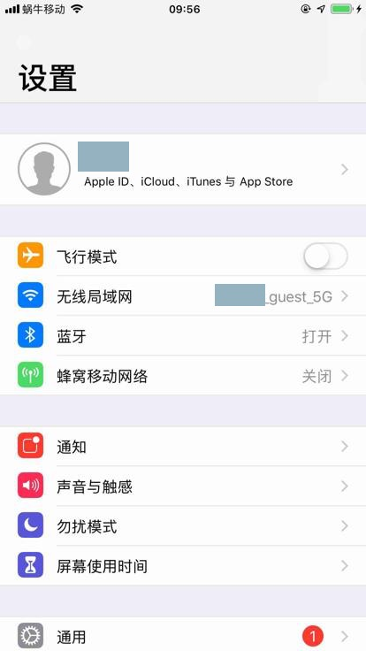
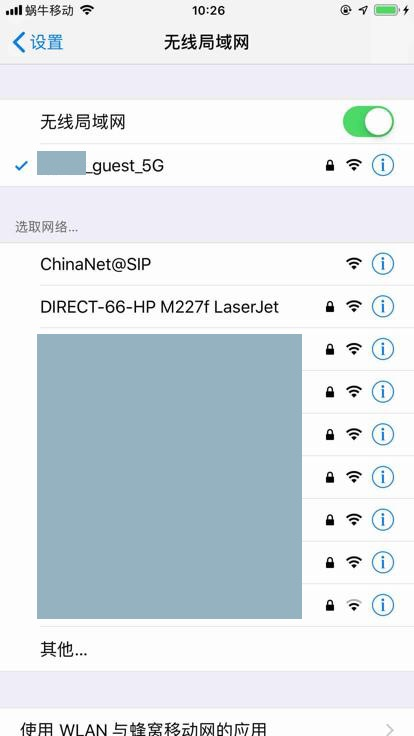
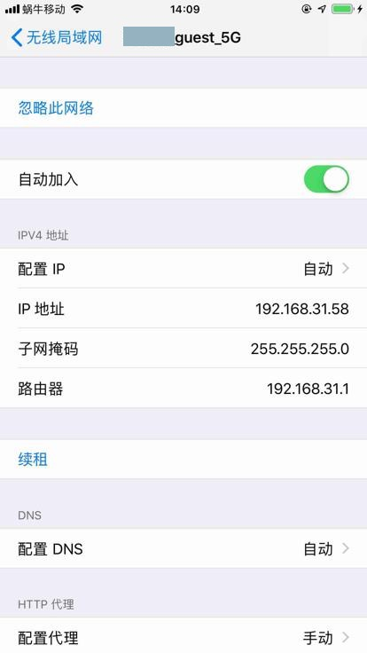
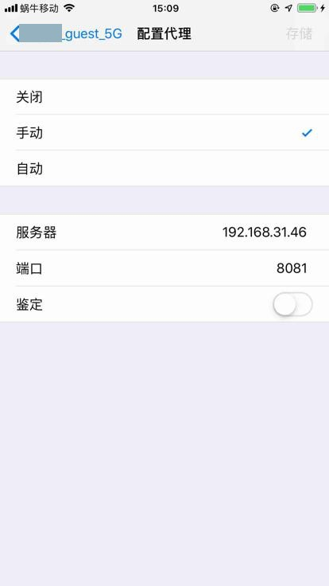
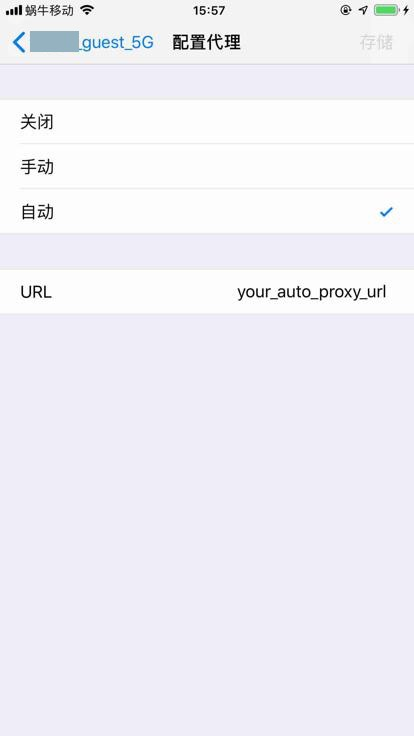
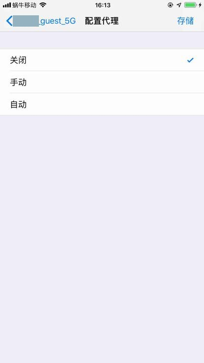
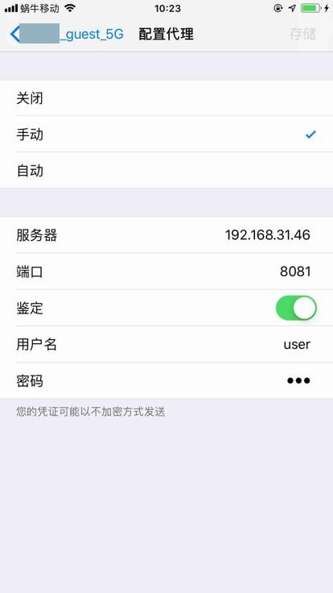
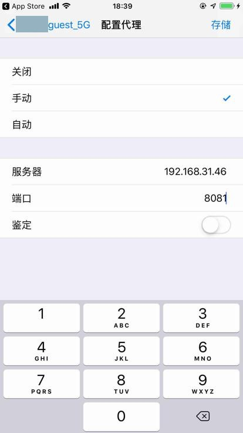

# 更新WiFi代理

此处整理用`facebook-wad`自动实现关闭和恢复代理的整个自动化过程。

此处把

【已解决】iOS自动化安装app：给当前WiFi去掉代理以及自动安装app后再恢复之前代理

中：

* 关闭代理
  * 给当前WiFi去掉代理
* 恢复代理
  * 给当前WiFi 加上代理

贴出来相关的逻辑和代理，供了解：iOS的自动化，是什么样的，代码大概怎么写

流程和相关代码：

```python
newProxyInfo = {
    "type": "关闭",
    "value": None,
}
isUpdateOk, respInfo = self.iOSWifiDetailUpdateProxy(newProxyInfo)
```

用于去关闭代理

（自动通过AppStore去安装iOS的app后）后续去恢复（之前保存的）代理：

```python
# # for debug
# # 'authUser': 'user', 'authPassword': '•••'
# proxyConfigInfo = {
#     'type': '手动',
#     'value': {
#         'server': '192.168.31.46',
#         'port': '8081',
#         # 'authenticate': '0'
#         'authenticate': '1',
#         'authUser': 'user',
#         'authPassword': 'pwd',
#     }
# }

# restore proxy if necessary
if proxyConfigInfo:
    # isRestoreOk = self.settingsRestoreWiFiProxy(proxyConfigInfo)
    isRestoreOk, respInfo = self.iOSWifiDetailUpdateProxy(proxyConfigInfo)
    logStr = "%s to restore previous proxy %s" % (isRestoreOk, proxyConfigInfo)
    if isRestoreOk:
        logging.info(logStr)
    else:
        logging.error(logStr)
```

具体实现：

```python
def iOSWifiDetailUpdateProxy(self, newProxyInfo):
    """iOS launch Settings, into WiFi list page, find current WiFi, into WiFi detail page
        then try update to new proxy config info
    Args:
        newProxyInfo (dict): new proxy config info
    Returns:
        bool, dict/str
            True, old proxy config info dict
            False, error message str
    Raises:
    """
    isUpdateProxyOk = False
    respInfo = None

    isGetProxyTypeOk, respInfo = self.iOSLaunchSettingsAndGetProxyType()
    if not isGetProxyTypeOk:
        respInfo = "Not find current WiFi proxy config type"
        return isUpdateProxyOk, respInfo

    curProxySoup = respInfo
    curProxyAttrDict = curProxySoup.attrs
    curTypeName = curProxyAttrDict.get("value")

    newTypeName = newProxyInfo["type"]
    if (newTypeName == "关闭") and (curTypeName == "关闭"):
        isUpdateProxyOk = True
        oldProxyInfo = {
            "type": "关闭",
            "value": None,
        }
        respInfo = oldProxyInfo
        return isUpdateProxyOk, respInfo
    else:
        # into config proxy page
        self.clickElementCenterPosition(curProxySoup)
        # get old proxy value
        # update to close
        # save
        isUpdateProxyOk, respInfo = self.iOSProxyConfigUpdateProxy(newProxyInfo)
        logging.info("Update proxy result: %s, %s", isUpdateProxyOk, respInfo)
        return isUpdateProxyOk, respInfo
```

其逻辑是：

启动`设置`，直到进入 当前已连接的WiFi的详情页，获取到当前代理的类型

其具体实现是：

```python
def iOSLaunchSettingsAndGetProxyType(self):
    """
        iOS launch Settings, and into WiFi list page, click into current connected WiFi detail page, find current proxy type
    Args:
    Returns:
        bool, soup/str
            True, proxy type soup
            False, error message str
    Raises:
    """
    isGetTypeOk = False
    respInfo = None

    isIntoWiFiListOk, respInfo = self.iOSLaunchSettingsAndIntoWiFiList()
    if not isIntoWiFiListOk:
        errMsg = respInfo
        respInfo = "Fail into WiFi list page for %s" % errMsg
        return isGetTypeOk, respInfo

    isIntoDetailOk = self.iOSFromWifiListIntoWifiDetail()
    if not isIntoDetailOk:
        respInfo = "Fail go into WiFi detail page"
        return isGetTypeOk, respInfo

    proxyTypeSoup = self.iOSGetCurrentWiFiProxyType()
    if proxyTypeSoup:
        isGetTypeOk = True
        respInfo = proxyTypeSoup

    return isGetTypeOk, respInfo
```

即：

* 先启动 设置
* 再进去WiFi的列表页
* 再进去当前已连接WiFi的详情页

具体实现：

```python
def iOSLaunchSettingsAndIntoWiFiList(self):
    """
        iOS launch Settings, then into / (sometime) already in WiFi list page

    Args:
    Returns:
        bool, None/str
            True, None
            False, error message str
    Raises:
    """
    isIntoWiFiListOk = False
    respInfo = None

    isLaunchOk, respInfo = self.iOSLaunchSettings()
    if not isLaunchOk:
        respInfo = "Fail to launch 设置"
        return isIntoWiFiListOk, respInfo

    # Special: sometime alreay being in WiFi list page, so need first check it
    isInWifiList = self.iOSIsInWiFiList()
    if isInWifiList:
        isIntoWiFiListOk = True
        respInfo = None
        return isIntoWiFiListOk, respInfo
    else:
        # foundAndClickedWifi = self.iOSFromSettingsIntoWifiList()
        foundAndClickedWifi = CommonUtils.multipleRetry({"functionCallback": self.iOSFromSettingsIntoWifiList})
        if not foundAndClickedWifi:
            respInfo = "Not find 无线局域网 in 设置"
            return isIntoWiFiListOk, respInfo

        isInWifiList = self.iOSIsInWiFiList()
        if isInWifiList:
            isIntoWiFiListOk = True
            respInfo = None
            return isIntoWiFiListOk, respInfo
        else:
            isIntoWiFiListOk = False
            respInfo = "Unknown Error"
            return isIntoWiFiListOk, respInfo
```

启动设置

```python
def iOSLaunchSettings(self, isTerminateFirst=True, isDebugState=True):
    """iOS terminal and re-launch Settings=Preferences app

    Args:
        isTerminateFirst (bool): force terminal Settings before launch
        isDebugState (bool): enable debug for app state
    Returns:
        bool
    Raises:
    """

    iOS_AppId_Settings = "com.apple.Preferences"

    if isTerminateFirst:
        if isDebugState:
            isGetOk, curState = self.iOSGetAppState(iOS_AppId_Settings)
            logging.info("before terminal: curState=%s", curState)
        # stop before start to avoid current page is not homepage of 设置
        isTerminalOk, respInfo = self.iOSTerminateApp(iOS_AppId_Settings)
        logging.info("%s: isTerminalOk=%s, respInfo=%s", iOS_AppId_Settings, isTerminalOk, respInfo)
        if isDebugState:
            isGetOk, curState = self.iOSGetAppState(iOS_AppId_Settings)
            logging.info("after terminal: curState=%s", curState)

    # settingsSession = self.wdaClient.session(iOS_AppId_Settings)
    # logging.debug("settingsSession=%s" % settingsSession)
    # launchResult = self.wdaClient.app_launch(iOS_AppId_Settings)
    # logging.debug("launchResult=%s", launchResult)
    isLaunchOk, respInfo = self.iOSLaunchApp(iOS_AppId_Settings)
    logging.info("isLaunchOk=%s, respInfo=%s", isLaunchOk, respInfo)
    # logging.info("launchResult: value=%s, status=%s, sessionId=%s", launchResult.value, launchResult.status, launchResult.sessionId)
    # launchResult: value=None, status=0, sessionId=79A39B72-F5F9-4A01-8E58-DD380452350A
    # logging.info("launchResult=%s", str(launchResult))
    # launchResult=GenericDict(value=None, sessionId='79A39B72-F5F9-4A01-8E58-DD380452350A', status=0)
    if isDebugState:
        isGetOk, curState = self.iOSGetAppState(iOS_AppId_Settings)
        logging.info("after launch: curState=%s", curState)
    return isLaunchOk, respInfo
```

对应页面 设置 首页：



进入WiFi列表页

在WiFi列表页中 找 无线局域网，即可以找到当前已连接的Wifi

页面 WiFi列表页：



点击无线局域网 进去 WiFi列表页

```python
def iOSFromSettingsIntoWifiList(self):
    """from settings page, click 无线局域网 into WiFi list page"""
    foundAndClickedWifi = False
    """
        设置 顶部 无线局域网:
            <XCUIElementTypeTable type="XCUIElementTypeTable" enabled="true" visible="true" x="0" y="0" width="414" height="736">

                <XCUIElementTypeCell type="XCUIElementTypeCell" value="xxx_guest_5G" name="无线局域网" label="无线局域网" enabled="true" visible="true" x="0" y="312" width="414" height="45">
                    <XCUIElementTypeImage type="XCUIElementTypeImage" enabled="true" visible="false" x="20" y="319" width="29" height="29"/>
                    <XCUIElementTypeStaticText type="XCUIElementTypeStaticText" value="无线局域网" name="无线局域网" label="无线局域网" enabled="true" visible="true" x="64" y="325" width="87" height="21"/>
                    <XCUIElementTypeOther type="XCUIElementTypeOther" enabled="true" visible="true" x="64" y="356" width="350" height="1"/>
                    <XCUIElementTypeStaticText type="XCUIElementTypeStaticText" value="xxx_guest_5G" name="xxx_guest_5G" label="xxx_guest_5G" enabled="true" visible="true" x="252" y="325" width="124" height="21"/>
                    <XCUIElementTypeButton type="XCUIElementTypeButton" name="更多信息" label="更多信息" enabled="false" visible="true" x="386" y="328" width="8" height="13"/>
                </XCUIElementTypeCell>
    """
    # parentWifiCellClassChain = "/XCUIElementTypeCell[`name = 无线局域网 AND rect.x = 0 AND rect.width = %d`]" % self.X
    parentWifiCellClassChain = "/XCUIElementTypeCell[`name = '无线局域网' AND rect.x = 0 AND rect.width = %d`]" % self.X
    wifiTextQuery = {"type":"XCUIElementTypeStaticText", "name": "无线局域网", "enabled": "true"}
    wifiTextQuery["parent_class_chains"] = [ parentWifiCellClassChain ]
    foundAndClickedWifi = self.findAndClickElement(query=wifiTextQuery, timeout=0.1)
    return foundAndClickedWifi
```

判断是否已进入WiFi列表页：

```python
def iOSIsInWiFiList(self):
    """Check whether is in WiFi list page or not

    Args:
    Returns:
        bool
    Raises:
    """
    isFoundWifi = False
    """
        设置 WiFi列表页：
            <XCUIElementTypeNavigationBar type="XCUIElementTypeNavigationBar" name="无线局域网" enabled="true" visible="true" x="0" y="20" width="414" height="44">
                <XCUIElementTypeButton type="XCUIElementTypeButton" name="设置" label="设置" enabled="true" visible="true" x="0" y="20" width="66" height="44"/>
                <XCUIElementTypeOther type="XCUIElementTypeOther" name="无线局域网" label="无线局域网" enabled="true" visible="true" x="163" y="31" width="88" height="21"/>
            </XCUIElementTypeNavigationBar>
    """
    wifiName = "无线局域网"
    parentNaviBarClassChain = "/XCUIElementTypeNavigationBar[`name = '%s' AND rect.x = 0 AND rect.width = %d`]" % (wifiName, self.X)
    wifiQuery = {"type":"XCUIElementTypeOther", "name": wifiName, "enabled": "true"}
    wifiQuery["parent_class_chains"] = [ parentNaviBarClassChain ]
    isFoundWifi, respInfo = self.findElement(query=wifiQuery, timeout=0.1)
    return isFoundWifi
```

且用多次判断，防止单次的失败。

再去从WiFi列表页进入详情页：

```python
def iOSFromWifiListIntoWifiDetail(self):
    """from WiFi list page, click more info button into WiFi detail page """
    isIntoDetailOk = False
    """
        设置 无线局域网 列表页：
            <XCUIElementTypeTable type="XCUIElementTypeTable" enabled="true" visible="true" x="0" y="0" width="414" height="736">
            。。。
                <XCUIElementTypeCell type="XCUIElementTypeCell" name="xxx_guest_5G, 安全网络, 信号强度 3 格，共 3 格" label="xxx_guest_5G, 安全网络, 信号强度 3 格，共 3 格" enabled="true" visible="true" x="0" y="144" width="414" height="43">
                    <XCUIElementTypeStaticText type="XCUIElementTypeStaticText" value="xxx_guest_5G" name="xxx_guest_5G" label="xxx_guest_5G" enabled="true" visible="true" x="40" y="155" width="278" height="21"/>
                    <XCUIElementTypeOther type="XCUIElementTypeOther" enabled="true" visible="true" x="0" y="186" width="414" height="1"/>
                    <XCUIElementTypeOther type="XCUIElementTypeOther" enabled="true" visible="true" x="8" y="151" width="28" height="29">
                        <XCUIElementTypeImage type="XCUIElementTypeImage" name="UIPreferencesBlueCheck" enabled="true" visible="false" x="8" y="151" width="28" height="29"/>
                    </XCUIElementTypeOther>
                    <XCUIElementTypeOther type="XCUIElementTypeOther" enabled="true" visible="false" x="15" y="187" width="245" height="1"/>
                    <XCUIElementTypeImage type="XCUIElementTypeImage" name="Lock" enabled="true" visible="false" x="326" y="159" width="8" height="12"/>
                    <XCUIElementTypeImage type="XCUIElementTypeImage" name="WifiBars3" enabled="true" visible="false" x="346" y="153" width="16" height="25"/>
                    <XCUIElementTypeButton type="XCUIElementTypeButton" name="更多信息" label="更多信息" enabled="true" visible="true" x="372" y="154" width="22" height="22"/>
                </XCUIElementTypeCell>
    """
    curPageXml = self.get_page_source()
    soup = CommonUtils.xmlToSoup(curPageXml)
    blueCheckChainList = [
        {
            "tag": "XCUIElementTypeCell",
            "attrs": {"enabled":"true", "visible":"true", "x":"0", "width":"%s" % self.X}
        },
        {
            "tag": "XCUIElementTypeOther",
            "attrs": {"enabled":"true", "visible":"true"}
        },
        {
            "tag": "XCUIElementTypeImage",
            # "attrs": {"enabled":"true", "visible":"true", "name": "UIPreferencesBlueCheck"}
            "attrs": {"enabled":"true", "name": "UIPreferencesBlueCheck"}
        },
    ]
    blueCheckSoup = CommonUtils.bsChainFind(soup, blueCheckChainList)
    if blueCheckSoup:
        parentOtherSoup = blueCheckSoup.parent
        parentCellSoup = parentOtherSoup.parent
        moreInfoSoup = parentCellSoup.find(
            'XCUIElementTypeButton',
            attrs={"type": "XCUIElementTypeButton", "name": "更多信息", "enabled":"true", "visible":"true"},
        )
        if moreInfoSoup:
            clickedOk = self.clickElementCenterPosition(moreInfoSoup)
            isIntoDetailOk = clickedOk
    return isIntoDetailOk
```

页面 WiFi详情页：



再从当前WiFi详情页，找到代理的类型：

```python
def iOSGetCurrentWiFiProxyType(self):
    """from WiFi detail page, get current proxy config type soup"""
    proxyTypeSoup = None
    """
        设置 无线局域网 详情页 代理 关闭：
            <XCUIElementTypeTable type="XCUIElementTypeTable" enabled="true" visible="true" x="0" y="0" width="414" height="736">
            。。。
                <XCUIElementTypeOther type="XCUIElementTypeOther" enabled="true" visible="true" x="0" y="657" width="414" height="39">
                    <XCUIElementTypeStaticText type="XCUIElementTypeStaticText" value="HTTP 代理" name="HTTP 代理" label="HTTP 代理" enabled="true" visible="true" x="0" y="657" width="414" height="39"/>
                </XCUIElementTypeOther>
                <XCUIElementTypeCell type="XCUIElementTypeCell" enabled="true" visible="true" x="0" y="695" width="414" height="46">
                    <XCUIElementTypeOther type="XCUIElementTypeOther" enabled="true" visible="true" x="0" y="695" width="414" height="1"/>
                    <XCUIElementTypeOther type="XCUIElementTypeOther" enabled="true" visible="false" x="0" y="740" width="414" height="1"/>
                    <XCUIElementTypeStaticText type="XCUIElementTypeStaticText" value="配置代理" name="配置代理" label="配置代理" enabled="true" visible="true" x="20" y="708" width="70" height="21"/>
                    <XCUIElementTypeStaticText type="XCUIElementTypeStaticText" value="关闭" name="关闭" label="关闭" enabled="true" visible="true" x="341" y="708" width="35" height="21"/>
                    <XCUIElementTypeButton type="XCUIElementTypeButton" name="更多信息" label="更多信息" enabled="false" visible="true" x="386" y="711" width="8" height="14"/>
                </XCUIElementTypeCell>

        设置 无线局域网 详情页 代理 手动：
            <XCUIElementTypeCell type="XCUIElementTypeCell" enabled="true" visible="true" x="0" y="695" width="414" height="46">
                <XCUIElementTypeOther type="XCUIElementTypeOther" enabled="true" visible="true" x="0" y="695" width="414" height="1"/>
                <XCUIElementTypeOther type="XCUIElementTypeOther" enabled="true" visible="false" x="0" y="740" width="414" height="1"/>
                <XCUIElementTypeStaticText type="XCUIElementTypeStaticText" value="配置代理" name="配置代理" label="配置代理" enabled="true" visible="true" x="20" y="708" width="70" height="21"/>
                <XCUIElementTypeStaticText type="XCUIElementTypeStaticText" value="手动" name="手动" label="手动" enabled="true" visible="true" x="341" y="708" width="35" height="21"/>
                <XCUIElementTypeButton type="XCUIElementTypeButton" name="更多信息" label="更多信息" enabled="false" visible="true" x="386" y="711" width="8" height="14"/>
            </XCUIElementTypeCell>
    """
    curPageXml = self.get_page_source()
    soup = CommonUtils.xmlToSoup(curPageXml)
    configProxyChainList = [
        {
            "tag": "XCUIElementTypeTable",
            "attrs": self.FullScreenAttrDict
        },
        {
            "tag": "XCUIElementTypeCell",
            "attrs": {"enabled":"true", "visible":"true", "x":"0", "width":"%s" % self.X}
        },
        {
            "tag": "XCUIElementTypeStaticText",
            "attrs": {"enabled":"true", "visible":"true", "value": "配置代理"}
        },
    ]
    configProxySoup = CommonUtils.bsChainFind(soup, configProxyChainList)
    if configProxySoup:
        parentCellSoup = configProxySoup.parent
        # proxyTypeP = re.compile("(手动)|(自动)|(关闭)")
        # proxyTypeSoup = parentCellSoup.find(
        #     'XCUIElementTypeStaticText',
        #     attrs={"type": "XCUIElementTypeStaticText", "value": proxyTypeP, "enabled":"true", "visible":"true"},
        # )
        proxyTypeSoup = self.iOSFindChildProxyType(parentCellSoup, isReturnSoup=True)

    return proxyTypeSoup
```

此处返回是 str （类型的字符串名称）或soup（类型的soup节点）

```python
def iOSFindChildProxyType(self, parentCellSoup, isReturnSoup=False):
    """from parent cell soup, find child proxy type node / node's name

    Args:
        parentCellSoup (soup): Beautifulsoup soup of parent XCUIElementTypeCell
        isReturnSoup (bool): return soup if true, otherwise return soup's name
    Returns:
        str/soup:
            str: 手动/自动/关闭
            soup: soup node
    Raises:
    """
    # proxyTypeName = None
    # some cases:
    """
        设置 无线局域网 详情页 代理 关闭：
            <XCUIElementTypeCell type="XCUIElementTypeCell" enabled="true" visible="true" x="0" y="695" width="414" height="46">
                <XCUIElementTypeOther type="XCUIElementTypeOther" enabled="true" visible="true" x="0" y="695" width="414" height="1"/>
                <XCUIElementTypeOther type="XCUIElementTypeOther" enabled="true" visible="false" x="0" y="740" width="414" height="1"/>
                <XCUIElementTypeStaticText type="XCUIElementTypeStaticText" value="配置代理" name="配置代理" label="配置代理" enabled="true" visible="true" x="20" y="708" width="70" height="21"/>
                <XCUIElementTypeStaticText type="XCUIElementTypeStaticText" value="关闭" name="关闭" label="关闭" enabled="true" visible="true" x="341" y="708" width="35" height="21"/>
                <XCUIElementTypeButton type="XCUIElementTypeButton" name="更多信息" label="更多信息" enabled="false" visible="true" x="386" y="711" width="8" height="14"/>
            </XCUIElementTypeCell>

        设置 无线局域网 详情页 代理 手动：
            <XCUIElementTypeCell type="XCUIElementTypeCell" enabled="true" visible="true" x="0" y="695" width="414" height="46">
                <XCUIElementTypeOther type="XCUIElementTypeOther" enabled="true" visible="true" x="0" y="695" width="414" height="1"/>
                <XCUIElementTypeOther type="XCUIElementTypeOther" enabled="true" visible="false" x="0" y="740" width="414" height="1"/>
                <XCUIElementTypeStaticText type="XCUIElementTypeStaticText" value="配置代理" name="配置代理" label="配置代理" enabled="true" visible="true" x="20" y="708" width="70" height="21"/>
                <XCUIElementTypeStaticText type="XCUIElementTypeStaticText" value="手动" name="手动" label="手动" enabled="true" visible="true" x="341" y="708" width="35" height="21"/>
                <XCUIElementTypeButton type="XCUIElementTypeButton" name="更多信息" label="更多信息" enabled="false" visible="true" x="386" y="711" width="8" height="14"/>
            </XCUIElementTypeCell>

        设置 无线局域网 配置代理 手动：
            <XCUIElementTypeCell type="XCUIElementTypeCell" enabled="true" visible="true" x="0" y="144" width="414" height="45">
                <XCUIElementTypeStaticText type="XCUIElementTypeStaticText" value="手动" name="手动" label="手动" enabled="true" visible="true" x="20" y="144" width="350" height="45"/>
                <XCUIElementTypeOther type="XCUIElementTypeOther" enabled="true" visible="true" x="20" y="188" width="394" height="1"/>
                <XCUIElementTypeButton type="XCUIElementTypeButton" name="更多信息" label="更多信息" enabled="false" visible="true" x="380" y="161" width="14" height="11"/>
            </XCUIElementTypeCell>

        设置 无线局域网 配置代理 关闭：
            <XCUIElementTypeCell type="XCUIElementTypeCell" enabled="true" visible="true" x="0" y="99" width="414" height="45">
                <XCUIElementTypeOther type="XCUIElementTypeOther" enabled="true" visible="true" x="0" y="99" width="414" height="1"/>
                <XCUIElementTypeStaticText type="XCUIElementTypeStaticText" value="关闭" name="关闭" label="关闭" enabled="true" visible="true" x="20" y="99" width="350" height="45"/>
                <XCUIElementTypeOther type="XCUIElementTypeOther" enabled="true" visible="true" x="20" y="143" width="394" height="1"/>
                <XCUIElementTypeButton type="XCUIElementTypeButton" name="更多信息" label="更多信息" enabled="false" visible="true" x="380" y="116" width="14" height="11"/>
            </XCUIElementTypeCell>

        设置 无线局域网 配置代理 自动：
            <XCUIElementTypeCell type="XCUIElementTypeCell" enabled="true" visible="true" x="0" y="189" width="414" height="45">
                <XCUIElementTypeOther type="XCUIElementTypeOther" enabled="true" visible="true" x="0" y="233" width="414" height="1"/>
                <XCUIElementTypeStaticText type="XCUIElementTypeStaticText" value="自动" name="自动" label="自动" enabled="true" visible="true" x="20" y="189" width="350" height="45"/>
                <XCUIElementTypeButton type="XCUIElementTypeButton" name="更多信息" label="更多信息" enabled="false" visible="true" x="380" y="206" width="14" height="11"/>
            </XCUIElementTypeCell>
    """
    proxyTypeP = re.compile("(手动)|(自动)|(关闭)")
    proxyTypeSoup = parentCellSoup.find(
        'XCUIElementTypeStaticText',
        attrs={"type": "XCUIElementTypeStaticText", "value": proxyTypeP, "enabled":"true", "visible":"true"},
    )
    if isReturnSoup:
        return proxyTypeSoup
    else:
        proxySoupAttrDict = proxyTypeSoup.attrs
        proxyTypeName = proxySoupAttrDict.get("value")
        return proxyTypeName # '手动'
```

从xml中找到 类型名

之后点击此soup节点

```python
def clickElementCenterPosition(self, curElement):
    """Click center position of element

    Args:
        curElement (Element): Beautiful soup / lxml element / wda Element
    Returns:
        bool
    Raises:
    """
    hasClicked = False
    # centerPos = None
    centerX = None
    centerY = None

    hasBounds = hasattr(curElement, "bounds")
    curBounds = None
    if hasBounds:
        curBounds = curElement.bounds

    if hasBounds and curBounds:
        # wda element
        if hasattr(curBounds, "center"):
            # is wda Rect
            curRect = curBounds
            rectCenter = curRect.center
            centerX = rectCenter[0]
            centerY = rectCenter[1]
    else:
        attrDict = None
        if hasattr(curElement, "attrs"):
            # Beautiful soup node
            attrDict = curElement.attrs
        elif hasattr(curElement, "attrib"):
            # lxml element
            attrDict = dict(curElement.attrib)

        if attrDict:
            logging.info("attrDict=%s", attrDict)
            hasCoordinate = ("x" in attrDict) and ("y" in attrDict) and ("width" in attrDict) and ("height" in attrDict)
            if hasCoordinate:
                x = int(attrDict["x"])
                y = int(attrDict["y"])
                width = int(attrDict["width"])
                height = int(attrDict["height"])
                centerX = x + int(width / 2)
                centerY = y + int(height / 2)

    if centerX and centerY:
        centerPos = (centerX, centerY)
        self.tap(centerPos)
        logging.info("Clicked center position: %s", centerPos)
        hasClicked = True

    return hasClicked
```

进入 配置代理 页面：



去更新代理：

```python
def iOSProxyConfigUpdateProxy(self, newProxyInfo):
    """in proxy config = 代理配置 page, update proxy type

    Args:
        newProxyInfo (dict): new proxy info
    Returns:
        bool, dict/str
            True, old proxy config info
            False, error message str
    Raises:
    Examples:
        newProxyInfo exmaples:
            (1) to close:
                {
                    "type": "关闭",
                    "value": None
                }
            (2) to manual, no auth:
                {
                    'type': '手动',
                    'value': {
                        'server': '192.168.31.47',
                        'port': '8081',
                        'authenticate': '0',
                        'authUser': None,
                        'authPassword': None
                    }
                }
            (3) to manual, with auth:
                {
                    'type': '手动',
                    'value': {
                        'server': '192.168.31.47',
                        'port': '8081',
                        'authenticate': '1'
                        'authUser': 'user',
                        'authPassword': 'password'
                    }
                }
            (4) to auto:
                {
                    'type': '自动',
                    'value': {
                        'url': 'your_auto_proxy_url'
                    }
                }
    """
    isUpdateOk = False
    respInfo = None
    """
        设置 无线局域网 配置代理 关闭：
            <XCUIElementTypeTable type="XCUIElementTypeTable" enabled="true" visible="true" x="0" y="0" width="414" height="736">
                <XCUIElementTypeCell type="XCUIElementTypeCell" enabled="true" visible="true" x="0" y="99" width="414" height="45">
                    <XCUIElementTypeOther type="XCUIElementTypeOther" enabled="true" visible="true" x="0" y="99" width="414" height="1"/>
                    <XCUIElementTypeStaticText type="XCUIElementTypeStaticText" value="关闭" name="关闭" label="关闭" enabled="true" visible="true" x="20" y="99" width="350" height="45"/>
                    <XCUIElementTypeOther type="XCUIElementTypeOther" enabled="true" visible="true" x="20" y="143" width="394" height="1"/>
                    <XCUIElementTypeButton type="XCUIElementTypeButton" name="更多信息" label="更多信息" enabled="false" visible="true" x="380" y="116" width="14" height="11"/>
                </XCUIElementTypeCell>
                <XCUIElementTypeCell type="XCUIElementTypeCell" enabled="true" visible="true" x="0" y="144" width="414" height="45">
                    <XCUIElementTypeStaticText type="XCUIElementTypeStaticText" value="手动" name="手动" label="手动" enabled="true" visible="true" x="20" y="144" width="374" height="45"/>
                    <XCUIElementTypeOther type="XCUIElementTypeOther" enabled="true" visible="true" x="20" y="188" width="394" height="1"/>
                </XCUIElementTypeCell>
                <XCUIElementTypeCell type="XCUIElementTypeCell" enabled="true" visible="true" x="0" y="189" width="414" height="45">
                    <XCUIElementTypeOther type="XCUIElementTypeOther" enabled="true" visible="true" x="0" y="233" width="414" height="1"/>
                    <XCUIElementTypeStaticText type="XCUIElementTypeStaticText" value="自动" name="自动" label="自动" enabled="true" visible="true" x="20" y="189" width="374" height="45"/>
                </XCUIElementTypeCell>
            </XCUIElementTypeTable>

        设置 无线局域网 配置代理 手动：
            <XCUIElementTypeTable type="XCUIElementTypeTable" enabled="true" visible="true" x="0" y="0" width="414" height="736">
                <XCUIElementTypeCell type="XCUIElementTypeCell" enabled="true" visible="true" x="0" y="99" width="414" height="45">
                    <XCUIElementTypeOther type="XCUIElementTypeOther" enabled="true" visible="false" x="0" y="99" width="414" height="1"/>
                    <XCUIElementTypeStaticText type="XCUIElementTypeStaticText" value="关闭" name="关闭" label="关闭" enabled="true" visible="true" x="20" y="99" width="374" height="45"/>
                    <XCUIElementTypeOther type="XCUIElementTypeOther" enabled="true" visible="true" x="20" y="143" width="394" height="1"/>
                </XCUIElementTypeCell>
                <XCUIElementTypeCell type="XCUIElementTypeCell" enabled="true" visible="true" x="0" y="144" width="414" height="45">
                    <XCUIElementTypeStaticText type="XCUIElementTypeStaticText" value="手动" name="手动" label="手动" enabled="true" visible="true" x="20" y="144" width="350" height="45"/>
                    <XCUIElementTypeOther type="XCUIElementTypeOther" enabled="true" visible="true" x="20" y="188" width="394" height="1"/>
                    <XCUIElementTypeButton type="XCUIElementTypeButton" name="更多信息" label="更多信息" enabled="false" visible="true" x="380" y="161" width="14" height="11"/>
                </XCUIElementTypeCell>
                <XCUIElementTypeCell type="XCUIElementTypeCell" enabled="true" visible="true" x="0" y="189" width="414" height="45">
                    <XCUIElementTypeOther type="XCUIElementTypeOther" enabled="true" visible="true" x="0" y="233" width="414" height="1"/>
                    <XCUIElementTypeStaticText type="XCUIElementTypeStaticText" value="自动" name="自动" label="自动" enabled="true" visible="true" x="20" y="189" width="374" height="45"/>
                </XCUIElementTypeCell>
                <XCUIElementTypeCell type="XCUIElementTypeCell" enabled="true" visible="true" x="0" y="269" width="414" height="46">
                    <XCUIElementTypeOther type="XCUIElementTypeOther" enabled="true" visible="true" x="0" y="269" width="414" height="1"/>
                    <XCUIElementTypeTextField type="XCUIElementTypeTextField" value="192.168.31.46" name="服务器" label="服务器" enabled="true" visible="true" x="92" y="281" width="294" height="21"/>
                    <XCUIElementTypeOther type="XCUIElementTypeOther" enabled="true" visible="true" x="15" y="313" width="305" height="1"/>
                    <XCUIElementTypeOther type="XCUIElementTypeOther" enabled="true" visible="true" x="20" y="313" width="394" height="2"/>
                </XCUIElementTypeCell>
                <XCUIElementTypeCell type="XCUIElementTypeCell" enabled="true" visible="true" x="0" y="314" width="414" height="46">
                    <XCUIElementTypeTextField type="XCUIElementTypeTextField" value="8081" name="端口" label="端口" enabled="true" visible="true" x="74" y="326" width="312" height="22"/>
                    <XCUIElementTypeOther type="XCUIElementTypeOther" enabled="true" visible="true" x="15" y="358" width="305" height="2"/>
                    <XCUIElementTypeOther type="XCUIElementTypeOther" enabled="true" visible="true" x="20" y="359" width="394" height="1"/>
                </XCUIElementTypeCell>
                <XCUIElementTypeCell type="XCUIElementTypeCell" value="0" enabled="true" visible="true" x="0" y="359" width="414" height="46">
                    <XCUIElementTypeOther type="XCUIElementTypeOther" enabled="true" visible="true" x="0" y="404" width="414" height="1"/>
                    <XCUIElementTypeStaticText type="XCUIElementTypeStaticText" value="鉴定" name="鉴定" label="鉴定" enabled="true" visible="true" x="20" y="359" width="323" height="46"/>
                    <XCUIElementTypeSwitch type="XCUIElementTypeSwitch" value="0" name="鉴定" label="鉴定" enabled="true" visible="true" x="343" y="366" width="51" height="32"/>
                </XCUIElementTypeCell>
            </XCUIElementTypeTable>

        设置 无线局域网 配置代理 自动：
            <XCUIElementTypeTable type="XCUIElementTypeTable" enabled="true" visible="true" x="0" y="0" width="414" height="736">
                <XCUIElementTypeCell type="XCUIElementTypeCell" enabled="true" visible="true" x="0" y="99" width="414" height="45">
                    <XCUIElementTypeOther type="XCUIElementTypeOther" enabled="true" visible="false" x="0" y="99" width="414" height="1"/>
                    <XCUIElementTypeStaticText type="XCUIElementTypeStaticText" value="关闭" name="关闭" label="关闭" enabled="true" visible="true" x="20" y="99" width="374" height="45"/>
                    <XCUIElementTypeOther type="XCUIElementTypeOther" enabled="true" visible="true" x="20" y="143" width="394" height="1"/>
                </XCUIElementTypeCell>
                <XCUIElementTypeCell type="XCUIElementTypeCell" enabled="true" visible="true" x="0" y="144" width="414" height="45">
                    <XCUIElementTypeStaticText type="XCUIElementTypeStaticText" value="手动" name="手动" label="手动" enabled="true" visible="true" x="20" y="144" width="374" height="45"/>
                    <XCUIElementTypeOther type="XCUIElementTypeOther" enabled="true" visible="true" x="20" y="188" width="394" height="1"/>
                </XCUIElementTypeCell>
                <XCUIElementTypeCell type="XCUIElementTypeCell" enabled="true" visible="true" x="0" y="189" width="414" height="45">
                    <XCUIElementTypeOther type="XCUIElementTypeOther" enabled="true" visible="true" x="0" y="233" width="414" height="1"/>
                    <XCUIElementTypeStaticText type="XCUIElementTypeStaticText" value="自动" name="自动" label="自动" enabled="true" visible="true" x="20" y="189" width="350" height="45"/>
                    <XCUIElementTypeButton type="XCUIElementTypeButton" name="更多信息" label="更多信息" enabled="false" visible="true" x="380" y="206" width="14" height="11"/>
                </XCUIElementTypeCell>
                <XCUIElementTypeCell type="XCUIElementTypeCell" enabled="true" visible="true" x="0" y="269" width="414" height="46">
                    <XCUIElementTypeOther type="XCUIElementTypeOther" enabled="true" visible="true" x="0" y="269" width="414" height="1"/>
                    <XCUIElementTypeTextField type="XCUIElementTypeTextField" name="URL" label="URL" enabled="true" visible="true" x="72" y="281" width="314" height="21"/>
                    <XCUIElementTypeOther type="XCUIElementTypeOther" enabled="true" visible="true" x="0" y="313" width="414" height="2"/>
                    <XCUIElementTypeOther type="XCUIElementTypeOther" enabled="true" visible="true" x="15" y="313" width="305" height="1"/>
                </XCUIElementTypeCell>
            </XCUIElementTypeTable>
    """
    # check current proxy type: 手动/自动/关闭
    curPageXml = self.get_page_source()
    soup = CommonUtils.xmlToSoup(curPageXml)
    morenInfoChainList = [
        {
            "tag": "XCUIElementTypeTable",
            "attrs": self.FullScreenAttrDict
        },
        {
            "tag": "XCUIElementTypeCell",
            "attrs": {"enabled":"true", "visible":"true", "x":"0", "width":"%s" % self.X}
        },
        {
            "tag": "XCUIElementTypeButton",
            # "attrs": {"enabled":"false", "visible":"true", "name": "更多信息"}
            "attrs": {"visible":"true", "name": "更多信息"}
        },
    ]
    morenInfoSoup = CommonUtils.bsChainFind(soup, morenInfoChainList)
    if not morenInfoSoup:
        respInfo = "Fail to find 更多信息 in config proxy page"
        return isUpdateOk, respInfo

    parentCellSoup = morenInfoSoup.parent
    curTypeName = self.iOSFindChildProxyType(parentCellSoup)
    if not curTypeName:
        respInfo = "Fail to find current proxy type name in config proxy page"
        return isUpdateOk, respInfo

    parentTableSoup = parentCellSoup.parent

    newTypeName = newProxyInfo["type"]
    newProxyValue = newProxyInfo["value"]

    curProxyValue = None
    isSameType = False
    isNeedSwitchType = True
    isNeedGetCurValue = True
    isNeedCompareValue = False
    isNeedUpdateNewValue = True
    isNeedStore = True

    if newTypeName == curTypeName:
        isSameType = True
        isNeedSwitchType = False
        isNeedCompareValue = True
    else:
        isNeedSwitchType = True

    if curTypeName == "关闭":
        isNeedGetCurValue = False

    if newTypeName == "关闭":
        isNeedUpdateNewValue = False

    if (newTypeName == "关闭") and (curTypeName == "关闭"):
        isNeedStore = False
        isNeedCompareValue = False

    if isNeedGetCurValue:
        if curTypeName == "手动":
            curProxyValue = self.getManualProxyValue(parentTableSoup)
        elif curTypeName == "自动":
            curProxyValue = self.getAutoProxyValue(parentTableSoup)

        if not curProxyValue:
            respInfo = "Fail to get %s proxy value" % curTypeName
            return isUpdateOk, respInfo

    if isNeedCompareValue:
        # need check value is same or not
        if newProxyValue == curProxyValue:
            # if same, do nothing
            isNeedUpdateNewValue = False
            logging.info("No need change for same proxy type %s and value %s", curTypeName, curProxyValue)

    # common logic process

    if isNeedSwitchType:
        # switch to new type
        isSwitchOk = self.switchToProxyType(parentTableSoup, newTypeName)
        if isSwitchOk:
            isNeedStore = True
        else:
            respInfo = "Fail to switch to %s proxy" % curTypeName
            return isUpdateOk, respInfo

    if isNeedUpdateNewValue:
        if newTypeName == "手动":
            isUpateValueOk = self.setManualProxyValue(parentTableSoup, newProxyValue)
        elif newTypeName == "自动":
            isUpateValueOk = self.setAutoProxyValue(parentTableSoup, newProxyValue)

        if isUpateValueOk:
            isNeedStore = True
        else:
            respInfo = "Fail to update new %s proxy config value %s" % (curTypeName, newProxyValue)
            return isUpdateOk, respInfo

    if isNeedStore:
        # type and/or value changed, need store
        isStoredOk = self.storeChangedProxyType()
        if not isStoredOk:
            respInfo = "Fail to store after proxy from %s switch to %s" % (curTypeName, newTypeName)
            return isUpdateOk, respInfo

    isUpdateOk = True
    oldProxyInfo = {
        "type": curTypeName,
        "value": curProxyValue,
    }
    return isUpdateOk, oldProxyInfo
```

实现了，复杂的逻辑处理。总体上支持如下全部各种状态之间互相切换：

* 关闭
* 自动
    * 没开 鉴定
        * 只有
            * 服务器
            * 端口
            * 鉴定=0
    * 开启 鉴定
        * 服务器
        * 端口
        * 鉴定=1
            * 有额外的
                * 用户名
                * 密码
* 自动
    * 有
        * url值

且给出了传入的典型参数值：

(1) to close:
```bash
{
    "type": "关闭",
    "value": None
}
```
(2) to manual, no auth:
```bash
{
    'type': '手动',
    'value': {
        'server': '192.168.31.47',
        'port': '8081',
        'authenticate': '0',
        'authUser': None,
        'authPassword': None
    }
}
```
(3) to manual, with auth:
```bash
{
    'type': '手动',
    'value': {
        'server': '192.168.31.47',
        'port': '8081',
        'authenticate': '1'
        'authUser': 'user',
        'authPassword': 'password'
    }
}
```
(4) to auto:
```bash
{
    'type': '自动',
    'value': {
        'url': 'your_auto_proxy_url'
    }
}
```

其中内部调用到的函数是：

获取 手动 时的值

```python
def getManualProxyValue(self, parentTableSoup):
    """in 配置代理 page, from parent table soup, find 手动 proxy value: server, port, authenticate

    Args:
        parentTableSoup (soup): parent table soup
    Returns:
        dict
    Raises:
    """
    manualProxyValue = None
    """
        设置 无线局域网 配置代理 手动：
            <XCUIElementTypeTable type="XCUIElementTypeTable" enabled="true" visible="true" x="0" y="0" width="414" height="736">
                <XCUIElementTypeCell type="XCUIElementTypeCell" enabled="true" visible="true" x="0" y="99" width="414" height="45">
                    <XCUIElementTypeOther type="XCUIElementTypeOther" enabled="true" visible="false" x="0" y="99" width="414" height="1"/>
                    <XCUIElementTypeStaticText type="XCUIElementTypeStaticText" value="关闭" name="关闭" label="关闭" enabled="true" visible="true" x="20" y="99" width="374" height="45"/>
                    <XCUIElementTypeOther type="XCUIElementTypeOther" enabled="true" visible="true" x="20" y="143" width="394" height="1"/>
                </XCUIElementTypeCell>
                <XCUIElementTypeCell type="XCUIElementTypeCell" enabled="true" visible="true" x="0" y="144" width="414" height="45">
                    <XCUIElementTypeStaticText type="XCUIElementTypeStaticText" value="手动" name="手动" label="手动" enabled="true" visible="true" x="20" y="144" width="350" height="45"/>
                    <XCUIElementTypeOther type="XCUIElementTypeOther" enabled="true" visible="true" x="20" y="188" width="394" height="1"/>
                    <XCUIElementTypeButton type="XCUIElementTypeButton" name="更多信息" label="更多信息" enabled="false" visible="true" x="380" y="161" width="14" height="11"/>
                </XCUIElementTypeCell>
                <XCUIElementTypeCell type="XCUIElementTypeCell" enabled="true" visible="true" x="0" y="189" width="414" height="45">
                    <XCUIElementTypeOther type="XCUIElementTypeOther" enabled="true" visible="true" x="0" y="233" width="414" height="1"/>
                    <XCUIElementTypeStaticText type="XCUIElementTypeStaticText" value="自动" name="自动" label="自动" enabled="true" visible="true" x="20" y="189" width="374" height="45"/>
                </XCUIElementTypeCell>
                <XCUIElementTypeCell type="XCUIElementTypeCell" enabled="true" visible="true" x="0" y="269" width="414" height="46">
                    <XCUIElementTypeOther type="XCUIElementTypeOther" enabled="true" visible="true" x="0" y="269" width="414" height="1"/>
                    <XCUIElementTypeTextField type="XCUIElementTypeTextField" value="192.168.31.46" name="服务器" label="服务器" enabled="true" visible="true" x="92" y="281" width="294" height="21"/>
                    <XCUIElementTypeOther type="XCUIElementTypeOther" enabled="true" visible="true" x="15" y="313" width="305" height="1"/>
                    <XCUIElementTypeOther type="XCUIElementTypeOther" enabled="true" visible="true" x="20" y="313" width="394" height="2"/>
                </XCUIElementTypeCell>
                <XCUIElementTypeCell type="XCUIElementTypeCell" enabled="true" visible="true" x="0" y="314" width="414" height="46">
                    <XCUIElementTypeTextField type="XCUIElementTypeTextField" value="8081" name="端口" label="端口" enabled="true" visible="true" x="74" y="326" width="312" height="22"/>
                    <XCUIElementTypeOther type="XCUIElementTypeOther" enabled="true" visible="true" x="15" y="358" width="305" height="2"/>
                    <XCUIElementTypeOther type="XCUIElementTypeOther" enabled="true" visible="true" x="20" y="359" width="394" height="1"/>
                </XCUIElementTypeCell>
                <XCUIElementTypeCell type="XCUIElementTypeCell" value="0" enabled="true" visible="true" x="0" y="359" width="414" height="46">
                    <XCUIElementTypeOther type="XCUIElementTypeOther" enabled="true" visible="true" x="0" y="404" width="414" height="1"/>
                    <XCUIElementTypeStaticText type="XCUIElementTypeStaticText" value="鉴定" name="鉴定" label="鉴定" enabled="true" visible="true" x="20" y="359" width="323" height="46"/>
                    <XCUIElementTypeSwitch type="XCUIElementTypeSwitch" value="0" name="鉴定" label="鉴定" enabled="true" visible="true" x="343" y="366" width="51" height="32"/>
                </XCUIElementTypeCell>
            </XCUIElementTypeTable>

        设置 无线局域网 配置代理 手动 开启 鉴定：
            <XCUIElementTypeTable type="XCUIElementTypeTable" enabled="true" visible="true" x="0" y="0" width="414" height="736">
                <XCUIElementTypeCell type="XCUIElementTypeCell" enabled="true" visible="true" x="0" y="99" width="414" height="45">
                    <XCUIElementTypeOther type="XCUIElementTypeOther" enabled="true" visible="false" x="0" y="99" width="414" height="1"/>
                    <XCUIElementTypeStaticText type="XCUIElementTypeStaticText" value="关闭" name="关闭" label="关闭" enabled="true" visible="true" x="20" y="99" width="374" height="45"/>
                    <XCUIElementTypeOther type="XCUIElementTypeOther" enabled="true" visible="true" x="20" y="143" width="394" height="1"/>
                </XCUIElementTypeCell>
                <XCUIElementTypeCell type="XCUIElementTypeCell" enabled="true" visible="true" x="0" y="144" width="414" height="45">
                    <XCUIElementTypeStaticText type="XCUIElementTypeStaticText" value="手动" name="手动" label="手动" enabled="true" visible="true" x="20" y="144" width="350" height="45"/>
                    <XCUIElementTypeOther type="XCUIElementTypeOther" enabled="true" visible="true" x="20" y="188" width="394" height="1"/>
                    <XCUIElementTypeButton type="XCUIElementTypeButton" name="更多信息" label="更多信息" enabled="false" visible="true" x="380" y="161" width="14" height="11"/>
                </XCUIElementTypeCell>
                <XCUIElementTypeCell type="XCUIElementTypeCell" enabled="true" visible="true" x="0" y="189" width="414" height="45">
                    <XCUIElementTypeOther type="XCUIElementTypeOther" enabled="true" visible="true" x="0" y="233" width="414" height="1"/>
                    <XCUIElementTypeStaticText type="XCUIElementTypeStaticText" value="自动" name="自动" label="自动" enabled="true" visible="true" x="20" y="189" width="374" height="45"/>
                </XCUIElementTypeCell>
                <XCUIElementTypeCell type="XCUIElementTypeCell" enabled="true" visible="true" x="0" y="269" width="414" height="46">
                    <XCUIElementTypeOther type="XCUIElementTypeOther" enabled="true" visible="true" x="0" y="269" width="414" height="1"/>
                    <XCUIElementTypeTextField type="XCUIElementTypeTextField" value="192.168.31.46" name="服务器" label="服务器" enabled="true" visible="true" x="92" y="281" width="294" height="21"/>
                    <XCUIElementTypeOther type="XCUIElementTypeOther" enabled="true" visible="true" x="15" y="313" width="305" height="1"/>
                    <XCUIElementTypeOther type="XCUIElementTypeOther" enabled="true" visible="true" x="20" y="313" width="394" height="2"/>
                </XCUIElementTypeCell>
                <XCUIElementTypeCell type="XCUIElementTypeCell" enabled="true" visible="true" x="0" y="314" width="414" height="46">
                    <XCUIElementTypeTextField type="XCUIElementTypeTextField" value="8081" name="端口" label="端口" enabled="true" visible="true" x="74" y="326" width="312" height="22"/>
                    <XCUIElementTypeOther type="XCUIElementTypeOther" enabled="true" visible="true" x="15" y="358" width="305" height="2"/>
                    <XCUIElementTypeOther type="XCUIElementTypeOther" enabled="true" visible="true" x="20" y="359" width="394" height="1"/>
                </XCUIElementTypeCell>
                <XCUIElementTypeCell type="XCUIElementTypeCell" value="1" enabled="true" visible="true" x="0" y="359" width="414" height="46">
                    <XCUIElementTypeStaticText type="XCUIElementTypeStaticText" value="鉴定" name="鉴定" label="鉴定" enabled="true" visible="true" x="20" y="359" width="323" height="46"/>
                    <XCUIElementTypeOther type="XCUIElementTypeOther" enabled="true" visible="true" x="20" y="404" width="394" height="1"/>
                    <XCUIElementTypeSwitch type="XCUIElementTypeSwitch" value="1" name="鉴定" label="鉴定" enabled="true" visible="true" x="343" y="366" width="51" height="32"/>
                </XCUIElementTypeCell>
                <XCUIElementTypeCell type="XCUIElementTypeCell" enabled="true" visible="true" x="0" y="404" width="414" height="46">
                    <XCUIElementTypeTextField type="XCUIElementTypeTextField" value="user" name="用户名" label="用户名" enabled="true" visible="true" x="92" y="416" width="294" height="22"/>
                    <XCUIElementTypeOther type="XCUIElementTypeOther" enabled="true" visible="true" x="15" y="448" width="305" height="2"/>
                    <XCUIElementTypeOther type="XCUIElementTypeOther" enabled="true" visible="true" x="20" y="449" width="394" height="1"/>
                </XCUIElementTypeCell>
                <XCUIElementTypeCell type="XCUIElementTypeCell" enabled="true" visible="true" x="0" y="449" width="414" height="47">
                    <XCUIElementTypeSecureTextField type="XCUIElementTypeSecureTextField" value="•••" name="密码" label="密码" enabled="true" visible="true" x="74" y="461" width="312" height="22"/>
                    <XCUIElementTypeOther type="XCUIElementTypeOther" enabled="true" visible="true" x="0" y="494" width="414" height="2"/>
                    <XCUIElementTypeOther type="XCUIElementTypeOther" enabled="true" visible="true" x="15" y="493" width="305" height="2"/>
                </XCUIElementTypeCell>
                <XCUIElementTypeOther type="XCUIElementTypeOther" enabled="true" visible="true" x="0" y="495" width="414" height="31">
                    <XCUIElementTypeStaticText type="XCUIElementTypeStaticText" value="您的凭证可能以不加密方式发送" name="您的凭证可能以不加密方式发送" label="您的凭证可能以不加密方式发送" enabled="true" visible="true" x="0" y="495" width="414" height="31"/>
                </XCUIElementTypeOther>
                <XCUIElementTypeOther type="XCUIElementTypeOther" name="您的凭证可能以不加密方式发送" label="您的凭证可能以不加密方式发送" enabled="true" visible="false" x="0" y="495" width="414" height="31"/>
            </XCUIElementTypeTable>
    """
    # proxyServer = None
    # proxyPort = None
    # proxyAuthenticate = None
    # <XCUIElementTypeTextField type="XCUIElementTypeTextField" value="192.168.31.46" name="服务器" label="服务器" enabled="true" visible="true" x="92" y="281" width="294" height="21"/>
    proxyServerSoup = parentTableSoup.find(
        'XCUIElementTypeTextField',
        attrs={"type": "XCUIElementTypeTextField", "name": "服务器", "enabled":"true", "visible":"true"},
    )
    if not proxyServerSoup:
        return manualProxyValue
    proxyServer = proxyServerSoup.attrs.get("value", None) # '192.168.31.46'

    # <XCUIElementTypeTextField type="XCUIElementTypeTextField" value="8081" name="端口" label="端口" enabled="true" visible="true" x="74" y="326" width="312" height="22"/>
    proxyPortSoup = parentTableSoup.find(
        'XCUIElementTypeTextField',
        attrs={"type": "XCUIElementTypeTextField", "name": "端口", "enabled":"true", "visible":"true"},
    )
    if not proxyPortSoup:
        return manualProxyValue
    proxyPort = proxyPortSoup.attrs.get("value", None) # '8081'

    # <XCUIElementTypeSwitch type="XCUIElementTypeSwitch" value="0" name="鉴定" label="鉴定" enabled="true" visible="true" x="343" y="366" width="51" height="32"/>
    proxyAuthenticateSoup = parentTableSoup.find(
        'XCUIElementTypeSwitch',
        attrs={"type": "XCUIElementTypeSwitch", "name": "鉴定", "enabled":"true", "visible":"true"},
    )
    if not proxyAuthenticateSoup:
        return manualProxyValue
    proxyAuthenticate = proxyAuthenticateSoup.attrs.get("value", None) # '0'

    authUser = None
    authPassword = None

    if proxyAuthenticate == "1":
        # need save user and password
        # <XCUIElementTypeTextField type="XCUIElementTypeTextField" name="用户名" label="用户名" enabled="true" visible="true" x="92" y="416" width="294" height="22"/>
        authUserSoup = parentTableSoup.find(
            'XCUIElementTypeTextField',
            attrs={"type": "XCUIElementTypeTextField", "name": "用户名", "enabled":"true", "visible":"true"},
        )
        if not authUserSoup:
            return manualProxyValue
        authUser = authUserSoup.attrs.get("value", None) # 'user'

        # <XCUIElementTypeSecureTextField type="XCUIElementTypeSecureTextField" name="密码" label="密码" enabled="true" visible="true" x="74" y="461" width="312" height="22"/>
        authPasswordSoup = parentTableSoup.find(
            'XCUIElementTypeSecureTextField',
            attrs={"type": "XCUIElementTypeSecureTextField", "name": "密码", "enabled":"true", "visible":"true"},
        )
        if not authPasswordSoup:
            return manualProxyValue
        authPassword = authPasswordSoup.attrs.get("value", None) # '•••'
        if '•' in authPassword:
            logging.warning("Get proxy autheticate password only get dot • -> Please user self makesure the password is correct !")

    manualProxyValue = {
        "server": proxyServer,
        "port": proxyPort,
        "authenticate": proxyAuthenticate,
        "authUser": authUser,
        "authPassword": authPassword,
    }
    logging.info("manualProxyValue=%s", manualProxyValue)
    # manualProxyValue={'server': '192.168.31.46', 'port': '8081', 'authenticate': '0'}
    # manualProxyValue={'server': '192.168.31.46', 'port': '8081', 'authenticate': '1', 'authUser': 'user', 'authPassword': '•••'}
    return manualProxyValue
```

获取 自动时的值：

页面：



```python
def getAutoProxyValue(self, parentTableSoup):
    """in 配置代理 page, from parent table soup, find 自动 proxy value: url

    Args:
        parentTableSoup (soup): parent table soup
    Returns:
        dict
    Raises:
    """
    autoProxyValue = None
    """
        设置 无线局域网 配置代理 自动：
            <XCUIElementTypeTable type="XCUIElementTypeTable" enabled="true" visible="true" x="0" y="0" width="414" height="736">
                <XCUIElementTypeCell type="XCUIElementTypeCell" enabled="true" visible="true" x="0" y="99" width="414" height="45">
                    <XCUIElementTypeOther type="XCUIElementTypeOther" enabled="true" visible="false" x="0" y="99" width="414" height="1"/>
                    <XCUIElementTypeStaticText type="XCUIElementTypeStaticText" value="关闭" name="关闭" label="关闭" enabled="true" visible="true" x="20" y="99" width="374" height="45"/>
                    <XCUIElementTypeOther type="XCUIElementTypeOther" enabled="true" visible="true" x="20" y="143" width="394" height="1"/>
                </XCUIElementTypeCell>
                <XCUIElementTypeCell type="XCUIElementTypeCell" enabled="true" visible="true" x="0" y="144" width="414" height="45">
                    <XCUIElementTypeStaticText type="XCUIElementTypeStaticText" value="手动" name="手动" label="手动" enabled="true" visible="true" x="20" y="144" width="374" height="45"/>
                    <XCUIElementTypeOther type="XCUIElementTypeOther" enabled="true" visible="true" x="20" y="188" width="394" height="1"/>
                </XCUIElementTypeCell>
                <XCUIElementTypeCell type="XCUIElementTypeCell" enabled="true" visible="true" x="0" y="189" width="414" height="45">
                    <XCUIElementTypeOther type="XCUIElementTypeOther" enabled="true" visible="true" x="0" y="233" width="414" height="1"/>
                    <XCUIElementTypeStaticText type="XCUIElementTypeStaticText" value="自动" name="自动" label="自动" enabled="true" visible="true" x="20" y="189" width="350" height="45"/>
                    <XCUIElementTypeButton type="XCUIElementTypeButton" name="更多信息" label="更多信息" enabled="false" visible="true" x="380" y="206" width="14" height="11"/>
                </XCUIElementTypeCell>
                <XCUIElementTypeCell type="XCUIElementTypeCell" enabled="true" visible="true" x="0" y="269" width="414" height="46">
                    <XCUIElementTypeOther type="XCUIElementTypeOther" enabled="true" visible="true" x="0" y="269" width="414" height="1"/>
                    <XCUIElementTypeTextField type="XCUIElementTypeTextField" value="your_auto_proxy_url" name="URL" label="URL" enabled="true" visible="true" x="72" y="281" width="314" height="21"/>
                    <XCUIElementTypeOther type="XCUIElementTypeOther" enabled="true" visible="true" x="0" y="313" width="414" height="2"/>
                    <XCUIElementTypeOther type="XCUIElementTypeOther" enabled="true" visible="true" x="15" y="313" width="305" height="1"/>
                </XCUIElementTypeCell>
            </XCUIElementTypeTable>
    """
    autoUrlSoup = parentTableSoup.find(
        'XCUIElementTypeTextField',
        attrs={"type": "XCUIElementTypeTextField", "name": "URL", "enabled":"true", "visible":"true"},
    )
    if not autoUrlSoup:
        return autoProxyValue
    autoProxyValue = autoUrlSoup.attrs.get("value", None) # 'your_auto_proxy_url'
    return autoProxyValue
```

点击去切换类型：

```python
def switchToProxyType(self, parentTableSoup, newProxyTypeName):
    """in 配置代理 page, switch to new proxy type

    Args:
        parentTableSoup (soup): parent table soup
        newProxyTypeName (str): new proxy type name
    Returns:
        bool
    Raises:
    """
    isSwitchOk = False
    """
        设置 无线局域网 配置代理 手动：
            <XCUIElementTypeTable type="XCUIElementTypeTable" enabled="true" visible="true" x="0" y="0" width="414" height="736">
                <XCUIElementTypeCell type="XCUIElementTypeCell" enabled="true" visible="true" x="0" y="99" width="414" height="45">
                    ...
                    <XCUIElementTypeStaticText type="XCUIElementTypeStaticText" value="关闭" name="关闭" label="关闭" enabled="true" visible="true" x="20" y="99" width="374" height="45"/>

                    。。。
                    <XCUIElementTypeStaticText type="XCUIElementTypeStaticText" value="手动" name="手动" label="手动" enabled="true" visible="true" x="20" y="144" width="350" height="45"/>

                    。。。
                    <XCUIElementTypeStaticText type="XCUIElementTypeStaticText" value="自动" name="自动" label="自动" enabled="true" visible="true" x="20" y="189" width="374" height="45"/>
    """
    newProxySoup = parentTableSoup.find(
        'XCUIElementTypeStaticText',
        attrs={"type": "XCUIElementTypeStaticText", "value": newProxyTypeName, "enabled":"true", "visible":"true"},
    )
    if newProxySoup:
        clickedNewProxy = self.clickElementCenterPosition(newProxySoup)
        if clickedNewProxy:
            isSwitchOk = True
    return isSwitchOk
```

比如从 手动 切换到 关闭：



然后去恢复设置对应的值：

设置 手动 时的值：

```python
def setManualProxyValue(self, parentTableSoup, newManualProxyValue):
    """in 配置代理 page, after changed to 手动
        set new manual proxy value

    Args:
        parentTableSoup (soup): parent table soup
        newManualProxyValue (dict): new manual proxy value dict
    Returns:
        bool
    Raises:
    """
    isUpateManualOk = False
    """
                <XCUIElementTypeCell type="XCUIElementTypeCell" enabled="true" visible="true" x="0" y="269" width="414" height="46">
                    <XCUIElementTypeOther type="XCUIElementTypeOther" enabled="true" visible="true" x="0" y="269" width="414" height="1"/>
                    <XCUIElementTypeTextField type="XCUIElementTypeTextField" value="192.168.31.46" name="服务器" label="服务器" enabled="true" visible="true" x="92" y="281" width="294" height="21"/>
                    <XCUIElementTypeOther type="XCUIElementTypeOther" enabled="true" visible="true" x="15" y="313" width="305" height="1"/>
                    <XCUIElementTypeOther type="XCUIElementTypeOther" enabled="true" visible="true" x="20" y="313" width="394" height="2"/>
                </XCUIElementTypeCell>
    """
    parentCellClassChain = "/XCUIElementTypeCell[`rect.x = 0 AND rect.width = %d`]" % self.X

    newServerValue = newManualProxyValue["server"]
    serverFieldQuery = {"type":"XCUIElementTypeTextField", "name": "服务器", "enabled": "true"}
    serverFieldQuery["parent_class_chains"] = [ parentCellClassChain ]
    # isFoundServer, respInfo = self.findElement(query=serverFieldQuery, timeout=0.1)
    # if not isFoundServer:
    #     return False
    isInputServerOk = self.wait_element_setText_iOS(serverFieldQuery, newServerValue)
    if not isInputServerOk:
        return False
    
    """
                <XCUIElementTypeCell type="XCUIElementTypeCell" enabled="true" visible="true" x="0" y="314" width="414" height="46">
                    <XCUIElementTypeTextField type="XCUIElementTypeTextField" value="8081" name="端口" label="端口" enabled="true" visible="true" x="74" y="326" width="312" height="22"/>
                    <XCUIElementTypeOther type="XCUIElementTypeOther" enabled="true" visible="true" x="15" y="358" width="305" height="2"/>
                    <XCUIElementTypeOther type="XCUIElementTypeOther" enabled="true" visible="true" x="20" y="359" width="394" height="1"/>
                </XCUIElementTypeCell>
    """
    newPortValue = newManualProxyValue["port"]
    portFieldQuery = {"type":"XCUIElementTypeTextField", "name": "端口", "enabled": "true"}
    portFieldQuery["parent_class_chains"] = [ parentCellClassChain ]
    isInputPortOk = self.wait_element_setText_iOS(portFieldQuery, newPortValue)
    if not isInputPortOk:
        return False

    """
                <XCUIElementTypeCell type="XCUIElementTypeCell" value="0" enabled="true" visible="true" x="0" y="359" width="414" height="46">
                    <XCUIElementTypeOther type="XCUIElementTypeOther" enabled="true" visible="true" x="0" y="404" width="414" height="1"/>
                    <XCUIElementTypeStaticText type="XCUIElementTypeStaticText" value="鉴定" name="鉴定" label="鉴定" enabled="true" visible="true" x="20" y="359" width="323" height="46"/>
                    <XCUIElementTypeSwitch type="XCUIElementTypeSwitch" value="0" name="鉴定" label="鉴定" enabled="true" visible="true" x="343" y="366" width="51" height="32"/>
                </XCUIElementTypeCell>
    """
    newAuthenticateValue = newManualProxyValue["authenticate"]
    authSwitchQuery = {"type":"XCUIElementTypeSwitch", "name": "鉴定", "enabled": "true"}
    authSwitchQuery["parent_class_chains"] = [ parentCellClassChain ]
    foundAuth, respInfo = self.findElement(authSwitchQuery, timeout=0.1)
    if not foundAuth:
        return False

    authSwitchElement = respInfo

    curAuthValueStr = ""
    # curAuthValue = authSwitchElement.value # '0'
    # curAuthValueStr = str(curAuthValue)
    # Special: sometime wda element value is WRONG, actual is '1', but got '0'
    # so change to bs find then get value from page source xml
    curPageXml = self.get_page_source()
    soup = CommonUtils.xmlToSoup(curPageXml)
    authSwitchChainList = [
        {
            "tag": "XCUIElementTypeTable",
            "attrs": self.FullScreenAttrDict
        },
        {
            "tag": "XCUIElementTypeCell",
            "attrs": {"enabled":"true", "visible":"true", "x":"0", "width":"%s" % self.X}
        },
        {
            "tag": "XCUIElementTypeSwitch",
            "attrs": {"enabled":"true", "visible":"true", "name": "鉴定"}
        },
    ]
    authSwitchSoup = CommonUtils.bsChainFind(soup, authSwitchChainList)
    if authSwitchSoup:
        curAuthValue =  authSwitchSoup.attrs.get("value", None)
        if curAuthValue:
            curAuthValueStr = str(curAuthValue)
    
    if curAuthValueStr == "":
        return False

    if curAuthValueStr != newAuthenticateValue:
        # click switch element to change value
        isClickOk = self.clickElement(authSwitchElement)
        if not isClickOk:
            return False

    if newAuthenticateValue == "1":
        # need restore auth user and password
        newAuthUserValue = newManualProxyValue["authUser"]
        userFieldQuery = {"type":"XCUIElementTypeTextField", "name": "用户名", "enabled": "true"}
        userFieldQuery["parent_class_chains"] = [ parentCellClassChain ]
        isInputUserOk = self.wait_element_setText_iOS(userFieldQuery, newAuthUserValue)
        if not isInputUserOk:
            return False

        newAuthPasswordValue = newManualProxyValue["authPassword"]
        passwordFieldQuery = {"type":"XCUIElementTypeSecureTextField", "name": "密码", "enabled": "true"}
        passwordFieldQuery["parent_class_chains"] = [ parentCellClassChain ]
        isInputPasswordOk = self.wait_element_setText_iOS(passwordFieldQuery, newAuthPasswordValue)
        if not isInputPasswordOk:
            return False

    isUpateManualOk = True
    return isUpateManualOk
```

页面：

支持 开启 鉴定 的值的恢复：



设置 自动 时的值：

```python
def setAutoProxyValue(self, parentTableSoup, newAutoProxyValue):
    """in 配置代理 page, after changed to 自动
        set new manual proxy value
            by click each item then set value

    Args:
        parentTableSoup (soup): parent table soup
        newAutoProxyValue (dict): new auto proxy value dict
    Returns:
        bool
    Raises:
    """
    isUpdateAutoOk = False
    """
                <XCUIElementTypeCell type="XCUIElementTypeCell" enabled="true" visible="true" x="0" y="269" width="414" height="46">
                    <XCUIElementTypeOther type="XCUIElementTypeOther" enabled="true" visible="true" x="0" y="269" width="414" height="1"/>
                    <XCUIElementTypeTextField type="XCUIElementTypeTextField" value="your_auto_proxy_url" name="URL" label="URL" enabled="true" visible="true" x="72" y="281" width="314" height="21"/>
                    <XCUIElementTypeOther type="XCUIElementTypeOther" enabled="true" visible="true" x="0" y="313" width="414" height="2"/>
                    <XCUIElementTypeOther type="XCUIElementTypeOther" enabled="true" visible="true" x="15" y="313" width="305" height="1"/>
                </XCUIElementTypeCell>
    """
    newUrlValue = newAutoProxyValue["url"]
    parentCellClassChain = "/XCUIElementTypeCell[`rect.x = 0 AND rect.width = %d`]" % self.X
    urlFieldQuery = {"type":"XCUIElementTypeTextField", "name": "URL", "enabled": "true"}
    urlFieldQuery["parent_class_chains"] = [ parentCellClassChain ]
    # foundUrl, respInfo = self.findElement(urlFieldQuery, timeout=0.1)
    # if not foundUrl:
    #     return False
    isInputUrlOk = self.wait_element_setText_iOS(urlFieldQuery, newUrlValue)
    isUpdateAutoOk = isInputUrlOk
    return isUpdateAutoOk
```

当有变化后，右上角的存储 

比如从 关闭 切换到 手动，且已填写完 手动时的配置后，右上角存储是蓝色 可以点击：



可以点击去保存改动：

```python
def storeChangedProxyType(self):
    """in 配置代理 page, save changed proxy type, by click navigation bar 存储 button

    Args:
        parentTableSoup (soup): parent table soup
        newProxyTypeName (str): new proxy type name
    Returns:
        bool
    Raises:
    """
    isStoredOk = False
    """
        设置 WiFi 配置代理 从手动切换到 关闭 存储：
            <XCUIElementTypeNavigationBar type="XCUIElementTypeNavigationBar" name="配置代理" enabled="true" visible="true" x="0" y="20" width="414" height="44">
                <XCUIElementTypeButton type="XCUIElementTypeButton" name="xxx_guest_5G" label="xxx_guest_5G" enabled="true" visible="true" x="0" y="20" width="155" height="44"/>
                <XCUIElementTypeOther type="XCUIElementTypeOther" name="配置代理" label="配置代理" enabled="true" visible="true" x="172" y="31" width="70" height="21"/>
                <XCUIElementTypeButton type="XCUIElementTypeButton" name="存储" label="存储" enabled="true" visible="true" x="359" y="20" width="43" height="44"/>
            </XCUIElementTypeNavigationBar>
    """
    storeName = "存储"
    parentNaviBarClassChain = "/XCUIElementTypeNavigationBar[`name = '配置代理' AND rect.x = 0 AND rect.width = %d`]" % self.X
    storeButtonQuery = {"type":"XCUIElementTypeButton", "name": storeName, "enabled": "true"}
    storeButtonQuery["parent_class_chains"] = [ parentNaviBarClassChain ]
    foundAndClickedStore = self.findAndClickElement(query=storeButtonQuery, timeout=0.1)
    isStoredOk = foundAndClickedStore
    return isStoredOk
```

即可。
