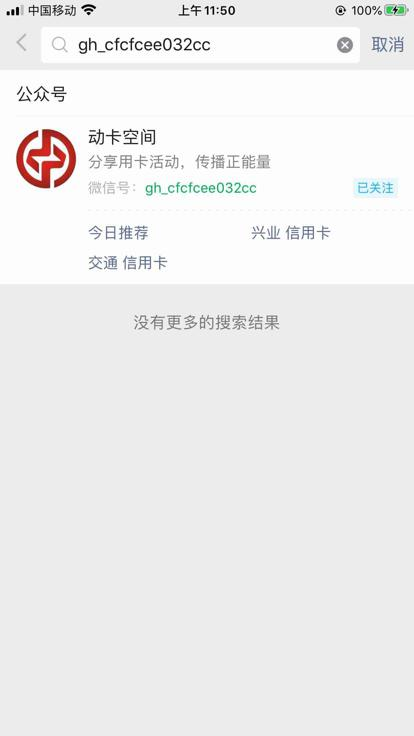
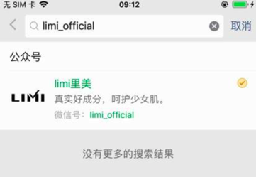

# 微信公众号

此处整理微信中关于微信公众号的部分的常见代码段。

## isPublicAccountSearchPage_iOS 判断是否处于微信公众号搜索页

```python
def isPublicAccountSearchPage_iOS(self, page):
    """Check whether current page is Weixin Public account search page"""
    isPublicAccountSearch = False
    curInputValue = ""

    """
        is search:
            <XCUIElementTypeImage type="XCUIElementTypeImage" enabled="true" visible="true" x="0" y="0" width="414" height="70">
                <XCUIElementTypeButton type="XCUIElementTypeButton" name="返回" label="返回" enabled="true" visible="true" x="0" y="20" width="33" height="50"/>
                <XCUIElementTypeOther type="XCUIElementTypeOther" enabled="true" visible="true" x="33" y="20" width="381" height="56">
                    <XCUIElementTypeOther type="XCUIElementTypeOther" enabled="true" visible="true" x="33" y="20" width="381" height="50">
                        <XCUIElementTypeImage type="XCUIElementTypeImage" enabled="true" visible="false" x="33" y="0" width="381" height="70"/>
                        <XCUIElementTypeOther type="XCUIElementTypeOther" enabled="true" visible="true" x="33" y="20" width="381" height="50">
                            <XCUIElementTypeSearchField type="XCUIElementTypeSearchField" name="搜索" label="搜索" enabled="true" visible="true" x="41" y="27" width="319" height="36"/>
                            <XCUIElementTypeButton type="XCUIElementTypeButton" name="取消" label="取消" enabled="true" visible="true" x="371" y="29" width="35" height="30">
                                <XCUIElementTypeStaticText type="XCUIElementTypeStaticText" value="取消" name="取消" label="取消" enabled="true" visible="true" x="371" y="33" width="35" height="22"/>
                            </XCUIElementTypeButton>
                        </XCUIElementTypeOther>
                    </XCUIElementTypeOther>
                </XCUIElementTypeOther>
            </XCUIElementTypeImage>

            <XCUIElementTypeImage type="XCUIElementTypeImage" enabled="true" visible="true" x="0" y="0" width="414" height="70">
            <XCUIElementTypeButton type="XCUIElementTypeButton" name="返回" label="返回" enabled="true" visible="true" x="0" y="20" width="33" height="50"/>
            <XCUIElementTypeOther type="XCUIElementTypeOther" enabled="true" visible="true" x="33" y="20" width="381" height="56">
                <XCUIElementTypeOther type="XCUIElementTypeOther" enabled="true" visible="true" x="33" y="20" width="381" height="50">
                <XCUIElementTypeImage type="XCUIElementTypeImage" enabled="true" visible="false" x="33" y="0" width="381" height="70"/>
                <XCUIElementTypeOther type="XCUIElementTypeOther" enabled="true" visible="true" x="33" y="20" width="381" height="50">
                    <XCUIElementTypeSearchField type="XCUIElementTypeSearchField" value="gh_cfcfcee032cc" name="搜索" label="搜索" enabled="true" visible="true" x="41" y="27" width="319" height="36">
                    <XCUIElementTypeButton type="XCUIElementTypeButton" name="清除文本" label="清除文本" enabled="true" visible="true" x="335" y="35" width="20" height="20"/>
                    </XCUIElementTypeSearchField>
                    <XCUIElementTypeButton type="XCUIElementTypeButton" name="取消" label="取消" enabled="true" visible="true" x="371" y="29" width="35" height="30">
                    <XCUIElementTypeStaticText type="XCUIElementTypeStaticText" value="取消" name="取消" label="取消" enabled="true" visible="true" x="371" y="33" width="35" height="22"/>
                    </XCUIElementTypeButton>
                </XCUIElementTypeOther>
                </XCUIElementTypeOther>
            </XCUIElementTypeOther>
            </XCUIElementTypeImage>

            <XCUIElementTypeImage type="XCUIElementTypeImage" enabled="true" visible="true" x="0" y="0" width="414" height="70">
            <XCUIElementTypeButton type="XCUIElementTypeButton" name="返回" label="返回" enabled="true" visible="true" x="0" y="20" width="33" height="50"/>
            <XCUIElementTypeOther type="XCUIElementTypeOther" enabled="true" visible="true" x="33" y="20" width="381" height="56">
                <XCUIElementTypeOther type="XCUIElementTypeOther" enabled="true" visible="true" x="33" y="20" width="381" height="50">
                <XCUIElementTypeImage type="XCUIElementTypeImage" enabled="true" visible="false" x="33" y="0" width="381" height="70"/>
                <XCUIElementTypeOther type="XCUIElementTypeOther" enabled="true" visible="true" x="33" y="20" width="381" height="50">
                    <XCUIElementTypeSearchField type="XCUIElementTypeSearchField" value="gh_cfcfcee032cc" name="搜索" label="搜索" enabled="true" visible="true" x="41" y="27" width="319" height="36">
                    <XCUIElementTypeButton type="XCUIElementTypeButton" name="清除文本" label="清除文本" enabled="true" visible="false" x="335" y="35" width="20" height="20"/>
                    </XCUIElementTypeSearchField>
                    <XCUIElementTypeButton type="XCUIElementTypeButton" name="取消" label="取消" enabled="true" visible="true" x="371" y="29" width="35" height="30">
                    <XCUIElementTypeStaticText type="XCUIElementTypeStaticText" value="取消" name="取消" label="取消" enabled="true" visible="true" x="371" y="33" width="35" height="22"/>
                    </XCUIElementTypeButton>
                </XCUIElementTypeOther>
                </XCUIElementTypeOther>
            </XCUIElementTypeOther>
            </XCUIElementTypeImage>
    """
    soup = CommonUtils.xmlToSoup(page)
    widthStr = str(self.X)
    foundImage = soup.find(
        'XCUIElementTypeImage',
        attrs={"type":"XCUIElementTypeImage", "enabled":"true", "x":"0", "y":"0", "width":widthStr},
    )
    if foundImage:
        foundSearchField = foundImage.find("XCUIElementTypeSearchField",
            attrs={"type": "XCUIElementTypeSearchField", "name":"搜索", "label":"搜索", "enabled":"true"}
        )
        if foundSearchField:
            isPublicAccountSearch = True
            # curInputValue = foundSearchField.attrs["value"]
            curInputValue = foundSearchField.attrs.get("value")

    return isPublicAccountSearch, curInputValue
```

## isPublicAccountFocusOrIntoPage_iOS

```python
def isPublicAccountFocusOrIntoPage_iOS(self, page):
    """Check whether current page is Weixin Public focus or enter into page"""
    isPublicAccountFocusOrInto = False

    """
        is Focus:
            <XCUIElementTypeNavigationBar type="XCUIElementTypeNavigationBar" name="通讯录" enabled="true" visible="true" x="0" y="20" width="414" height="44">
                <XCUIElementTypeButton type="XCUIElementTypeButton" name="返回" label="返回" enabled="true" visible="true" x="20" y="20" width="30" height="44"/>
                <XCUIElementTypeOther type="XCUIElementTypeOther" enabled="true" visible="false" x="206" y="24" width="2" height="36"/>
                <XCUIElementTypeButton type="XCUIElementTypeButton" name="搜索" label="搜索" enabled="true" visible="true" x="306" y="20" width="40" height="44"/>
                <XCUIElementTypeButton type="XCUIElementTypeButton" name="更多" label="更多" enabled="true" visible="true" x="354" y="20" width="40" height="44"/>
            </XCUIElementTypeNavigationBar>

                    <XCUIElementTypeTable type="XCUIElementTypeTable" enabled="true" visible="true" x="0" y="0" width="414" height="736">
                        <XCUIElementTypeButton type="XCUIElementTypeButton" name="头像" label="头像" enabled="true" visible="true" x="20" y="76" width="69" height="69"/>
                        <XCUIElementTypeStaticText type="XCUIElementTypeStaticText" value="动卡空间" name="动卡空间" label="动卡空间" enabled="true" visible="false" x="108" y="74" width="82" height="24"/>
                        <XCUIElementTypeImage type="XCUIElementTypeImage" enabled="true" visible="false" x="194" y="78" width="16" height="17"/>
                        <XCUIElementTypeButton type="XCUIElementTypeButton" name="分享用卡活动，传播正能量" label="分享用卡活动，传播正能量" enabled="true" visible="true" x="108" y="108" width="270" height="17">
                            <XCUIElementTypeStaticText type="XCUIElementTypeStaticText" value="分享用卡活动，传播正能量" name="分享用卡活动，传播正能量" label="分享用卡活动，传播正能量" enabled="true" visible="false" x="108" y="108" width="172" height="17"/>
                        </XCUIElementTypeButton>
                        <XCUIElementTypeStaticText type="XCUIElementTypeStaticText" value="2位朋友关注" name="2位朋友关注" label="2位朋友关注" enabled="true" visible="true" x="108" y="135" width="82" height="17"/>
                        <XCUIElementTypeButton type="XCUIElementTypeButton" name="关注公众号" label="关注公众号" enabled="true" visible="true" x="166" y="177" width="82" height="20">
                            <XCUIElementTypeStaticText type="XCUIElementTypeStaticText" value="关注公众号" name="关注公众号" label="关注公众号" enabled="true" visible="false" x="166" y="176" width="83" height="21"/>
                        </XCUIElementTypeButton>
                        <XCUIElementTypeButton type="XCUIElementTypeButton" name="进入公众号" label="进入公众号" enabled="true" visible="false" x="0" y="177" width="82" height="20">
                            <XCUIElementTypeStaticText type="XCUIElementTypeStaticText" value="进入公众号" name="进入公众号" label="进入公众号" enabled="true" visible="false" x="0" y="176" width="82" height="21"/>
                        </XCUIElementTypeButton>
                        <XCUIElementTypeButton type="XCUIElementTypeButton" name="不再关注" label="不再关注" enabled="true" visible="false" x="0" y="177" width="66" height="20">
                            <XCUIElementTypeStaticText type="XCUIElementTypeStaticText" value="不再关注" name="不再关注" label="不再关注" enabled="true" visible="false" x="-1" y="176" width="67" height="21"/>
                        </XCUIElementTypeButton>

        is enter into:
            <XCUIElementTypeNavigationBar type="XCUIElementTypeNavigationBar" name="通讯录" enabled="true" visible="true" x="0" y="20" width="414" height="44">
                <XCUIElementTypeButton type="XCUIElementTypeButton" name="返回" label="返回" enabled="true" visible="true" x="20" y="20" width="30" height="44"/>
                <XCUIElementTypeOther type="XCUIElementTypeOther" enabled="true" visible="false" x="206" y="24" width="2" height="36"/>
                <XCUIElementTypeButton type="XCUIElementTypeButton" name="搜索" label="搜索" enabled="true" visible="true" x="306" y="20" width="40" height="44"/>
                <XCUIElementTypeButton type="XCUIElementTypeButton" name="更多" label="更多" enabled="true" visible="true" x="354" y="20" width="40" height="44"/>
            </XCUIElementTypeNavigationBar>

                <XCUIElementTypeTable type="XCUIElementTypeTable" enabled="true" visible="true" x="0" y="0" width="414" height="736">
                    <XCUIElementTypeButton type="XCUIElementTypeButton" name="头像" label="头像" enabled="true" visible="true" x="20" y="76" width="69" height="69"/>
                    <XCUIElementTypeStaticText type="XCUIElementTypeStaticText" value="动卡空间" name="动卡空间" label="动卡空间" enabled="true" visible="false" x="108" y="74" width="82" height="24"/>
                    <XCUIElementTypeImage type="XCUIElementTypeImage" enabled="true" visible="false" x="194" y="78" width="16" height="17"/>
                    <XCUIElementTypeButton type="XCUIElementTypeButton" name="分享用卡活动，传播正能量" label="分享用卡活动，传播正能量" enabled="true" visible="true" x="108" y="108" width="270" height="17">
                        <XCUIElementTypeStaticText type="XCUIElementTypeStaticText" value="分享用卡活动，传播正能量" name="分享用卡活动，传播正能量" label="分享用卡活动，传播正能量" enabled="true" visible="false" x="108" y="108" width="172" height="17"/>
                    </XCUIElementTypeButton>
                    <XCUIElementTypeStaticText type="XCUIElementTypeStaticText" value="2位朋友关注" name="2位朋友关注" label="2位朋友关注" enabled="true" visible="true" x="108" y="135" width="82" height="17"/>
                    <XCUIElementTypeButton type="XCUIElementTypeButton" enabled="true" visible="false" x="0" y="177" width="0" height="0">
                        <XCUIElementTypeStaticText type="XCUIElementTypeStaticText" enabled="true" visible="false" x="0" y="177" width="0" height="0"/>
                    </XCUIElementTypeButton>
                    <XCUIElementTypeButton type="XCUIElementTypeButton" name="进入公众号" label="进入公众号" enabled="true" visible="true" x="95" y="177" width="82" height="20">
                        <XCUIElementTypeStaticText type="XCUIElementTypeStaticText" value="进入公众号" name="进入公众号" label="进入公众号" enabled="true" visible="false" x="95" y="176" width="83" height="21"/>
                    </XCUIElementTypeButton>
                    <XCUIElementTypeButton type="XCUIElementTypeButton" name="不再关注" label="不再关注" enabled="true" visible="true" x="237" y="177" width="66" height="20">
                        <XCUIElementTypeStaticText type="XCUIElementTypeStaticText" value="不再关注" name="不再关注" label="不再关注" enabled="true" visible="false" x="236" y="176" width="67" height="21"/>
                    </XCUIElementTypeButton>

    """
    soup = CommonUtils.xmlToSoup(page)
    foundNaviBar = soup.find(
        'XCUIElementTypeNavigationBar',
        attrs={"type":"XCUIElementTypeNavigationBar", "enabled":"true"},
    )
    # logging.debug("foundNaviBar=%s", foundNaviBar)
    if foundNaviBar:
        foundTypeOther = foundNaviBar.find("XCUIElementTypeOther",
            attrs={"type": "XCUIElementTypeOther", "enabled":"true"}
        )
        logging.debug("foundTypeOther=%s", foundTypeOther)
        if foundTypeOther:
            # typeOtherName = foundTypeOther.attrs["name"]
            typeOtherName = foundTypeOther.attrs.get("name")
            logging.debug("typeOtherName=%s", typeOtherName)
            isTypeOtherNameNotEmpty = bool(typeOtherName)
            isTypeOtherNameEmpty = not isTypeOtherNameNotEmpty
            logging.debug("isTypeOtherNameEmpty=%s", isTypeOtherNameEmpty)
            if isTypeOtherNameEmpty:
                foundIntoAccount = soup.find(
                    'XCUIElementTypeButton',
                    attrs={"type":"XCUIElementTypeButton", "enabled":"true", "name":"进入公众号", "label":"进入公众号"},
                )
                logging.debug("foundIntoAccount=%s", foundIntoAccount)
                if foundIntoAccount:
                    prevSiblingList = foundIntoAccount.previous_siblings
                    logging.debug("prevSiblingList=%s", prevSiblingList)
                    curAccountZhcnName = self.account_zw
                    TypeStaticText = "XCUIElementTypeStaticText"
                    for eachPrevSibling in prevSiblingList:
                        # curType = eachPrevSibling.attrs["type"]
                        # curName = eachPrevSibling.attrs["name"]
                        # curType = eachPrevSibling.attrs.get("type")
                        # curName = eachPrevSibling.attrs.get("name")
                        if hasattr(eachPrevSibling, "attrs"):
                            curType = eachPrevSibling.attrs.get("type")
                            curName = eachPrevSibling.attrs.get("name")
                            if (curType == TypeStaticText) and (curName == curAccountZhcnName):
                                isPublicAccountFocusOrInto = True
                        else:
                            logging.debug("eachPrevSibling=%s no attrs", eachPrevSibling)

    logging.debug("isPublicAccountFocusOrInto=%s", isPublicAccountFocusOrInto)
    return isPublicAccountFocusOrInto
```

调用：

```python
def isCurPageInOffline_iOS(self, page):
    """Check whether current page is belong to (unexpeced) offiline page

        offline page include:
            * 微信首页
            * 微信通讯录
            * 微信公众号列表页
            * 微信公众号搜索-待输入
            * 微信公众号搜索-输入公众号ID
            * 微信公众号搜索-搜索结果
            * 微信公众号-关注公众号
            * 微信公众号-进入公众号
    """
    isOffline = False

    OfflinePageNaviBarNameList = [
        "微信",
        "通讯录",
        "公众号",
    ]
    hasNaviBar, naviBarName = self.isPageHasNaviBar_iOS(page)
    if hasNaviBar:
        if naviBarName in OfflinePageNaviBarNameList:
            # is in some weixin page
            isOffline = True

    if not isOffline:
        isPublicAccountSearch, curInputValue = self.isPublicAccountSearchPage_iOS(page)
        if isPublicAccountSearch:
            # is in public account search page
            isOffline = True

    if not isOffline:
        isPublicAccountFocusOrIntoPage = self.isPublicAccountFocusOrIntoPage_iOS(page)
        if isPublicAccountFocusOrIntoPage:
            # is in public account focus or enter into page
            isOffline = True

    return isOffline
```

## findWeixinPublicAccountZhcnFullName 微信公众号搜索结果列表页 查找 微信公众号的中文（全）名

对于页面：






从中查找出 公众号的中文名（的全称）

```python
# def findWeixinPublicAccountZhcnSoup(self, soup, curAccountId):
def findWeixinPublicAccountZhcnFullName(self, soup, curAccountId):
    """Find weixin public account element's zh-CN full name

    Args:
        soup (soup): soup of current page xml
    Returns:
        public account zh-CN full name
    Raises:
    """
    # accountZhcnTextSoup = None
    accountZhcnFullName = ""
    parentNodeLocator = None

    """
        搜索结果中文名节点是Text
            <XCUIElementTypeOther type="XCUIElementTypeOther" name="搜一搜" label="搜一搜" enabled="true" visible="true" x="0" y="70" width="414" height="666">
                <XCUIElementTypeOther type="XCUIElementTypeOther" value="2" name="公众号" label="公众号" enabled="true" visible="true" x="16" y="83" width="398" height="23">
                    <XCUIElementTypeOther type="XCUIElementTypeOther" value="2" enabled="true" visible="true" x="16" y="83" width="52" height="23">
                        <XCUIElementTypeStaticText type="XCUIElementTypeStaticText" value="2" name="公众号" label="公众号" enabled="true" visible="true" x="16" y="83" width="52" height="22"/>
                    </XCUIElementTypeOther>
                </XCUIElementTypeOther>
                <XCUIElementTypeOther type="XCUIElementTypeOther" enabled="true" visible="false" x="16" y="129" width="60" height="60"/>
                <XCUIElementTypeOther type="XCUIElementTypeOther" enabled="true" visible="true" x="88" y="126" width="310" height="23">
                    <XCUIElementTypeStaticText type="XCUIElementTypeStaticText" value="动卡空间" name="动卡空间" label="动卡空间" enabled="true" visible="true" x="88" y="126" width="70" height="22"/>
                </XCUIElementTypeOther>
                <XCUIElementTypeOther type="XCUIElementTypeOther" enabled="true" visible="true" x="88" y="151" width="310" height="21">
                    <XCUIElementTypeStaticText type="XCUIElementTypeStaticText" value="分享用卡活动，传播正能量" name="分享用卡活动，传播正能量" label="分享用卡活动，传播正能量" enabled="true" visible="true" x="88" y="152" width="184" height="19"/>
                </XCUIElementTypeOther>
                <XCUIElementTypeOther type="XCUIElementTypeOther" enabled="true" visible="true" x="88" y="178" width="266" height="20">
                    <XCUIElementTypeStaticText type="XCUIElementTypeStaticText" value="微信号：" name="微信号：" label="微信号：" enabled="true" visible="true" x="88" y="178" width="58" height="19"/>
                    <XCUIElementTypeStaticText type="XCUIElementTypeStaticText" value="gh_cfcfcee032cc" name="gh_cfcfcee032cc" label="gh_cfcfcee032cc" enabled="true" visible="true" x="145" y="178" width="112" height="19"/>
                </XCUIElementTypeOther>
        
        搜索结果中文名节点是Other，其下是多个Text节点：
            <XCUIElementTypeOther type="XCUIElementTypeOther" name="搜一搜" label="搜一搜" enabled="true" visible="true" x="0" y="70" width="375" height="600">
                <XCUIElementTypeOther type="XCUIElementTypeOther" value="2" name="公众号" label="公众号" enabled="true" visible="true" x="16" y="83" width="359" height="23">
                    <XCUIElementTypeStaticText type="XCUIElementTypeStaticText" value="2" name="公众号" label="公众号" enabled="true" visible="true" x="16" y="83" width="52" height="23"/>
                </XCUIElementTypeOther>
                <XCUIElementTypeOther type="XCUIElementTypeOther" enabled="true" visible="false" x="16" y="129" width="60" height="60"/>
                <XCUIElementTypeImage type="XCUIElementTypeImage" enabled="true" visible="true" x="343" y="128" width="16" height="16"/>
                <XCUIElementTypeImage type="XCUIElementTypeImage" enabled="true" visible="true" x="324" y="128" width="16" height="16"/>
                <XCUIElementTypeOther type="XCUIElementTypeOther" enabled="true" visible="true" x="88" y="126" width="271" height="23">
                    <XCUIElementTypeStaticText type="XCUIElementTypeStaticText" value="牛尔" name="牛尔" label="牛尔" enabled="true" visible="true" x="88" y="126" width="35" height="22"/>
                    <XCUIElementTypeStaticText type="XCUIElementTypeStaticText" value="Tmall" name="Tmall" label="Tmall" enabled="true" visible="true" x="122" y="126" width="41" height="22"/>
                    <XCUIElementTypeStaticText type="XCUIElementTypeStaticText" value="旗舰店" name="旗舰店" label="旗舰店" enabled="true" visible="true" x="162" y="126" width="53" height="22"/>
                </XCUIElementTypeOther>
                <XCUIElementTypeOther type="XCUIElementTypeOther" enabled="true" visible="true" x="88" y="151" width="271" height="21">
                    <XCUIElementTypeStaticText type="XCUIElementTypeStaticText" value="牛尔亲研天猫官方旗舰店" name="牛尔亲研天猫官方旗舰店" label="牛尔亲研天猫官方旗舰店" enabled="true" visible="true" x="88" y="152" width="169" height="19"/>
                </XCUIElementTypeOther>
                <XCUIElementTypeOther type="XCUIElementTypeOther" enabled="true" visible="true" x="88" y="178" width="271" height="19">
                    <XCUIElementTypeStaticText type="XCUIElementTypeStaticText" value="微信号：" name="微信号：" label="微信号：" enabled="true" visible="true" x="88" y="178" width="58" height="18"/>
                    <XCUIElementTypeStaticText type="XCUIElementTypeStaticText" value="niuer-tmall" name="niuer-tmall" label="niuer-tmall" enabled="true" visible="true" x="145" y="178" width="70" height="18"/>
                </XCUIElementTypeOther>

        公众号中文名全部是绿色的：
            <XCUIElementTypeOther type="XCUIElementTypeOther" name="搜一搜" label="搜一搜" enabled="true" visible="true" x="0" y="70" width="414" height="666">
                <XCUIElementTypeOther type="XCUIElementTypeOther" value="2" name="公众号" label="公众号" enabled="true" visible="true" x="16" y="83" width="398" height="23">
                    <XCUIElementTypeOther type="XCUIElementTypeOther" value="2" enabled="true" visible="true" x="16" y="83" width="52" height="23">
                        <XCUIElementTypeStaticText type="XCUIElementTypeStaticText" value="2" name="公众号" label="公众号" enabled="true" visible="true" x="16" y="83" width="52" height="22"/>
                    </XCUIElementTypeOther>
                </XCUIElementTypeOther>
                <XCUIElementTypeOther type="XCUIElementTypeOther" enabled="true" visible="false" x="16" y="129" width="60" height="60"/>
                <XCUIElementTypeImage type="XCUIElementTypeImage" enabled="true" visible="true" x="382" y="128" width="16" height="16"/>
                <XCUIElementTypeOther type="XCUIElementTypeOther" enabled="true" visible="true" x="88" y="126" width="310" height="23">
                    <XCUIElementTypeStaticText type="XCUIElementTypeStaticText" value="limi里美" name="limi里美" label="limi里美" enabled="true" visible="true" x="88" y="126" width="61" height="22"/>
                </XCUIElementTypeOther>
                <XCUIElementTypeOther type="XCUIElementTypeOther" enabled="true" visible="true" x="88" y="151" width="310" height="21">
                    <XCUIElementTypeStaticText type="XCUIElementTypeStaticText" value="真实好成分，呵护少女肌。" name="真实好成分，呵护少女肌。" label="真实好成分，呵护少女肌。" enabled="true" visible="true" x="88" y="152" width="184" height="19"/>
                </XCUIElementTypeOther>
                <XCUIElementTypeOther type="XCUIElementTypeOther" enabled="true" visible="true" x="88" y="178" width="310" height="19">
                    <XCUIElementTypeStaticText type="XCUIElementTypeStaticText" value="微信号：" name="微信号：" label="微信号：" enabled="true" visible="true" x="88" y="178" width="58" height="18"/>
                    <XCUIElementTypeStaticText type="XCUIElementTypeStaticText" value="limi_official" name="limi_official" label="limi_official" enabled="true" visible="true" x="145" y="178" width="72" height="18"/>
                </XCUIElementTypeOther>
                <XCUIElementTypeOther type="XCUIElementTypeOther" enabled="true" visible="false" x="0" y="0" width="0" height="0"/>
                <XCUIElementTypeOther type="XCUIElementTypeOther" enabled="true" visible="true" x="0" y="237" width="414" height="25">
                    <XCUIElementTypeStaticText type="XCUIElementTypeStaticText" value="没有更多的搜索结果" name="没有更多的搜索结果" label="没有更多的搜索结果" enabled="true" visible="true" x="133" y="239" width="148" height="20"/>
                </XCUIElementTypeOther>
            </XCUIElementTypeOther>
    """
    foundAccountId = soup.find(
        'XCUIElementTypeStaticText',
        attrs={"value": curAccountId, "name": curAccountId, "type": "XCUIElementTypeStaticText"},
    )
    logging.debug("foundAccountId=%s", foundAccountId)
    # foundAccountId=<XCUIElementTypeStaticText enabled="true" height="18" label="gh_cfcfcee032cc" name="gh_cfcfcee032cc" type="XCUIElementTypeStaticText" value="gh_cfcfcee032cc" visible="true" width="112" x="145" y="178"/>
    if foundAccountId:
        idParent = foundAccountId.parent
        logging.debug("idParent=%s", idParent)
        if idParent:
            # method 1: two prev.prev
            # # idParentPrev = idParent.previous_sibling
            # idParentPrev = idParent.previous_sibling.previous_sibling
            # accountDescNode = idParentPrev
            # logging.info("accountDescNode=%s", accountDescNode) # '\n'
            # if accountDescNode:
            #     # accountZhcnNode = accountDescNode.previous_sibling
            #     accountZhcnNode = accountDescNode.previous_sibling.previous_sibling
            #     logging.info("accountZhcnNode=%s", accountZhcnNode)

            # # method 2: siblings[-2] of XCUIElementTypeOther
            # idParentPrevSiblingList = idParent.previous_siblings

            # accountDescNode = None
            # accountZhcnNode = None

            # TypeOther = "XCUIElementTypeOther"
            # typeOtherNodeCurIdx = 0
            # AccountDescNodeIdx = 1
            # AccountZhcnNodeIdx = 2

            # for eachPrevSiblingNode in idParentPrevSiblingList:
            #     curNodeName = eachPrevSiblingNode.name
            #     isTypeOtherNode = curNodeName == TypeOther
            #     if isTypeOtherNode:
            #         typeOtherNodeCurIdx += 1

            #         if AccountDescNodeIdx == typeOtherNodeCurIdx:
            #             accountDescNode = eachPrevSiblingNode
            #         elif AccountZhcnNodeIdx == typeOtherNodeCurIdx:
            #             accountZhcnNode = eachPrevSiblingNode
                
            #     hasFoundAll = accountDescNode and accountZhcnNode
            #     if hasFoundAll:
            #         break
            
            # logging.info("accountDescNode=%s", accountDescNode)
            # logging.info("accountZhcnNode=%s", accountZhcnNode)

            # if accountZhcnNode:
            #     accountZhcnTextSoup = accountZhcnNode.find(
            #         'XCUIElementTypeStaticText',
            #         attrs={ "type": "XCUIElementTypeStaticText"},
            #     )

            # method 3: parent'parent is 搜一搜, direct child 2nd XCUIElementTypeOther of enabled="true" visible="true"
            idParentParent = idParent.parent
            if idParentParent:
                otherSoupList = idParentParent.find_all(
                    "XCUIElementTypeOther",
                    attrs={"type": "XCUIElementTypeOther", "enabled":"true", "visible":"true"},
                    recursive=False,
                )
                if otherSoupList and (len(otherSoupList) >= 2):
                    firstOtherSoup = otherSoupList[0]
                    if firstOtherSoup.attrs["name"] == "公众号":
                        secondOtherSoup = otherSoupList[1]
                        zhcnNameSoupList = secondOtherSoup.find_all(
                            "XCUIElementTypeStaticText",
                            attrs={"type": "XCUIElementTypeStaticText", "enabled":"true", "visible":"true"},
                        )
                        if zhcnNameSoupList:
                            for eachTextSoup in zhcnNameSoupList:
                                curPartName = eachTextSoup.attrs.get("value")
                                accountZhcnFullName += curPartName
                            
                            if accountZhcnFullName:
                                secondOtherAttrDict = secondOtherSoup.attrs
                                parentX = secondOtherAttrDict["x"]
                                parentY = secondOtherAttrDict["y"]
                                parentWidth = secondOtherAttrDict["width"]
                                parentHeight = secondOtherAttrDict["height"]
                                parentNodeLocator = {
                                    "type": "XCUIElementTypeOther",
                                    "enabled": "true",
                                    "visible": "true",
                                    "x": parentX,
                                    "y": parentY,
                                    "width": parentWidth,
                                    "height": parentHeight,
                                }

    # return accountZhcnTextSoup
    # return accountZhcnFullName
    return accountZhcnFullName, parentNodeLocator
```

调用举例：

```python
curAccountId = "gh_cfcfcee032cc"
curPageXml = self.get_page_source()
soup = CommonUtils.xmlToSoup(curPageXml)

accountZhcnName, parentNodeLocator = self.findWeixinPublicAccountZhcnFullName(soup, curAccountId)
```
