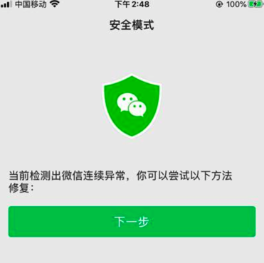
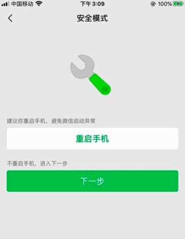
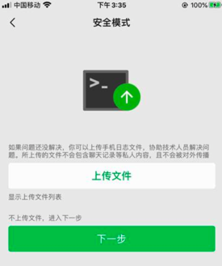
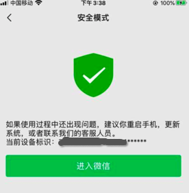

# 安全模式

## 背景

在`facebook-wda`调试期间，通过代码控制微信app的退出和启动，多次如此调试后就会导致微信检测到以为发生了多次的异常，所以会进入**安全模式**。

此时只能根据提示，一次次点击`下一步`，才能最终退出`安全模式`：










详见：

【已解决】自动抓包工具适配iOS：当前检测出微信连续异常，你可以尝试一下方法修复 下一步

## 代码：`iOSWeixinExceptionNextStep`

自动检测是否处于`安全模式`，并自动点击直到退出`安全模式`的代码如下，供参考：

```python
def iOSMakesureIntoWeixin(self):
    """Makesure into weixin main page
        if exception, process it, until into weixin page
    """
    # maxRetryNum = 3
    maxRetryNum = 5
    beInWeixin = self.iOSisInWeixin()

    while (not beInWeixin) and (maxRetryNum > 0):
        beInWeixin = self.iOSisInWeixin()
        if not beInWeixin:
            # try process for exception
            foundAndProcessedException = self.iOSWeixinExceptionNextStep()
            if foundAndProcessedException:
                beInWeixin = self.iOSisInWeixin()

        maxRetryNum -= 1

    return beInWeixin

def iOSWeixinExceptionNextStep(self):
    foundAndClicked = False

    scrollViewClassChain = "/XCUIElementTypeScrollView[`rect.width = %d AND rect.height = %d`]" % (self.X, self.totalY)

    ButtonLabelNextStep = "下一步"
    ButtonLabelIntoWeixin = "进入微信"

    # nextStepButtonQuery = {"type":"XCUIElementTypeButton", "label": "下一步", "enabled": "true"}
    # nextStepButtonQuery["parent_class_chains"] = [scrollViewClassChain]

    # intoWeixinButtonQuery = {"type":"XCUIElementTypeButton", "label": "进入微信", "enabled": "true"}
    # intoWeixinButtonQuery["parent_class_chains"] = [scrollViewClassChain]

    """
        <XCUIElementTypeScrollView type="XCUIElementTypeScrollView" enabled="true" visible="true" x="0" y="0" width="414" height="736">
            <XCUIElementTypeImage type="XCUIElementTypeImage" enabled="true" visible="false" x="147" y="106" width="120" height="120"/>
            <XCUIElementTypeStaticText type="XCUIElementTypeStaticText" value="当前检测出微信连续异常，你可以尝试以下方法修复：" name="当前检测出微信连续异常，你可以尝试以下方法修复：" label="当前检测出微信连续异常，你可以尝试以下方法修复：" enabled="true" visible="true" x="18" y="262" width="378" height="39"/>
            <XCUIElementTypeButton type="XCUIElementTypeButton" name="下一步" label="下一步" enabled="true" visible="true" x="18" y="319" width="378" height="47">
                <XCUIElementTypeStaticText type="XCUIElementTypeStaticText" value="下一步" name="下一步" label="下一步" enabled="true" visible="true" x="179" y="331" width="56" height="23"/>
            </XCUIElementTypeButton>
        </XCUIElementTypeScrollView>
    """
    # continousExceptionQuery = {"type":"XCUIElementTypeStaticText", "value": "当前检测出微信连续异常，你可以尝试以下方法修复：", "enabled": "true"}
    # continousExceptionQuery["parent_class_chains"] = [scrollViewClassChain]
    # isFoundContinousException, respInfo = self.findElement(query=continousExceptionQuery, timeout=0.5)
    # if isFoundContinousException:
    #     isFoundNextStep, respInfo = self.findElement(query=nextStepButtonQuery)
    #     if isFoundNextStep:
    #         nextStepElement = respInfo
    #         foundAndClicked = self.clickElement(nextStepElement)

    """
        <XCUIElementTypeScrollView type="XCUIElementTypeScrollView" enabled="true" visible="true" x="0" y="0" width="414" height="736">
            <XCUIElementTypeImage type="XCUIElementTypeImage" enabled="true" visible="false" x="147" y="106" width="120" height="120"/>
            <XCUIElementTypeStaticText type="XCUIElementTypeStaticText" value="建议你重启手机，避免微信启动异常" name="建议你重启手机，避免微信启动异常" label="建议你重启手机，避免微信启动异常" enabled="true" visible="true" x="18" y="262" width="378" height="15"/>
            <XCUIElementTypeButton type="XCUIElementTypeButton" name="重启手机" label="重启手机" enabled="true" visible="true" x="18" y="285" width="378" height="47">
                <XCUIElementTypeStaticText type="XCUIElementTypeStaticText" value="重启手机" name="重启手机" label="重启手机" enabled="true" visible="true" x="170" y="297" width="74" height="23"/>
            </XCUIElementTypeButton>
            <XCUIElementTypeStaticText type="XCUIElementTypeStaticText" value="不重启手机，进入下一步" name="不重启手机，进入下一步" label="不重启手机，进入下一步" enabled="true" visible="true" x="18" y="356" width="378" height="15"/>
            <XCUIElementTypeButton type="XCUIElementTypeButton" name="下一步" label="下一步" enabled="true" visible="true" x="18" y="379" width="378" height="47">
                <XCUIElementTypeStaticText type="XCUIElementTypeStaticText" value="下一步" name="下一步" label="下一步" enabled="true" visible="true" x="179" y="391" width="56" height="23"/>
            </XCUIElementTypeButton>
            <XCUIElementTypeOther type="XCUIElementTypeOther" value="0%" name="垂直滚动条, 1页" label="垂直滚动条, 1页" enabled="true" visible="true" x="381" y="64" width="30" height="672"/>
            <XCUIElementTypeOther type="XCUIElementTypeOther" value="0%" name="水平滚动条, 1页" label="水平滚动条, 1页" enabled="true" visible="true" x="0" y="703" width="414" height="30"/>
        </XCUIElementTypeScrollView>
    """
    # # if not foundAndClicked:
    # rebootWeixinQuery = {"type":"XCUIElementTypeStaticText", "value": "建议你重启手机，避免微信启动异常", "enabled": "true"}
    # rebootWeixinQuery["parent_class_chains"] = [scrollViewClassChain]
    # isFoundRebootWeixin, respInfo = self.findElement(query=rebootWeixinQuery, timeout=0.5)
    # if isFoundRebootWeixin:
    #     isFoundNextStep, respInfo = self.findElement(query=nextStepButtonQuery)
    #     if isFoundNextStep:
    #         nextStepElement = respInfo
    #         foundAndClicked = self.clickElement(nextStepElement)
    
    """
        <XCUIElementTypeScrollView type="XCUIElementTypeScrollView" enabled="true" visible="true" x="0" y="0" width="414" height="736">
            <XCUIElementTypeOther type="XCUIElementTypeOther" enabled="true" visible="true" x="0" y="64" width="414" height="243">
                <XCUIElementTypeImage type="XCUIElementTypeImage" enabled="true" visible="false" x="115" y="94" width="184" height="183"/>
                <XCUIElementTypeImage type="XCUIElementTypeImage" enabled="true" visible="false" x="115" y="94" width="184" height="183"/>
            </XCUIElementTypeOther>
            <XCUIElementTypeStaticText type="XCUIElementTypeStaticText" value="清理缓存会清理你的手机本地缓存文件，但不会清理你的消息数据，使用后需要重新登录微信" name="清理缓存会清理你的手机本地缓存文件，但不会清理你的消息数据，使用后需要重新登录微信" label="清理缓存会清理你的手机本地缓存文件，但不会清理你的消息数据，使用后需要重新登录微信" enabled="true" visible="true" x="18" y="330" width="378" height="29"/>
            <XCUIElementTypeButton type="XCUIElementTypeButton" name="清理缓存" label="清理缓存" enabled="true" visible="true" x="18" y="367" width="378" height="47">
                <XCUIElementTypeStaticText type="XCUIElementTypeStaticText" value="清理缓存" name="清理缓存" label="清理缓存" enabled="true" visible="true" x="170" y="379" width="74" height="23"/>
            </XCUIElementTypeButton>
            <XCUIElementTypeStaticText type="XCUIElementTypeStaticText" value="不清理缓存，进入下一步" name="不清理缓存，进入下一步" label="不清理缓存，进入下一步" enabled="true" visible="true" x="18" y="438" width="378" height="15"/>
            <XCUIElementTypeButton type="XCUIElementTypeButton" name="下一步" label="下一步" enabled="true" visible="true" x="18" y="461" width="378" height="47">
                <XCUIElementTypeStaticText type="XCUIElementTypeStaticText" value="下一步" name="下一步" label="下一步" enabled="true" visible="true" x="179" y="473" width="56" height="23"/>
            </XCUIElementTypeButton>
            <XCUIElementTypeOther type="XCUIElementTypeOther" value="0%" name="垂直滚动条, 1页" label="垂直滚动条, 1页" enabled="true" visible="true" x="381" y="64" width="30" height="672"/>
            <XCUIElementTypeOther type="XCUIElementTypeOther" value="0%" name="水平滚动条, 1页" label="水平滚动条, 1页" enabled="true" visible="true" x="0" y="703" width="414" height="30"/>
        </XCUIElementTypeScrollView>
    """
    # # if not foundAndClicked:
    # clearCacheQuery = {"type":"XCUIElementTypeStaticText", "value": "清理缓存会清理你的手机本地缓存文件，但不会清理你的消息数据，使用后需要重新登录微信", "enabled": "true"}
    # clearCacheQuery["parent_class_chains"] = [scrollViewClassChain]
    # isFoundClearCache, respInfo = self.findElement(query=clearCacheQuery, timeout=0.5)
    # if isFoundClearCache:
    #     isFoundNextStep, respInfo = self.findElement(query=nextStepButtonQuery)
    #     if isFoundNextStep:
    #         nextStepElement = respInfo
    #         foundAndClicked = self.clickElement(nextStepElement)
    
    """
        <XCUIElementTypeScrollView type="XCUIElementTypeScrollView" enabled="true" visible="true" x="0" y="0" width="414" height="736">
            <XCUIElementTypeImage type="XCUIElementTypeImage" enabled="true" visible="false" x="147" y="106" width="120" height="120"/>
            <XCUIElementTypeStaticText type="XCUIElementTypeStaticText" value="如果问题还没解决，你可以上传手机日志文件，协助技术人员解决问题。所上传的文件不会包含聊天记录等私人内容，且不会被对外传播" name="如果问题还没解决，你可以上传手机日志文件，协助技术人员解决问题。所上传的文件不会包含聊天记录等私人内容，且不会被对外传播" label="如果问题还没解决，你可以上传手机日志文件，协助技术人员解决问题。所上传的文件不会包含聊天记录等私人内容，且不会被对外传播" enabled="true" visible="true" x="18" y="262" width="378" height="29"/>
            <XCUIElementTypeButton type="XCUIElementTypeButton" name="上传文件" label="上传文件" enabled="true" visible="true" x="18" y="298" width="378" height="47">
                <XCUIElementTypeStaticText type="XCUIElementTypeStaticText" value="上传文件" name="上传文件" label="上传文件" enabled="true" visible="true" x="170" y="310" width="74" height="23"/>
            </XCUIElementTypeButton>
            <XCUIElementTypeButton type="XCUIElementTypeButton" name="显示上传文件列表" label="显示上传文件列表" enabled="true" visible="true" x="17" y="353" width="100" height="15">
                <XCUIElementTypeStaticText type="XCUIElementTypeStaticText" value="显示上传文件列表" name="显示上传文件列表" label="显示上传文件列表" enabled="true" visible="true" x="17" y="352" width="100" height="16"/>
            </XCUIElementTypeButton>
            <XCUIElementTypeStaticText type="XCUIElementTypeStaticText" value="不上传文件，进入下一步" name="不上传文件，进入下一步" label="不上传文件，进入下一步" enabled="true" visible="true" x="18" y="391" width="378" height="15"/>
            <XCUIElementTypeButton type="XCUIElementTypeButton" name="下一步" label="下一步" enabled="true" visible="true" x="18" y="413" width="378" height="47">
                <XCUIElementTypeStaticText type="XCUIElementTypeStaticText" value="下一步" name="下一步" label="下一步" enabled="true" visible="true" x="179" y="425" width="56" height="23"/>
            </XCUIElementTypeButton>
            <XCUIElementTypeOther type="XCUIElementTypeOther" value="0%" name="垂直滚动条, 1页" label="垂直滚动条, 1页" enabled="true" visible="true" x="381" y="64" width="30" height="672"/>
            <XCUIElementTypeOther type="XCUIElementTypeOther" value="0%" name="水平滚动条, 1页" label="水平滚动条, 1页" enabled="true" visible="true" x="0" y="703" width="414" height="30"/>
        </XCUIElementTypeScrollView>
    """

    """
        <XCUIElementTypeScrollView type="XCUIElementTypeScrollView" enabled="true" visible="true" x="0" y="0" width="414" height="736">
            <XCUIElementTypeImage type="XCUIElementTypeImage" enabled="true" visible="false" x="147" y="106" width="120" height="120"/>
            <XCUIElementTypeButton type="XCUIElementTypeButton" enabled="true" visible="true" x="147" y="106" width="120" height="120"/>
            <XCUIElementTypeStaticText type="XCUIElementTypeStaticText" value="如果使用过程中还出现问题，建议你重启手机，更新系统，或者联系我们的客服人员。 当前设备标识：7a3e060db5c52291******" name="如果使用过程中还出现问题，建议你重启手机，更新系统，或者联系我们的客服人员。 当前设备标识：7a3e060db5c52291******" label="如果使用过程中还出现问题，建议你重启手机，更新系统，或者联系我们的客服人员。 当前设备标识：7a3e060db5c52291******" enabled="true" visible="true" x="18" y="262" width="378" height="58"/>
            <XCUIElementTypeButton type="XCUIElementTypeButton" name="进入微信" label="进入微信" enabled="true" visible="true" x="18" y="338" width="378" height="47">
                <XCUIElementTypeStaticText type="XCUIElementTypeStaticText" value="进入微信" name="进入微信" label="进入微信" enabled="true" visible="true" x="170" y="350" width="74" height="23"/>
            </XCUIElementTypeButton>
            <XCUIElementTypeOther type="XCUIElementTypeOther" value="0%" name="垂直滚动条, 1页" label="垂直滚动条, 1页" enabled="true" visible="true" x="381" y="64" width="30" height="672"/>
            <XCUIElementTypeOther type="XCUIElementTypeOther" value="0%" name="水平滚动条, 1页" label="水平滚动条, 1页" enabled="true" visible="true" x="0" y="703" width="414" height="30"/>
        </XCUIElementTypeScrollView>
    """

    EachStepNoticeList = [
        # ("当前检测出微信连续异常，你可以尝试以下方法修复：", ButtonLabelNextStep),
        ("当前检测出微信连续异常", ButtonLabelNextStep),
        ("建议你重启手机，避免微信启动异常", ButtonLabelNextStep),
        ("清理缓存会清理你的手机本地缓存文件，但不会清理你的消息数据，使用后需要重新登录微信", ButtonLabelNextStep),
        ("如果问题还没解决，你可以上传手机日志文件，协助技术人员解决问题。所上传的文件不会包含聊天记录等私人内容，且不会被对外传播", ButtonLabelNextStep),
        ("如果使用过程中还出现问题，建议你重启手机，更新系统，或者联系我们的客服人员。", ButtonLabelIntoWeixin),
    ]
    for (curStepNotice, buttonLabel) in EachStepNoticeList:
        # curNoticeQuery = {"type":"XCUIElementTypeStaticText", "value": curStepNotice, "enabled": "true"}
        # curNoticeQuery = {"type":"XCUIElementTypeStaticText", "value_part": curStepNotice, "enabled": "true"}
        curNoticeQuery = {"type":"XCUIElementTypeStaticText", "valueContains": curStepNotice, "enabled": "true"}
        curNoticeQuery["parent_class_chains"] = [scrollViewClassChain]
        isFoundCurNotice, respInfo = self.findElement(query=curNoticeQuery, timeout=0.5)
        if isFoundCurNotice:
            # isFoundNextStep, respInfo = self.findElement(query=nextStepButtonQuery)
            # isFoundButton, respInfo = self.findElement(query=buttonQuery)
            buttonQuery = {"type":"XCUIElementTypeButton", "label": buttonLabel, "enabled": "true"}
            buttonQuery["parent_class_chains"] = [scrollViewClassChain]
            isFoundButton, respInfo = self.findElement(query=buttonQuery)
            if isFoundButton:
                buttonElement = respInfo
                clickOk = self.clickElement(buttonElement)
                if clickOk:
                    foundAndClicked = clickOk

    return foundAndClicked
```
