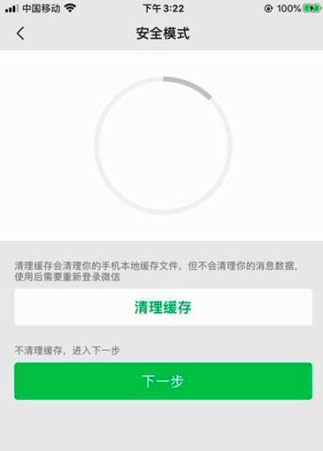

# 微信相关

## isPublicAccountSearchPage_iOS 判断是否处于微信公众号搜索页

```python
def isPublicAccountSearchPage_iOS(self, page):
    """Check whether current page is Weixin Public account search page"""
    isPublicAccountSearch = False
    curInputValue = ""

    """
        is search:
            <XCUIElementTypeImage type="XCUIElementTypeImage" enabled="true" visible="true" x="0" y="0" width="414" height="70">
                <XCUIElementTypeButton type="XCUIElementTypeButton" name="返回" label="返回" enabled="true" visible="true" x="0" y="20" width="33" height="50"/>
                <XCUIElementTypeOther type="XCUIElementTypeOther" enabled="true" visible="true" x="33" y="20" width="381" height="56">
                    <XCUIElementTypeOther type="XCUIElementTypeOther" enabled="true" visible="true" x="33" y="20" width="381" height="50">
                        <XCUIElementTypeImage type="XCUIElementTypeImage" enabled="true" visible="false" x="33" y="0" width="381" height="70"/>
                        <XCUIElementTypeOther type="XCUIElementTypeOther" enabled="true" visible="true" x="33" y="20" width="381" height="50">
                            <XCUIElementTypeSearchField type="XCUIElementTypeSearchField" name="搜索" label="搜索" enabled="true" visible="true" x="41" y="27" width="319" height="36"/>
                            <XCUIElementTypeButton type="XCUIElementTypeButton" name="取消" label="取消" enabled="true" visible="true" x="371" y="29" width="35" height="30">
                                <XCUIElementTypeStaticText type="XCUIElementTypeStaticText" value="取消" name="取消" label="取消" enabled="true" visible="true" x="371" y="33" width="35" height="22"/>
                            </XCUIElementTypeButton>
                        </XCUIElementTypeOther>
                    </XCUIElementTypeOther>
                </XCUIElementTypeOther>
            </XCUIElementTypeImage>

            <XCUIElementTypeImage type="XCUIElementTypeImage" enabled="true" visible="true" x="0" y="0" width="414" height="70">
            <XCUIElementTypeButton type="XCUIElementTypeButton" name="返回" label="返回" enabled="true" visible="true" x="0" y="20" width="33" height="50"/>
            <XCUIElementTypeOther type="XCUIElementTypeOther" enabled="true" visible="true" x="33" y="20" width="381" height="56">
                <XCUIElementTypeOther type="XCUIElementTypeOther" enabled="true" visible="true" x="33" y="20" width="381" height="50">
                <XCUIElementTypeImage type="XCUIElementTypeImage" enabled="true" visible="false" x="33" y="0" width="381" height="70"/>
                <XCUIElementTypeOther type="XCUIElementTypeOther" enabled="true" visible="true" x="33" y="20" width="381" height="50">
                    <XCUIElementTypeSearchField type="XCUIElementTypeSearchField" value="gh_cfcfcee032cc" name="搜索" label="搜索" enabled="true" visible="true" x="41" y="27" width="319" height="36">
                    <XCUIElementTypeButton type="XCUIElementTypeButton" name="清除文本" label="清除文本" enabled="true" visible="true" x="335" y="35" width="20" height="20"/>
                    </XCUIElementTypeSearchField>
                    <XCUIElementTypeButton type="XCUIElementTypeButton" name="取消" label="取消" enabled="true" visible="true" x="371" y="29" width="35" height="30">
                    <XCUIElementTypeStaticText type="XCUIElementTypeStaticText" value="取消" name="取消" label="取消" enabled="true" visible="true" x="371" y="33" width="35" height="22"/>
                    </XCUIElementTypeButton>
                </XCUIElementTypeOther>
                </XCUIElementTypeOther>
            </XCUIElementTypeOther>
            </XCUIElementTypeImage>

            <XCUIElementTypeImage type="XCUIElementTypeImage" enabled="true" visible="true" x="0" y="0" width="414" height="70">
            <XCUIElementTypeButton type="XCUIElementTypeButton" name="返回" label="返回" enabled="true" visible="true" x="0" y="20" width="33" height="50"/>
            <XCUIElementTypeOther type="XCUIElementTypeOther" enabled="true" visible="true" x="33" y="20" width="381" height="56">
                <XCUIElementTypeOther type="XCUIElementTypeOther" enabled="true" visible="true" x="33" y="20" width="381" height="50">
                <XCUIElementTypeImage type="XCUIElementTypeImage" enabled="true" visible="false" x="33" y="0" width="381" height="70"/>
                <XCUIElementTypeOther type="XCUIElementTypeOther" enabled="true" visible="true" x="33" y="20" width="381" height="50">
                    <XCUIElementTypeSearchField type="XCUIElementTypeSearchField" value="gh_cfcfcee032cc" name="搜索" label="搜索" enabled="true" visible="true" x="41" y="27" width="319" height="36">
                    <XCUIElementTypeButton type="XCUIElementTypeButton" name="清除文本" label="清除文本" enabled="true" visible="false" x="335" y="35" width="20" height="20"/>
                    </XCUIElementTypeSearchField>
                    <XCUIElementTypeButton type="XCUIElementTypeButton" name="取消" label="取消" enabled="true" visible="true" x="371" y="29" width="35" height="30">
                    <XCUIElementTypeStaticText type="XCUIElementTypeStaticText" value="取消" name="取消" label="取消" enabled="true" visible="true" x="371" y="33" width="35" height="22"/>
                    </XCUIElementTypeButton>
                </XCUIElementTypeOther>
                </XCUIElementTypeOther>
            </XCUIElementTypeOther>
            </XCUIElementTypeImage>
    """
    soup = CommonUtils.xmlToSoup(page)
    widthStr = str(self.X)
    foundImage = soup.find(
        'XCUIElementTypeImage',
        attrs={"type":"XCUIElementTypeImage", "enabled":"true", "x":"0", "y":"0", "width":widthStr},
    )
    if foundImage:
        foundSearchField = foundImage.find("XCUIElementTypeSearchField",
            attrs={"type": "XCUIElementTypeSearchField", "name":"搜索", "label":"搜索", "enabled":"true"}
        )
        if foundSearchField:
            isPublicAccountSearch = True
            # curInputValue = foundSearchField.attrs["value"]
            curInputValue = foundSearchField.attrs.get("value")

    return isPublicAccountSearch, curInputValue
```

## isPublicAccountFocusOrIntoPage_iOS

```python
def isPublicAccountFocusOrIntoPage_iOS(self, page):
    """Check whether current page is Weixin Public focus or enter into page"""
    isPublicAccountFocusOrInto = False

    """
        is Focus:
            <XCUIElementTypeNavigationBar type="XCUIElementTypeNavigationBar" name="通讯录" enabled="true" visible="true" x="0" y="20" width="414" height="44">
                <XCUIElementTypeButton type="XCUIElementTypeButton" name="返回" label="返回" enabled="true" visible="true" x="20" y="20" width="30" height="44"/>
                <XCUIElementTypeOther type="XCUIElementTypeOther" enabled="true" visible="false" x="206" y="24" width="2" height="36"/>
                <XCUIElementTypeButton type="XCUIElementTypeButton" name="搜索" label="搜索" enabled="true" visible="true" x="306" y="20" width="40" height="44"/>
                <XCUIElementTypeButton type="XCUIElementTypeButton" name="更多" label="更多" enabled="true" visible="true" x="354" y="20" width="40" height="44"/>
            </XCUIElementTypeNavigationBar>

                    <XCUIElementTypeTable type="XCUIElementTypeTable" enabled="true" visible="true" x="0" y="0" width="414" height="736">
                        <XCUIElementTypeButton type="XCUIElementTypeButton" name="头像" label="头像" enabled="true" visible="true" x="20" y="76" width="69" height="69"/>
                        <XCUIElementTypeStaticText type="XCUIElementTypeStaticText" value="动卡空间" name="动卡空间" label="动卡空间" enabled="true" visible="false" x="108" y="74" width="82" height="24"/>
                        <XCUIElementTypeImage type="XCUIElementTypeImage" enabled="true" visible="false" x="194" y="78" width="16" height="17"/>
                        <XCUIElementTypeButton type="XCUIElementTypeButton" name="分享用卡活动，传播正能量" label="分享用卡活动，传播正能量" enabled="true" visible="true" x="108" y="108" width="270" height="17">
                            <XCUIElementTypeStaticText type="XCUIElementTypeStaticText" value="分享用卡活动，传播正能量" name="分享用卡活动，传播正能量" label="分享用卡活动，传播正能量" enabled="true" visible="false" x="108" y="108" width="172" height="17"/>
                        </XCUIElementTypeButton>
                        <XCUIElementTypeStaticText type="XCUIElementTypeStaticText" value="2位朋友关注" name="2位朋友关注" label="2位朋友关注" enabled="true" visible="true" x="108" y="135" width="82" height="17"/>
                        <XCUIElementTypeButton type="XCUIElementTypeButton" name="关注公众号" label="关注公众号" enabled="true" visible="true" x="166" y="177" width="82" height="20">
                            <XCUIElementTypeStaticText type="XCUIElementTypeStaticText" value="关注公众号" name="关注公众号" label="关注公众号" enabled="true" visible="false" x="166" y="176" width="83" height="21"/>
                        </XCUIElementTypeButton>
                        <XCUIElementTypeButton type="XCUIElementTypeButton" name="进入公众号" label="进入公众号" enabled="true" visible="false" x="0" y="177" width="82" height="20">
                            <XCUIElementTypeStaticText type="XCUIElementTypeStaticText" value="进入公众号" name="进入公众号" label="进入公众号" enabled="true" visible="false" x="0" y="176" width="82" height="21"/>
                        </XCUIElementTypeButton>
                        <XCUIElementTypeButton type="XCUIElementTypeButton" name="不再关注" label="不再关注" enabled="true" visible="false" x="0" y="177" width="66" height="20">
                            <XCUIElementTypeStaticText type="XCUIElementTypeStaticText" value="不再关注" name="不再关注" label="不再关注" enabled="true" visible="false" x="-1" y="176" width="67" height="21"/>
                        </XCUIElementTypeButton>

        is enter into:
            <XCUIElementTypeNavigationBar type="XCUIElementTypeNavigationBar" name="通讯录" enabled="true" visible="true" x="0" y="20" width="414" height="44">
                <XCUIElementTypeButton type="XCUIElementTypeButton" name="返回" label="返回" enabled="true" visible="true" x="20" y="20" width="30" height="44"/>
                <XCUIElementTypeOther type="XCUIElementTypeOther" enabled="true" visible="false" x="206" y="24" width="2" height="36"/>
                <XCUIElementTypeButton type="XCUIElementTypeButton" name="搜索" label="搜索" enabled="true" visible="true" x="306" y="20" width="40" height="44"/>
                <XCUIElementTypeButton type="XCUIElementTypeButton" name="更多" label="更多" enabled="true" visible="true" x="354" y="20" width="40" height="44"/>
            </XCUIElementTypeNavigationBar>

                <XCUIElementTypeTable type="XCUIElementTypeTable" enabled="true" visible="true" x="0" y="0" width="414" height="736">
                    <XCUIElementTypeButton type="XCUIElementTypeButton" name="头像" label="头像" enabled="true" visible="true" x="20" y="76" width="69" height="69"/>
                    <XCUIElementTypeStaticText type="XCUIElementTypeStaticText" value="动卡空间" name="动卡空间" label="动卡空间" enabled="true" visible="false" x="108" y="74" width="82" height="24"/>
                    <XCUIElementTypeImage type="XCUIElementTypeImage" enabled="true" visible="false" x="194" y="78" width="16" height="17"/>
                    <XCUIElementTypeButton type="XCUIElementTypeButton" name="分享用卡活动，传播正能量" label="分享用卡活动，传播正能量" enabled="true" visible="true" x="108" y="108" width="270" height="17">
                        <XCUIElementTypeStaticText type="XCUIElementTypeStaticText" value="分享用卡活动，传播正能量" name="分享用卡活动，传播正能量" label="分享用卡活动，传播正能量" enabled="true" visible="false" x="108" y="108" width="172" height="17"/>
                    </XCUIElementTypeButton>
                    <XCUIElementTypeStaticText type="XCUIElementTypeStaticText" value="2位朋友关注" name="2位朋友关注" label="2位朋友关注" enabled="true" visible="true" x="108" y="135" width="82" height="17"/>
                    <XCUIElementTypeButton type="XCUIElementTypeButton" enabled="true" visible="false" x="0" y="177" width="0" height="0">
                        <XCUIElementTypeStaticText type="XCUIElementTypeStaticText" enabled="true" visible="false" x="0" y="177" width="0" height="0"/>
                    </XCUIElementTypeButton>
                    <XCUIElementTypeButton type="XCUIElementTypeButton" name="进入公众号" label="进入公众号" enabled="true" visible="true" x="95" y="177" width="82" height="20">
                        <XCUIElementTypeStaticText type="XCUIElementTypeStaticText" value="进入公众号" name="进入公众号" label="进入公众号" enabled="true" visible="false" x="95" y="176" width="83" height="21"/>
                    </XCUIElementTypeButton>
                    <XCUIElementTypeButton type="XCUIElementTypeButton" name="不再关注" label="不再关注" enabled="true" visible="true" x="237" y="177" width="66" height="20">
                        <XCUIElementTypeStaticText type="XCUIElementTypeStaticText" value="不再关注" name="不再关注" label="不再关注" enabled="true" visible="false" x="236" y="176" width="67" height="21"/>
                    </XCUIElementTypeButton>

    """
    soup = CommonUtils.xmlToSoup(page)
    foundNaviBar = soup.find(
        'XCUIElementTypeNavigationBar',
        attrs={"type":"XCUIElementTypeNavigationBar", "enabled":"true"},
    )
    # logging.debug("foundNaviBar=%s", foundNaviBar)
    if foundNaviBar:
        foundTypeOther = foundNaviBar.find("XCUIElementTypeOther",
            attrs={"type": "XCUIElementTypeOther", "enabled":"true"}
        )
        logging.debug("foundTypeOther=%s", foundTypeOther)
        if foundTypeOther:
            # typeOtherName = foundTypeOther.attrs["name"]
            typeOtherName = foundTypeOther.attrs.get("name")
            logging.debug("typeOtherName=%s", typeOtherName)
            isTypeOtherNameNotEmpty = bool(typeOtherName)
            isTypeOtherNameEmpty = not isTypeOtherNameNotEmpty
            logging.debug("isTypeOtherNameEmpty=%s", isTypeOtherNameEmpty)
            if isTypeOtherNameEmpty:
                foundIntoAccount = soup.find(
                    'XCUIElementTypeButton',
                    attrs={"type":"XCUIElementTypeButton", "enabled":"true", "name":"进入公众号", "label":"进入公众号"},
                )
                logging.debug("foundIntoAccount=%s", foundIntoAccount)
                if foundIntoAccount:
                    prevSiblingList = foundIntoAccount.previous_siblings
                    logging.debug("prevSiblingList=%s", prevSiblingList)
                    curAccountZhcnName = self.account_zw
                    TypeStaticText = "XCUIElementTypeStaticText"
                    for eachPrevSibling in prevSiblingList:
                        # curType = eachPrevSibling.attrs["type"]
                        # curName = eachPrevSibling.attrs["name"]
                        # curType = eachPrevSibling.attrs.get("type")
                        # curName = eachPrevSibling.attrs.get("name")
                        if hasattr(eachPrevSibling, "attrs"):
                            curType = eachPrevSibling.attrs.get("type")
                            curName = eachPrevSibling.attrs.get("name")
                            if (curType == TypeStaticText) and (curName == curAccountZhcnName):
                                isPublicAccountFocusOrInto = True
                        else:
                            logging.debug("eachPrevSibling=%s no attrs", eachPrevSibling)

    logging.debug("isPublicAccountFocusOrInto=%s", isPublicAccountFocusOrInto)
    return isPublicAccountFocusOrInto
```

调用：

```python
def isCurPageInOffline_iOS(self, page):
    """Check whether current page is belong to (unexpeced) offiline page

        offline page include:
            * 微信首页
            * 微信通讯录
            * 微信公众号列表页
            * 微信公众号搜索-待输入
            * 微信公众号搜索-输入公众号ID
            * 微信公众号搜索-搜索结果
            * 微信公众号-关注公众号
            * 微信公众号-进入公众号
    """
    isOffline = False

    OfflinePageNaviBarNameList = [
        "微信",
        "通讯录",
        "公众号",
    ]
    hasNaviBar, naviBarName = self.isPageHasNaviBar_iOS(page)
    if hasNaviBar:
        if naviBarName in OfflinePageNaviBarNameList:
            # is in some weixin page
            isOffline = True

    if not isOffline:
        isPublicAccountSearch, curInputValue = self.isPublicAccountSearchPage_iOS(page)
        if isPublicAccountSearch:
            # is in public account search page
            isOffline = True

    if not isOffline:
        isPublicAccountFocusOrIntoPage = self.isPublicAccountFocusOrIntoPage_iOS(page)
        if isPublicAccountFocusOrIntoPage:
            # is in public account focus or enter into page
            isOffline = True

    return isOffline
```

## 当发生异常提示时，一直点击（多数都是 下一步），直到退出异常提示

```python
def iOSMakesureIntoWeixin(self):
    """Makesure into weixin main page
        if exception, process it, until into weixin page
    """
    # maxRetryNum = 3
    maxRetryNum = 5
    beInWeixin = self.iOSisInWeixin()

    while (not beInWeixin) and (maxRetryNum > 0):
        beInWeixin = self.iOSisInWeixin()
        if not beInWeixin:
            # try process for exception
            foundAndProcessedException = self.iOSWeixinExceptionNextStep()
            if foundAndProcessedException:
                beInWeixin = self.iOSisInWeixin()

        maxRetryNum -= 1

    return beInWeixin

def iOSWeixinExceptionNextStep(self):
    foundAndClicked = False

    scrollViewClassChain = "/XCUIElementTypeScrollView[`rect.width = %d AND rect.height = %d`]" % (self.X, self.totalY)

    ButtonLabelNextStep = "下一步"
    ButtonLabelIntoWeixin = "进入微信"

    # nextStepButtonQuery = {"type":"XCUIElementTypeButton", "label": "下一步", "enabled": "true"}
    # nextStepButtonQuery["parent_class_chains"] = [scrollViewClassChain]

    # intoWeixinButtonQuery = {"type":"XCUIElementTypeButton", "label": "进入微信", "enabled": "true"}
    # intoWeixinButtonQuery["parent_class_chains"] = [scrollViewClassChain]

    """
        <XCUIElementTypeScrollView type="XCUIElementTypeScrollView" enabled="true" visible="true" x="0" y="0" width="414" height="736">
            <XCUIElementTypeImage type="XCUIElementTypeImage" enabled="true" visible="false" x="147" y="106" width="120" height="120"/>
            <XCUIElementTypeStaticText type="XCUIElementTypeStaticText" value="当前检测出微信连续异常，你可以尝试以下方法修复：" name="当前检测出微信连续异常，你可以尝试以下方法修复：" label="当前检测出微信连续异常，你可以尝试以下方法修复：" enabled="true" visible="true" x="18" y="262" width="378" height="39"/>
            <XCUIElementTypeButton type="XCUIElementTypeButton" name="下一步" label="下一步" enabled="true" visible="true" x="18" y="319" width="378" height="47">
                <XCUIElementTypeStaticText type="XCUIElementTypeStaticText" value="下一步" name="下一步" label="下一步" enabled="true" visible="true" x="179" y="331" width="56" height="23"/>
            </XCUIElementTypeButton>
        </XCUIElementTypeScrollView>
    """
    # continousExceptionQuery = {"type":"XCUIElementTypeStaticText", "value": "当前检测出微信连续异常，你可以尝试以下方法修复：", "enabled": "true"}
    # continousExceptionQuery["parent_class_chains"] = [scrollViewClassChain]
    # isFoundContinousException, respInfo = self.findElement(query=continousExceptionQuery, timeout=0.5)
    # if isFoundContinousException:
    #     isFoundNextStep, respInfo = self.findElement(query=nextStepButtonQuery)
    #     if isFoundNextStep:
    #         nextStepElement = respInfo
    #         foundAndClicked = self.clickElement(nextStepElement)

    """
        <XCUIElementTypeScrollView type="XCUIElementTypeScrollView" enabled="true" visible="true" x="0" y="0" width="414" height="736">
            <XCUIElementTypeImage type="XCUIElementTypeImage" enabled="true" visible="false" x="147" y="106" width="120" height="120"/>
            <XCUIElementTypeStaticText type="XCUIElementTypeStaticText" value="建议你重启手机，避免微信启动异常" name="建议你重启手机，避免微信启动异常" label="建议你重启手机，避免微信启动异常" enabled="true" visible="true" x="18" y="262" width="378" height="15"/>
            <XCUIElementTypeButton type="XCUIElementTypeButton" name="重启手机" label="重启手机" enabled="true" visible="true" x="18" y="285" width="378" height="47">
                <XCUIElementTypeStaticText type="XCUIElementTypeStaticText" value="重启手机" name="重启手机" label="重启手机" enabled="true" visible="true" x="170" y="297" width="74" height="23"/>
            </XCUIElementTypeButton>
            <XCUIElementTypeStaticText type="XCUIElementTypeStaticText" value="不重启手机，进入下一步" name="不重启手机，进入下一步" label="不重启手机，进入下一步" enabled="true" visible="true" x="18" y="356" width="378" height="15"/>
            <XCUIElementTypeButton type="XCUIElementTypeButton" name="下一步" label="下一步" enabled="true" visible="true" x="18" y="379" width="378" height="47">
                <XCUIElementTypeStaticText type="XCUIElementTypeStaticText" value="下一步" name="下一步" label="下一步" enabled="true" visible="true" x="179" y="391" width="56" height="23"/>
            </XCUIElementTypeButton>
            <XCUIElementTypeOther type="XCUIElementTypeOther" value="0%" name="垂直滚动条, 1页" label="垂直滚动条, 1页" enabled="true" visible="true" x="381" y="64" width="30" height="672"/>
            <XCUIElementTypeOther type="XCUIElementTypeOther" value="0%" name="水平滚动条, 1页" label="水平滚动条, 1页" enabled="true" visible="true" x="0" y="703" width="414" height="30"/>
        </XCUIElementTypeScrollView>
    """
    # # if not foundAndClicked:
    # rebootWeixinQuery = {"type":"XCUIElementTypeStaticText", "value": "建议你重启手机，避免微信启动异常", "enabled": "true"}
    # rebootWeixinQuery["parent_class_chains"] = [scrollViewClassChain]
    # isFoundRebootWeixin, respInfo = self.findElement(query=rebootWeixinQuery, timeout=0.5)
    # if isFoundRebootWeixin:
    #     isFoundNextStep, respInfo = self.findElement(query=nextStepButtonQuery)
    #     if isFoundNextStep:
    #         nextStepElement = respInfo
    #         foundAndClicked = self.clickElement(nextStepElement)
    
    """
        <XCUIElementTypeScrollView type="XCUIElementTypeScrollView" enabled="true" visible="true" x="0" y="0" width="414" height="736">
            <XCUIElementTypeOther type="XCUIElementTypeOther" enabled="true" visible="true" x="0" y="64" width="414" height="243">
                <XCUIElementTypeImage type="XCUIElementTypeImage" enabled="true" visible="false" x="115" y="94" width="184" height="183"/>
                <XCUIElementTypeImage type="XCUIElementTypeImage" enabled="true" visible="false" x="115" y="94" width="184" height="183"/>
            </XCUIElementTypeOther>
            <XCUIElementTypeStaticText type="XCUIElementTypeStaticText" value="清理缓存会清理你的手机本地缓存文件，但不会清理你的消息数据，使用后需要重新登录微信" name="清理缓存会清理你的手机本地缓存文件，但不会清理你的消息数据，使用后需要重新登录微信" label="清理缓存会清理你的手机本地缓存文件，但不会清理你的消息数据，使用后需要重新登录微信" enabled="true" visible="true" x="18" y="330" width="378" height="29"/>
            <XCUIElementTypeButton type="XCUIElementTypeButton" name="清理缓存" label="清理缓存" enabled="true" visible="true" x="18" y="367" width="378" height="47">
                <XCUIElementTypeStaticText type="XCUIElementTypeStaticText" value="清理缓存" name="清理缓存" label="清理缓存" enabled="true" visible="true" x="170" y="379" width="74" height="23"/>
            </XCUIElementTypeButton>
            <XCUIElementTypeStaticText type="XCUIElementTypeStaticText" value="不清理缓存，进入下一步" name="不清理缓存，进入下一步" label="不清理缓存，进入下一步" enabled="true" visible="true" x="18" y="438" width="378" height="15"/>
            <XCUIElementTypeButton type="XCUIElementTypeButton" name="下一步" label="下一步" enabled="true" visible="true" x="18" y="461" width="378" height="47">
                <XCUIElementTypeStaticText type="XCUIElementTypeStaticText" value="下一步" name="下一步" label="下一步" enabled="true" visible="true" x="179" y="473" width="56" height="23"/>
            </XCUIElementTypeButton>
            <XCUIElementTypeOther type="XCUIElementTypeOther" value="0%" name="垂直滚动条, 1页" label="垂直滚动条, 1页" enabled="true" visible="true" x="381" y="64" width="30" height="672"/>
            <XCUIElementTypeOther type="XCUIElementTypeOther" value="0%" name="水平滚动条, 1页" label="水平滚动条, 1页" enabled="true" visible="true" x="0" y="703" width="414" height="30"/>
        </XCUIElementTypeScrollView>
    """
    # # if not foundAndClicked:
    # clearCacheQuery = {"type":"XCUIElementTypeStaticText", "value": "清理缓存会清理你的手机本地缓存文件，但不会清理你的消息数据，使用后需要重新登录微信", "enabled": "true"}
    # clearCacheQuery["parent_class_chains"] = [scrollViewClassChain]
    # isFoundClearCache, respInfo = self.findElement(query=clearCacheQuery, timeout=0.5)
    # if isFoundClearCache:
    #     isFoundNextStep, respInfo = self.findElement(query=nextStepButtonQuery)
    #     if isFoundNextStep:
    #         nextStepElement = respInfo
    #         foundAndClicked = self.clickElement(nextStepElement)
    
    """
        <XCUIElementTypeScrollView type="XCUIElementTypeScrollView" enabled="true" visible="true" x="0" y="0" width="414" height="736">
            <XCUIElementTypeImage type="XCUIElementTypeImage" enabled="true" visible="false" x="147" y="106" width="120" height="120"/>
            <XCUIElementTypeStaticText type="XCUIElementTypeStaticText" value="如果问题还没解决，你可以上传手机日志文件，协助技术人员解决问题。所上传的文件不会包含聊天记录等私人内容，且不会被对外传播" name="如果问题还没解决，你可以上传手机日志文件，协助技术人员解决问题。所上传的文件不会包含聊天记录等私人内容，且不会被对外传播" label="如果问题还没解决，你可以上传手机日志文件，协助技术人员解决问题。所上传的文件不会包含聊天记录等私人内容，且不会被对外传播" enabled="true" visible="true" x="18" y="262" width="378" height="29"/>
            <XCUIElementTypeButton type="XCUIElementTypeButton" name="上传文件" label="上传文件" enabled="true" visible="true" x="18" y="298" width="378" height="47">
                <XCUIElementTypeStaticText type="XCUIElementTypeStaticText" value="上传文件" name="上传文件" label="上传文件" enabled="true" visible="true" x="170" y="310" width="74" height="23"/>
            </XCUIElementTypeButton>
            <XCUIElementTypeButton type="XCUIElementTypeButton" name="显示上传文件列表" label="显示上传文件列表" enabled="true" visible="true" x="17" y="353" width="100" height="15">
                <XCUIElementTypeStaticText type="XCUIElementTypeStaticText" value="显示上传文件列表" name="显示上传文件列表" label="显示上传文件列表" enabled="true" visible="true" x="17" y="352" width="100" height="16"/>
            </XCUIElementTypeButton>
            <XCUIElementTypeStaticText type="XCUIElementTypeStaticText" value="不上传文件，进入下一步" name="不上传文件，进入下一步" label="不上传文件，进入下一步" enabled="true" visible="true" x="18" y="391" width="378" height="15"/>
            <XCUIElementTypeButton type="XCUIElementTypeButton" name="下一步" label="下一步" enabled="true" visible="true" x="18" y="413" width="378" height="47">
                <XCUIElementTypeStaticText type="XCUIElementTypeStaticText" value="下一步" name="下一步" label="下一步" enabled="true" visible="true" x="179" y="425" width="56" height="23"/>
            </XCUIElementTypeButton>
            <XCUIElementTypeOther type="XCUIElementTypeOther" value="0%" name="垂直滚动条, 1页" label="垂直滚动条, 1页" enabled="true" visible="true" x="381" y="64" width="30" height="672"/>
            <XCUIElementTypeOther type="XCUIElementTypeOther" value="0%" name="水平滚动条, 1页" label="水平滚动条, 1页" enabled="true" visible="true" x="0" y="703" width="414" height="30"/>
        </XCUIElementTypeScrollView>
    """

    """
        <XCUIElementTypeScrollView type="XCUIElementTypeScrollView" enabled="true" visible="true" x="0" y="0" width="414" height="736">
            <XCUIElementTypeImage type="XCUIElementTypeImage" enabled="true" visible="false" x="147" y="106" width="120" height="120"/>
            <XCUIElementTypeButton type="XCUIElementTypeButton" enabled="true" visible="true" x="147" y="106" width="120" height="120"/>
            <XCUIElementTypeStaticText type="XCUIElementTypeStaticText" value="如果使用过程中还出现问题，建议你重启手机，更新系统，或者联系我们的客服人员。 当前设备标识：7a3e060db5c52291******" name="如果使用过程中还出现问题，建议你重启手机，更新系统，或者联系我们的客服人员。 当前设备标识：7a3e060db5c52291******" label="如果使用过程中还出现问题，建议你重启手机，更新系统，或者联系我们的客服人员。 当前设备标识：7a3e060db5c52291******" enabled="true" visible="true" x="18" y="262" width="378" height="58"/>
            <XCUIElementTypeButton type="XCUIElementTypeButton" name="进入微信" label="进入微信" enabled="true" visible="true" x="18" y="338" width="378" height="47">
                <XCUIElementTypeStaticText type="XCUIElementTypeStaticText" value="进入微信" name="进入微信" label="进入微信" enabled="true" visible="true" x="170" y="350" width="74" height="23"/>
            </XCUIElementTypeButton>
            <XCUIElementTypeOther type="XCUIElementTypeOther" value="0%" name="垂直滚动条, 1页" label="垂直滚动条, 1页" enabled="true" visible="true" x="381" y="64" width="30" height="672"/>
            <XCUIElementTypeOther type="XCUIElementTypeOther" value="0%" name="水平滚动条, 1页" label="水平滚动条, 1页" enabled="true" visible="true" x="0" y="703" width="414" height="30"/>
        </XCUIElementTypeScrollView>
    """

    EachStepNoticeList = [
        # ("当前检测出微信连续异常，你可以尝试以下方法修复：", ButtonLabelNextStep),
        ("当前检测出微信连续异常", ButtonLabelNextStep),
        ("建议你重启手机，避免微信启动异常", ButtonLabelNextStep),
        ("清理缓存会清理你的手机本地缓存文件，但不会清理你的消息数据，使用后需要重新登录微信", ButtonLabelNextStep),
        ("如果问题还没解决，你可以上传手机日志文件，协助技术人员解决问题。所上传的文件不会包含聊天记录等私人内容，且不会被对外传播", ButtonLabelNextStep),
        ("如果使用过程中还出现问题，建议你重启手机，更新系统，或者联系我们的客服人员。", ButtonLabelIntoWeixin),
    ]
    for (curStepNotice, buttonLabel) in EachStepNoticeList:
        # curNoticeQuery = {"type":"XCUIElementTypeStaticText", "value": curStepNotice, "enabled": "true"}
        # curNoticeQuery = {"type":"XCUIElementTypeStaticText", "value_part": curStepNotice, "enabled": "true"}
        curNoticeQuery = {"type":"XCUIElementTypeStaticText", "valueContains": curStepNotice, "enabled": "true"}
        curNoticeQuery["parent_class_chains"] = [scrollViewClassChain]
        isFoundCurNotice, respInfo = self.findElement(query=curNoticeQuery, timeout=0.5)
        if isFoundCurNotice:
            # isFoundNextStep, respInfo = self.findElement(query=nextStepButtonQuery)
            # isFoundButton, respInfo = self.findElement(query=buttonQuery)
            buttonQuery = {"type":"XCUIElementTypeButton", "label": buttonLabel, "enabled": "true"}
            buttonQuery["parent_class_chains"] = [scrollViewClassChain]
            isFoundButton, respInfo = self.findElement(query=buttonQuery)
            if isFoundButton:
                buttonElement = respInfo
                clickOk = self.clickElement(buttonElement)
                if clickOk:
                    foundAndClicked = clickOk

    return foundAndClicked
```

说明：

通过wda多次调试iOS微信，会导致退出再打开，时不时的会出现异常提示

希望一直点击，直到提示消失





详见：

【已解决】自动抓包工具适配iOS：当前检测出微信连续异常，你可以尝试一下方法修复 下一步
