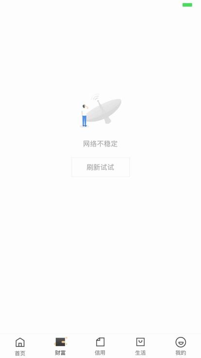
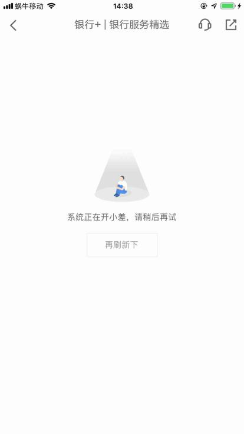
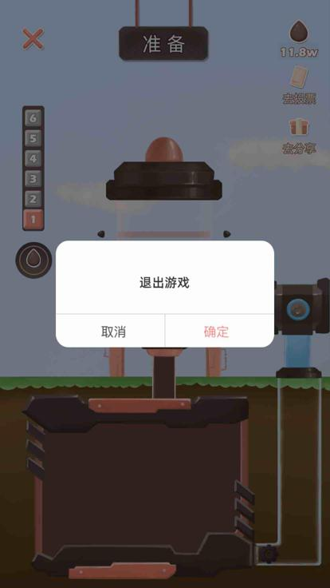
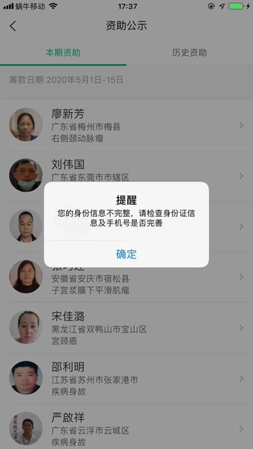
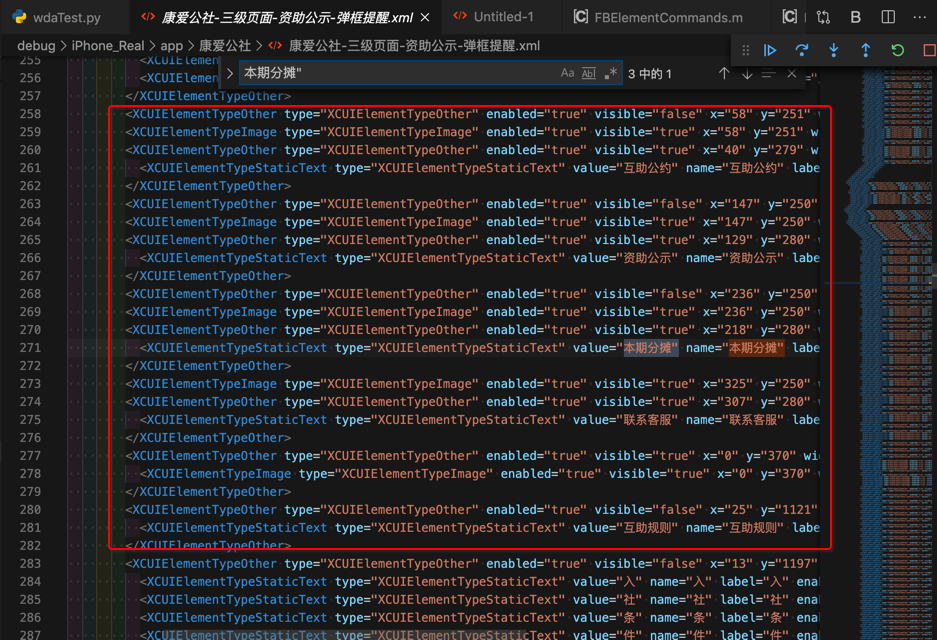
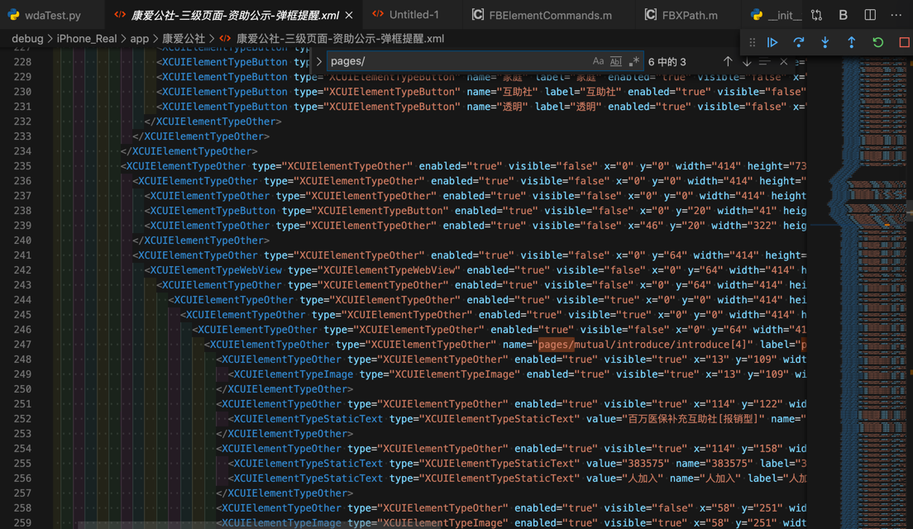
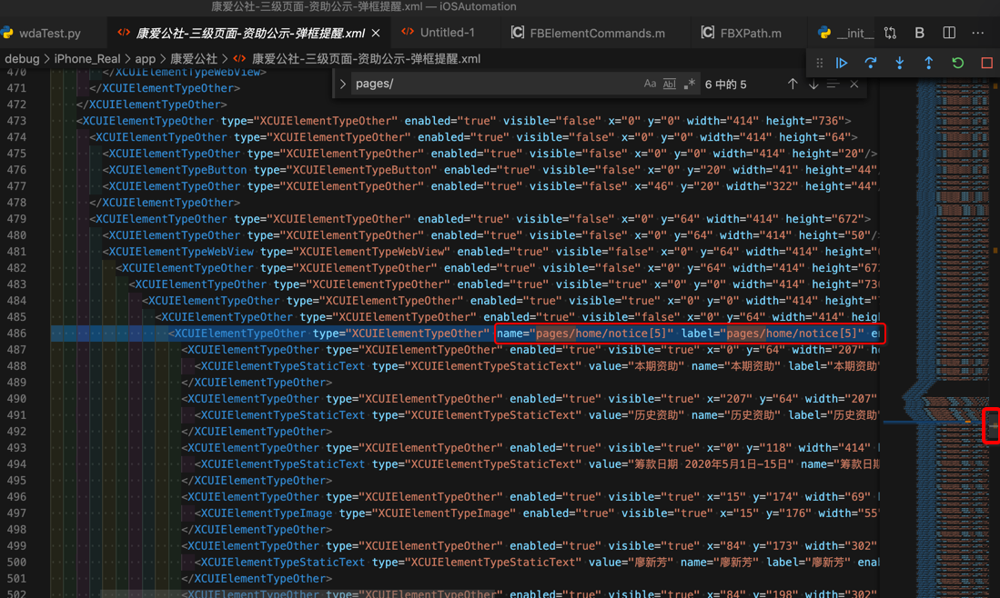

# iOS的各种坑

在用`facebook-wda`+`WebDriverAgent`去自动化测试iOS设备期间，遇到各种坑，现在来详细说说：

## 坑：即使查询条件和xml中内容正确匹配，也查询不到

对于页面：


xml是：

```xml
<XCUIElementTypeStaticText type="XCUIElementTypeStaticText" value="可申请(元) 200,000" name="可申请(元) 200,000" label="可申请(元) 200,000" enabled="true" visible="true" x="85" y="226" width="244" height="102"/>
```

去用：

```python
{'value': '可申请(元) 200,000', 'name': '可申请(元) 200,000', 'label': '可申请(元) 200,000', 'enabled': 'true', 'x': '85', 'y': '226', 'width': '244', 'height': '102', 'type': 'XCUIElementTypeStaticText'}
```

以及 去掉y的：

```python
{'value': '可申请(元) 200,000', 'name': '可申请(元) 200,000', 'label': '可申请(元) 200,000', 'enabled': 'true', 'x': '85', 'width': '244', 'height': '102', 'type': 'XCUIElementTypeStaticText'}
```

都查不到元素。

不过，去掉value，name，label后：

```python
{'enabled': 'true', 'x': '85', 'y': '226', 'width': '244', 'height': '102', 'type': 'XCUIElementTypeStaticText'}
```

是可以查询到元素的，所以很是诡异。

其原因，自己推测是此处的（value等）值有问题

但是具体的值是不是我猜测的

`可申请(元) 200000`

则无需，也懒得再去试了。

更重要的是，对于：

`可申请(元) 200,000`

页面上的内容的显示，是肉眼可见的分成了2部分

```bash
可申请(元)
200,000
```

且显示的样式都不同

-> 所以十分怀疑是：

iOS内部的元素和代码，其实本身就是这2部分是分开的

只不过是输出xml时，混在了一起

-> 导致通过value（name，label）才找不到元素的

-> 去掉value等值后，只用x、y等坐标值，就能找到：说明是对应着页面上的其中某一个元素

要么是 可申请(元)，或者是200,000

总之是：

iOS内部页面内容，和输出xml代码之间，一直做的很垃圾。

或者说故意做的很垃圾，让你很难自动化测试iOS。

详见：

【不去解决】自动抓包iOS的app恒易贷：找不到元素可申请元200000

## 坑：界面上按钮有文字，但是源码中没有文字

界面上：


本来希望去：写规则去查找button，且name是立即进入

结果源码中

```xml
<XCUIElementTypeOther type="XCUIElementTypeOther" enabled="true" visible="true" x="0" y="0" width="414" height="736">
    <XCUIElementTypeOther type="XCUIElementTypeOther" enabled="true" visible="true" x="0" y="0" width="414" height="736">
        <XCUIElementTypeScrollView type="XCUIElementTypeScrollView" enabled="true" visible="true" x="0" y="0" width="414" height="736">
            <XCUIElementTypeImage type="XCUIElementTypeImage" name="guide2" enabled="true" visible="true" x="0" y="0" width="414" height="736"/>
        </XCUIElementTypeScrollView>
        <XCUIElementTypeButton type="XCUIElementTypeButton" name="loading btn" label="loading btn" enabled="true" visible="true" x="141" y="628" width="132" height="30"/>
    </XCUIElementTypeOther>
</XCUIElementTypeOther>
```

没有我们希望的文字：立即进入

注：目测看起来，这个 立即进入 的button的文字 不是属于button图片本身，而是普通文字，只不过xml源码中，的确找不到

这样就影响了后续代码逻辑的判断，无法准确判断当前页面的按钮，是否是最后一页了。

详见：

【未解决】自动抓包iOS的app：左滑引导页进入首页

## 不爽的点：页面类似，但xml源码差异很大

对于页面：



但是对应xml：

```xml
<XCUIElementTypeOther type="XCUIElementTypeOther" enabled="true" visible="true" x="0" y="64" width="414" height="623">
    <XCUIElementTypeTable type="XCUIElementTypeTable" name="空列表" label="空列表" enabled="true" visible="false" x="0" y="64" width="414" height="623"/>
    <XCUIElementTypeOther type="XCUIElementTypeOther" enabled="true" visible="true" x="0" y="64" width="414" height="623">
        <XCUIElementTypeImage type="XCUIElementTypeImage" name="com_network_err" enabled="true" visible="false" x="152" y="164" width="110" height="110"/>
        <XCUIElementTypeStaticText type="XCUIElementTypeStaticText" value="网络不稳定" name="网络不稳定" label="网络不稳定" enabled="true" visible="true" x="0" y="287" width="414" height="17"/>
        <XCUIElementTypeButton type="XCUIElementTypeButton" name="刷新试试" label="刷新试试" enabled="true" visible="true" x="147" y="323" width="120" height="41"/>
    </XCUIElementTypeOther>
</XCUIElementTypeOther>
```

很明显，页面中的 刷新试试 明显是一个按钮，是没问题的

-> 后续就容易写规则去匹配和处理

但是后来遇到和上面很类似的页面：



可见页面上`再刷新下`也是一个按钮

但发现xml却是：

```xml
<XCUIElementTypeOther type="XCUIElementTypeOther" name="系统正在开小差，请稍后再试 再刷新下" label="系统正在开小差，请稍后再试 再刷新下" enabled="true" visible="true" x="0" y="64" width="414" height="672">
    <XCUIElementTypeOther type="XCUIElementTypeOther" name="系统正在开小差，请稍后再试 再刷新下" label="系统正在开小差，请稍后再试 再刷新下" enabled="true" visible="true" x="0" y="64" width="414" height="672">
        <XCUIElementTypeOther type="XCUIElementTypeOther" name="系统正在开小差，请稍后再试" label="系统正在开小差，请稍后再试" enabled="true" visible="true" x="114" y="240" width="186" height="136">
            <XCUIElementTypeImage type="XCUIElementTypeImage" enabled="true" visible="true" x="152" y="240" width="110" height="111"/>
            <XCUIElementTypeStaticText type="XCUIElementTypeStaticText" value="系统正在开小差，请稍后再试" name="系统正在开小差，请稍后再试" label="系统正在开小差，请稍后再试" enabled="true" visible="true" x="114" y="360" width="186" height="16"/>
        </XCUIElementTypeOther>
        <XCUIElementTypeOther type="XCUIElementTypeOther" name="再刷新下" label="再刷新下" enabled="true" visible="true" x="147" y="375" width="120" height="61">
            <XCUIElementTypeOther type="XCUIElementTypeOther" name="再刷新下" label="再刷新下" enabled="true" visible="true" x="147" y="395" width="120" height="41"/>
        </XCUIElementTypeOther>
    </XCUIElementTypeOther>
</XCUIElementTypeOther>
```

再刷新下 却是一个 XCUIElementTypeOther，而不是XCUIElementTypeButton

-> 后续代码去处理和写匹配逻辑，就显得很不顺，让人很不爽。

-> 如果也是和前面一样的XCUIElementTypeButton，就容易统一成一个逻辑去处理，更加通用，效率更高。

-> 现在没法统一，效率很低，逻辑上显得很冗余

总体结论：

页面上的元素，和xml源码内容，很多时候，对不上，甚至完全对不上，驴唇不对马嘴的感觉。

详见：

【未解决】自动抓包iOS的app京东金融：网络不稳定刷新试试

【未解决】自动抓包iOS的app京东金融：系统正在开小差再刷新下

## 坑：有些页面 获取到的源码实际上是空的 没有包含页面元素的源码

比如页面：



希望获取源码中包含弹框部分的内容

但是实际上获取到的是：

```xml
<?xml version="1.0" encoding="UTF-8"?>
<XCUIElementTypeApplication type="XCUIElementTypeApplication" name="益路同行" label="益路同行" enabled="true" visible="true" x="0" y="0" width="414" height="736">
  <XCUIElementTypeWindow type="XCUIElementTypeWindow" enabled="true" visible="true" x="0" y="0" width="414" height="736">
    <XCUIElementTypeOther type="XCUIElementTypeOther" enabled="true" visible="true" x="0" y="0" width="414" height="736">
      <XCUIElementTypeOther type="XCUIElementTypeOther" enabled="true" visible="true" x="0" y="0" width="414" height="736">
        <XCUIElementTypeOther type="XCUIElementTypeOther" enabled="true" visible="true" x="0" y="0" width="414" height="736">
          <XCUIElementTypeOther type="XCUIElementTypeOther" enabled="true" visible="true" x="0" y="0" width="414" height="736"/>
        </XCUIElementTypeOther>
      </XCUIElementTypeOther>
    </XCUIElementTypeOther>
  </XCUIElementTypeWindow>
  <XCUIElementTypeWindow type="XCUIElementTypeWindow" enabled="true" visible="false" x="0" y="0" width="414" height="736">
    <XCUIElementTypeOther type="XCUIElementTypeOther" enabled="true" visible="false" x="0" y="0" width="414" height="736"/>
  </XCUIElementTypeWindow>
  <XCUIElementTypeWindow type="XCUIElementTypeWindow" enabled="true" visible="false" x="0" y="0" width="0" height="0"/>
  <XCUIElementTypeWindow type="XCUIElementTypeWindow" enabled="true" visible="false" x="0" y="0" width="414" height="736">
    <XCUIElementTypeStatusBar type="XCUIElementTypeStatusBar" enabled="true" visible="false" x="0" y="0" width="414" height="20"/>
  </XCUIElementTypeWindow>
  <XCUIElementTypeWindow type="XCUIElementTypeWindow" enabled="true" visible="false" x="0" y="0" width="414" height="736">
    <XCUIElementTypeOther type="XCUIElementTypeOther" enabled="true" visible="false" x="0" y="0" width="414" height="736"/>
  </XCUIElementTypeWindow>
</XCUIElementTypeApplication>
```

即：

中间主体内容是空的

没有包含我们希望看到的 弹框部分

详见：

【未解决】自动抓包iOS的app益路同行：弹框退出游戏

## 坑：页面中图片明显可见，但是xml源码中visible=false表示不可见

页面中的中间部分的2个图片：


此处xml源码竟然是：

```xml
                    <XCUIElementTypeCell type="XCUIElementTypeCell" enabled="true" visible="true" x="0" y="280" width="414" height="320">
                      <XCUIElementTypeImage type="XCUIElementTypeImage" enabled="true" visible="false" x="15" y="290" width="384" height="181"/>
                      <XCUIElementTypeStaticText type="XCUIElementTypeStaticText" value="【善友筹】（已审核）父母懂事的孩子，成绩优异的班长，因白血病不得不离开学校和小伙伴，大家一起帮帮他渡过难关，定会滴水之恩，涌泉相报！" name="【善友筹】（已审核）父母懂事的孩子，成绩优异的班长，因白血病不得不离开学校和小伙伴，大家一起帮帮他渡过难关，定会滴水之恩，涌泉相报！" label="【善友筹】（已审核）父母懂事的孩子，成绩优异的班长，因白血病不得不离开学校和小伙伴，大家一起帮帮他渡过难关，定会滴水之恩，涌泉相报！" enabled="true" visible="true" x="15" y="475" width="384" height="60"/>
                      <XCUIElementTypeProgressIndicator type="XCUIElementTypeProgressIndicator" value="8%" name="进度" label="进度" enabled="true" visible="true" x="15" y="534" width="334" height="23"/>
                      <XCUIElementTypeStaticText type="XCUIElementTypeStaticText" value="发起人:邱嘉棋" name="发起人:邱嘉棋" label="发起人:邱嘉棋" enabled="true" visible="true" x="15" y="559" width="117" height="21"/>
                      <XCUIElementTypeStaticText type="XCUIElementTypeStaticText" value="认筹金额:1693" name="认筹金额:1693" label="认筹金额:1693" enabled="true" visible="true" x="117" y="559" width="150" height="21"/>
                      <XCUIElementTypeStaticText type="XCUIElementTypeStaticText" value="剩余:23天" name="剩余:23天" label="剩余:23天" enabled="true" visible="true" x="267" y="559" width="117" height="21"/>
                      <XCUIElementTypeStaticText type="XCUIElementTypeStaticText" value="8%" name="8%" label="8%" enabled="true" visible="true" x="334" y="534" width="100" height="21"/>
                    </XCUIElementTypeCell>
```

其中

```xml
<XCUIElementTypeImage type="XCUIElementTypeImage" enabled="true" visible="false" x="15" y="290" width="384" height="181"/>
```

即：

只有一个Image节点，（当前可能本身就是一张图，但是从app中看起来不像，还是像2张图）并且还是visible=false，即不可见！

你妹的，那还怎么解析出有效节点，根本没法提取有效节点，和后续抓取。

详见：

【未解决】自动抓包工具抓包iOS的app：善友筹

## 坑：偶尔会遇到 通过坐标值点击元素 无效 实际上误点击别的位置

对于页面：


代码已找到了 取消 按钮，然后去点击 其中间坐标位置

```python
clickCenterPosition(curSession, cancelSoup.attrs)

def clickCenterPosition(curSession, elementAttrDict):
    x = int(elementAttrDict["x"])
    y = int(elementAttrDict["y"])
    width = int(elementAttrDict["width"])
    height = int(elementAttrDict["height"])
    centerX = x + int(width / 2)
    centerY = y + int(height / 2)
    curSession.click(centerX, centerY)
    logging.info("Clicked [%s, %s]", centerX, centerY)
```

之前此点击元素中间位置的代码工作都是正常的

唯独这此，点击 取消按钮 后，实际上是点击了：呼叫 按钮的位置，导致进入 呼叫 界面：


最后无奈，只能绕过这个bug，换用别的方式去点击元素：

用wda的query去查找元素，通过元素点击本身

```python
        # parentOtherSoup = callSoup.parent
        # if parentOtherSoup:
        #     parentParentOtherSoup = parentOtherSoup.parent
        #     if parentParentOtherSoup:
        #         cancelSoup = parentParentOtherSoup.find(
        #             "XCUIElementTypeButton",
        #             attrs={"enabled":"true", "visible":"true", "name": "取消"}
        #         )
        #         if cancelSoup:
        #             clickCenterPosition(curSession, cancelSoup.attrs)
        #             foundAndProcessedPopup = True

        # above click position not work for 取消 !!!
        # change to find 取消 then click element

        cancelButtonQuery = {"type":"XCUIElementTypeButton", "enabled":"true", "visible":"true", "name": "取消"}
        foundAndClicked = findAndClickElement(curSession, cancelButtonQuery)
        foundAndProcessedPopup = foundAndClicked
```

才可以：点击取消 让弹框消失。

详见：

【已解决】自动抓包iOS的app无忧筹：弹框呼叫拨打电话

【后记1】

又在：

【未解决】自动抓包iOS的app京东金融：弹框想给您发送通知允许

遇到同样的问题：

bs4中搜索到了 允许 按钮，去点击 通过点击允许按钮的中间坐标值，结果实际上却是点击了：另外一个按钮 不允许 。。。

然后无奈，只能想办法用wda的query去查询元素 允许，再通过元素点击 估计就可以了。

【后记2】

又在：

【未解决】自动抓包iOS的app恒易贷：弹框使用无线数据无线局域网与蜂窝移动网络

遇到同样问题：

对于页面：


都已经用代码：

```python
    wifiCellularChainList = [
        {
            "tag": "XCUIElementTypeAlert",
            "attrs": {"enabled":"true", "visible":"true"}
        },
        {
            "tag": "XCUIElementTypeOther",
            "attrs": {"enabled":"true", "visible":"true"}
        },
        {
            "tag": "XCUIElementTypeButton",
            "attrs": {"enabled":"true", "visible":"true", "name": "无线局域网与蜂窝移动网络"}
        },
    ]
    wifiCellularSoup = utils.bsChainFind(soup, wifiCellularChainList)
    if wifiCellularSoup:
        clickCenterPosition(curSession, wifiCellularSoup.attrs)
        foundAndProcessedPopup = True
    return foundAndProcessedPopup
```

查到并点击了 无线局域网与蜂窝移动网络 按钮的中间位置，但是实际上点击的是：不允许

导致后来app无法访问网络，再次启动app后，也提示请开启网络权限。

只能去改为，wda的元素查找，找到元素后，根据元素去click点击：

```python
        wifiCellularSoup = CommonUtils.bsChainFind(soup, wifiCellularChainList)
        if wifiCellularSoup:
            # self.clickElementCenterPosition(wifiCellularSoup)
            # foundAndProcessedPopup = True

            # found 无线局域网与蜂窝移动网络 but actually click center position will click 不允许 ！！！
            # change to wda query element then click by element
            curName = wifiCellularSoup.attrs["name"] # 好
            wifiCellularButtonQuery = {"type":"XCUIElementTypeButton", "enabled":"true", "name": curName}
            foundAndClicked = self.findAndClickElement(wifiCellularButtonQuery, isShowErrLog=False)
            foundAndProcessedPopup = foundAndClicked
        return foundAndProcessedPopup
```

才可以。

【后记3】

由于经常遇到此问题，所以后来专门去提取逻辑到独立函数中，详见[常用代码段](https://book.crifan.com/books/ios_automation_facebook_wda/website/common_code)中的`findAndClickButtonElementBySoup`

## 坑：元素查找条件 都写的最完整，不能再详细了，但是却会出现 可以查询到 找到 多个元素

比如页面：


左下角的 3个tab页的父级元素，对应 locator，调试出现警告：

```bash
[200515 14:23:27][ParsePage.py 1019] Found 2 same node from tag=XCUIElementTypeOther, attr={'name': '筹款首页, tab, 1 of 3 发起筹款, tab, 2 of 3 我的筹款, tab, 3 of 3', 'label': '筹款首页, tab, 1 of 3 发起筹款, tab, 2 of 3 我的筹款, tab, 3 of 3', 'enabled': 'true', 'visible': 'true', 'x': '0', 'y': '687', 'width': '414', 'height': '49', 'type': 'XCUIElementTypeOther'}
```

提示上述locator可以找到2个元素，然后去xml源码中看看，果然是的：

```xml
    <XCUIElementTypeOther type="XCUIElementTypeOther" name="筹款首页, tab, 1 of 3 发起筹款, tab, 2 of 3 我的筹款, tab, 3 of 3" label="筹款首页, tab, 1 of 3 发起筹款, tab, 2 of 3 我的筹款, tab, 3 of 3" enabled="true" visible="true" x="0" y="687" width="414" height="49">
    <XCUIElementTypeOther type="XCUIElementTypeOther" name="筹款首页, tab, 1 of 3 发起筹款, tab, 2 of 3 我的筹款, tab, 3 of 3" label="筹款首页, tab, 1 of 3 发起筹款, tab, 2 of 3 我的筹款, tab, 3 of 3" enabled="true" visible="true" x="0" y="687" width="414" height="49”>
。。。
```


就是：底部3个按钮主菜单 的parent 和 parent的parent

-》坑就是：

如果通过上述（最详尽的）条件去定位元素，则理论上是会出现多个的

-》无法完美精准定位查询到某个想要的元素。

详见：

【未解决】自动抓包iOS的app：无忧筹点击首页的筹款首页后无法返回

## 坑：app内部某一层的页面中的xml源码，竟然还保留（之前的几层）父级的元素

比如

某个二级页面：

康爱公社-二级页面-百万医保补充互助社.jpg


其中，正常的符合预期的是，页面xml源码中，有页面中的元素，比如

顶部的第二排的 互助公约 资助公示 本期分摊 联系客服 等

但是点击了 资助公示 后，进入 三级页面：

康爱公社-三级页面-资助公示-弹框提醒.jpg



竟然其中xml源码中，还有 前一页的页面元素：



```xml
    <XCUIElementTypeOther type="XCUIElementTypeOther" enabled="true" visible="true" x="218" y="280" width="67" height="45">
        <XCUIElementTypeStaticText type="XCUIElementTypeStaticText" value="本期分摊" name="本期分摊" label="本期分摊" enabled="true" visible="true" x="218" y="300" width="67" height="21"/>
    </XCUIElementTypeOther>
```

其中可见，不仅存在之前页面的元素的xml，且竟然是visible=true，即：

表示当前页面可见。但是实际上不可见，不可能看到，前面几级页面的内容。

-》导致后续的基于xml源码判断元素的逻辑，就不可用了。完全混乱了。

即：在第三级页面，也能找到第二级，甚至第一级页面的元素，以为是在第二级或第一级页面呢，无需返回，即可找到并点击相关元素，而实际上页面上，并不是第二级或第一级页面，屏幕上并没有这些元素。

使得后续页面跳转，完全失效。无法继续正常逻辑。

仔细去看xml源码中发现，有个特点：

会存在 `pages/xxx/xxx` 之类的元素：

```xml
<XCUIElementTypeOther type="XCUIElementTypeOther" name="pages/mutual/introduce/introduce[4]" label="pages/mutual/introduce/introduce[4]" enabled="true" visible="false" x="0" y="64" width="414" height="3058">
。。。
```



且不止一个：

```xml
<XCUIElementTypeOther type="XCUIElementTypeOther" name="pages/home/notice[5]" label="pages/home/notice[5]" enabled="true" visible="true" x="0" y="64" width="414" height="891">
。。。
```



其中有几个 `page/xxx`

-> 存在 当前页面 实际上 包含了 几个（前后一共几级的）页面的xml源码

详见：

【无法解决】iOS抓包app康爱公社：第三级页面中也能点击到第一级页面中的元素导致页面无法返回

【规避解决】iOS抓包app康爱公社：第三级别RestPage互助公约子页面无法返回

