# iOS的各种坑

在用`facebook-wda`+`WebDriverAgent`去自动化测试iOS设备期间，遇到各种坑。

其中多数坑，都是苹果官方的API不稳定或有bug导致的，少数是`WebDriverAgent`或`facebook-wda`的。

## wda找到元素，点击元素，竟然偶尔会无效

对于页面：


代码去找到并点击 个人所得税：

```python
    isIntoDetailOk = CommonUtils.multipleRetry(
        {
            "functionCallback": self.appStoreSearchResultIntoDetail,
            "functionParaDict": {
                "appName": appName,
            }
        },
        maxRetryNum = 10,
        sleepInterval = 0.5,
    )

def appStoreSearchResultIntoDetail(self, appName):
    """for AppStore search result list page
        try find first match result
            then click into detail page
    
    Args:
        appName (str): app name
    Returns:
        bool, dict
            bool: is into detail page or not
    Raises:
    """
    isIntoDetailOk = False
    """
        搜索结果列表页 京东 重新下载：
            <XCUIElementTypeOther type="XCUIElementTypeOther" enabled="true" visible="true" x="0" y="0" width="414" height="736">
                <XCUIElementTypeOther type="XCUIElementTypeOther" enabled="true" visible="true" x="0" y="0" width="414" height="736">
                    <XCUIElementTypeCollectionView type="XCUIElementTypeCollectionView" enabled="true" visible="true" x="0" y="0" width="414" height="736">
                        <XCUIElementTypeCell type="XCUIElementTypeCell" name="京东-一起热爱 就现在, 新人送188元购物礼包, 四颗半星, 34.6万 个评分" label="京东-一起热爱 就现在, 新人送188元购物礼包, 四颗半星, 34.6万 个评分" enabled="true" visible="true" x="20" y="86" width="374" height="295">
                            <XCUIElementTypeButton type="XCUIElementTypeButton" name="重新下载" label="重新下载" enabled="true" visible="true" x="364" y="86" width="30" height="68"/>
                        </XCUIElementTypeCell>
                        <XCUIElementTypeCell type="XCUIElementTypeCell" name="京东金融-超过三亿人在用, 享24期免息，赚20亿金贴, 四颗半星, 20.8万 个评分" label="京东金融-超过三亿人在用, 享24期免息，赚20亿金贴, 四颗半星, 20.8万 个评分" enabled="true" visible="true" x="20" y="420" width="374" height="295">
                            <XCUIElementTypeButton type="XCUIElementTypeButton" name="打开" label="打开" enabled="true" visible="true" x="320" y="420" width="74" height="69"/>
                        </XCUIElementTypeCell>
                    </XCUIElementTypeCollectionView>
                </XCUIElementTypeOther>
            </XCUIElementTypeOther>

        搜索结果列表页 美团 获取：
            <XCUIElementTypeOther type="XCUIElementTypeOther" enabled="true" visible="true" x="0" y="0" width="414" height="736">
                <XCUIElementTypeOther type="XCUIElementTypeOther" enabled="true" visible="true" x="0" y="0" width="414" height="736">
                    <XCUIElementTypeCollectionView type="XCUIElementTypeCollectionView" enabled="true" visible="true" x="0" y="0" width="414" height="736">
                        <XCUIElementTypeCell type="XCUIElementTypeCell" name="美团-吃喝玩乐 尽在美团, 美食外卖买菜买药首选美团App, 四又四分之三颗星, 94.7万 个评分" label="美团-吃喝玩乐 尽在美团, 美食外卖买菜买药首选美团App, 四又四分之三颗星, 94.7万 个评分" enabled="true" visible="true" x="20" y="86" width="374" height="295">
                            <XCUIElementTypeButton type="XCUIElementTypeButton" name="获取" label="获取" enabled="true" visible="true" x="320" y="86" width="74" height="68"/>
                        </XCUIElementTypeCell>
                        <XCUIElementTypeCell type="XCUIElementTypeCell" name="美团外卖-外卖订餐,送啥都快, 美食生鲜,水果下午茶, 四又四分之三颗星, 607万 个评分" label="美团外卖-外卖订餐,送啥都快, 美食生鲜,水果下午茶, 四又四分之三颗星, 607万 个评分" enabled="true" visible="true" x="20" y="420" width="374" height="295">
                            <XCUIElementTypeButton type="XCUIElementTypeButton" name="获取" label="获取" enabled="true" visible="true" x="320" y="420" width="74" height="69"/>
                        </XCUIElementTypeCell>
                    </XCUIElementTypeCollectionView>
                </XCUIElementTypeOther>
            </XCUIElementTypeOther>
    """
    parentCollectionViewClassChain = "/XCUIElementTypeCollectionView[`rect.x = 0 AND rect.y = 0 AND rect.width = %d AND rect.height = %d`]" % (self.X, self.totalY)
    firstMatchCellQuery = {"type":"XCUIElementTypeCell", "nameContains": appName, "enabled": "true"}
    firstMatchCellQuery["parent_class_chains"] = [ parentCollectionViewClassChain ]
    foundAndClicked = self.findAndClickElement(query=firstMatchCellQuery, timeout=0.2)
    isIntoDetailOk = foundAndClicked
    return isIntoDetailOk
```

始终都是正常的：可以找到并点击元素，然后会进入app下载的详情页

但是目前调试期间，先后遇到2次了

只是对于特殊的app名字：`个人所得税`，出现了虽然代码中能找到元素，并点击了元素：

```bash
[200609 15:45:29][DevicesMethods.py 851] True to Clicked element {'type': 'XCUIElementTypeCell', 'nameContains': '个人所得税', 'enabled': 'true', 'parent_class_chains': ['/XCUIElementTypeCollectionView[`rect.x = 0 AND rect.y = 0 AND rect.width = 414 AND rect.height = 736`]']}
```

但是实际上：

竟然点击没生效

-》页面没有进入后续的详情页

-》但是同样代码，重新测试，却又正常，可以点击元素进入详情页了：

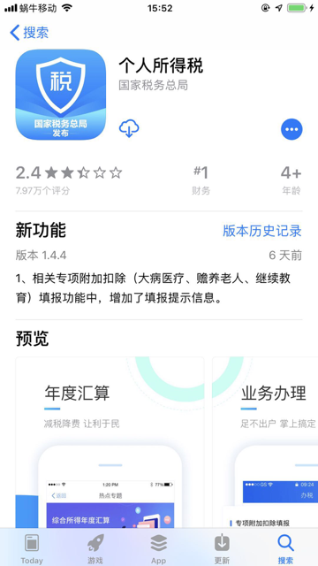

很是诡异。

根本原因：至今未知。

暂时在列表页前后加上等待时间：

```python
# Special: try add some wait time to avoid some special case:
# for 个人所得税 search result page, found and click 个人所得税, but sometime actually not into detail page
time.sleep(0.5)
isIntoDetailOk = CommonUtils.multipleRetry(
    {
        "functionCallback": self.appStoreSearchResultIntoDetail,
        "functionParaDict": {
            "appName": appName,
        }
    },
    maxRetryNum = 10,
    sleepInterval = 0.5,
)
if not isIntoDetailOk:
    respInfo = "Fail to into app detail page for %s" % appName
    return isInstallOk, respInfo
# Special: try add some wait time to avoid some special case:
# for 个人所得税 search result page, found and click 个人所得税, but sometime actually not into detail page
time.sleep(0.2)
```

希望，或许能稳定些，或许能规避此问题？

详见：

【未解决】facebook-wda点击个人所得税元素无效：没有进入AppStore详情页

## 偶尔会遇到 通过坐标值点击元素 无效 实际上误点击别的位置

对于页面：

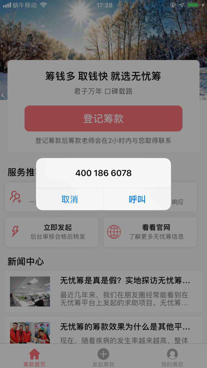

代码已找到了 取消 按钮，然后去点击 其中间坐标位置

```python
clickCenterPosition(curSession, cancelSoup.attrs)

def clickCenterPosition(curSession, elementAttrDict):
    x = int(elementAttrDict["x"])
    y = int(elementAttrDict["y"])
    width = int(elementAttrDict["width"])
    height = int(elementAttrDict["height"])
    centerX = x + int(width / 2)
    centerY = y + int(height / 2)
    curSession.click(centerX, centerY)
    logging.info("Clicked [%s, %s]", centerX, centerY)
```

之前此点击元素中间位置的代码工作都是正常的

唯独这此，点击 取消按钮 后，实际上是点击了：呼叫 按钮的位置，导致进入 呼叫 界面：

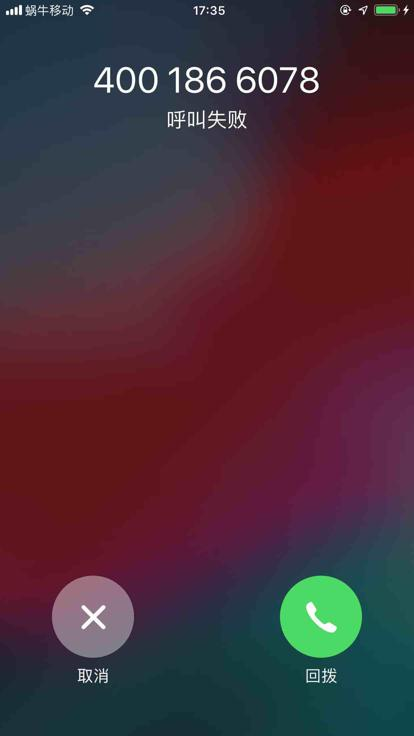

最后无奈，只能绕过这个bug，换用别的方式去点击元素：

用wda的query去查找元素，通过元素点击本身

```python
        # parentOtherSoup = callSoup.parent
        # if parentOtherSoup:
        #     parentParentOtherSoup = parentOtherSoup.parent
        #     if parentParentOtherSoup:
        #         cancelSoup = parentParentOtherSoup.find(
        #             "XCUIElementTypeButton",
        #             attrs={"enabled":"true", "visible":"true", "name": "取消"}
        #         )
        #         if cancelSoup:
        #             clickCenterPosition(curSession, cancelSoup.attrs)
        #             foundAndProcessedPopup = True

        # above click position not work for 取消 !!!
        # change to find 取消 then click element

        cancelButtonQuery = {"type":"XCUIElementTypeButton", "enabled":"true", "visible":"true", "name": "取消"}
        foundAndClicked = findAndClickElement(curSession, cancelButtonQuery)
        foundAndProcessedPopup = foundAndClicked
```

才可以：点击取消 让弹框消失。

详见：

【已解决】自动抓包iOS的app无忧筹：弹框呼叫拨打电话

【后记1】

又在：

【未解决】自动抓包iOS的app京东金融：弹框想给您发送通知允许

遇到同样的问题：

bs4中搜索到了 允许 按钮，去点击 通过点击允许按钮的中间坐标值，结果实际上却是点击了：另外一个按钮 不允许 。。。

然后无奈，只能想办法用wda的query去查询元素 允许，再通过元素点击 估计就可以了。

【后记2】

又在：

【未解决】自动抓包iOS的app恒易贷：弹框使用无线数据无线局域网与蜂窝移动网络

遇到同样问题：

对于页面：

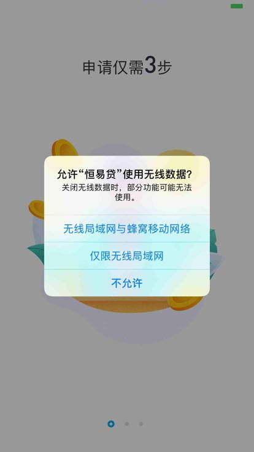

都已经用代码：

```python
    wifiCellularChainList = [
        {
            "tag": "XCUIElementTypeAlert",
            "attrs": {"enabled":"true", "visible":"true"}
        },
        {
            "tag": "XCUIElementTypeOther",
            "attrs": {"enabled":"true", "visible":"true"}
        },
        {
            "tag": "XCUIElementTypeButton",
            "attrs": {"enabled":"true", "visible":"true", "name": "无线局域网与蜂窝移动网络"}
        },
    ]
    wifiCellularSoup = utils.bsChainFind(soup, wifiCellularChainList)
    if wifiCellularSoup:
        clickCenterPosition(curSession, wifiCellularSoup.attrs)
        foundAndProcessedPopup = True
    return foundAndProcessedPopup
```

查到并点击了 无线局域网与蜂窝移动网络 按钮的中间位置，但是实际上点击的是：不允许

导致后来app无法访问网络，再次启动app后，也提示请开启网络权限。

只能去改为，wda的元素查找，找到元素后，根据元素去click点击：

```python
        wifiCellularSoup = CommonUtils.bsChainFind(soup, wifiCellularChainList)
        if wifiCellularSoup:
            # self.clickElementCenterPosition(wifiCellularSoup)
            # foundAndProcessedPopup = True

            # found 无线局域网与蜂窝移动网络 but actually click center position will click 不允许 ！！！
            # change to wda query element then click by element
            curName = wifiCellularSoup.attrs["name"] # 好
            wifiCellularButtonQuery = {"type":"XCUIElementTypeButton", "enabled":"true", "name": curName}
            foundAndClicked = self.findAndClickElement(wifiCellularButtonQuery, isShowErrLog=False)
            foundAndProcessedPopup = foundAndClicked
        return foundAndProcessedPopup
```

才可以。

【后记3】

由于经常遇到此问题，所以后来专门去提取逻辑到独立函数中，详见：

[元素处理 · iOS自动化测试利器：facebook-wda](https://book.crifan.com/books/ios_automation_facebook_wda/website/common_code/element_process.html#findandclickbuttonelementbysoup)

## 坑：元素查找条件 都写的最完整，不能再详细了，但是却会出现 可以查询到 找到 多个元素

比如页面：

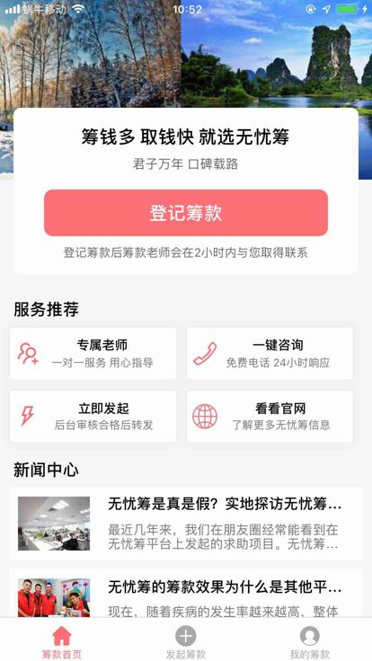

左下角的 3个tab页的父级元素，对应 locator，调试出现警告：

```bash
[200515 14:23:27][ParsePage.py 1019] Found 2 same node from tag=XCUIElementTypeOther, attr={'name': '筹款首页, tab, 1 of 3 发起筹款, tab, 2 of 3 我的筹款, tab, 3 of 3', 'label': '筹款首页, tab, 1 of 3 发起筹款, tab, 2 of 3 我的筹款, tab, 3 of 3', 'enabled': 'true', 'visible': 'true', 'x': '0', 'y': '687', 'width': '414', 'height': '49', 'type': 'XCUIElementTypeOther'}
```

提示上述locator可以找到2个元素，然后去xml源码中看看，果然是的：

```xml
    <XCUIElementTypeOther type="XCUIElementTypeOther" name="筹款首页, tab, 1 of 3 发起筹款, tab, 2 of 3 我的筹款, tab, 3 of 3" label="筹款首页, tab, 1 of 3 发起筹款, tab, 2 of 3 我的筹款, tab, 3 of 3" enabled="true" visible="true" x="0" y="687" width="414" height="49">
    <XCUIElementTypeOther type="XCUIElementTypeOther" name="筹款首页, tab, 1 of 3 发起筹款, tab, 2 of 3 我的筹款, tab, 3 of 3" label="筹款首页, tab, 1 of 3 发起筹款, tab, 2 of 3 我的筹款, tab, 3 of 3" enabled="true" visible="true" x="0" y="687" width="414" height="49”>
。。。
```

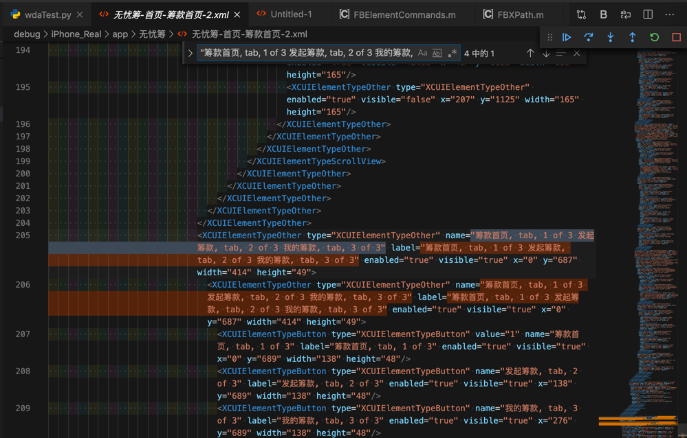

就是：底部3个按钮主菜单 的parent 和 parent的parent

-》坑就是：

如果通过上述（最详尽的）条件去定位元素，则理论上是会出现多个的

-》无法完美精准定位查询到某个想要的元素。

详见：

【未解决】自动抓包iOS的app：无忧筹点击首页的筹款首页后无法返回

## wda获取到了switch的值，但是是错的

对于页面：

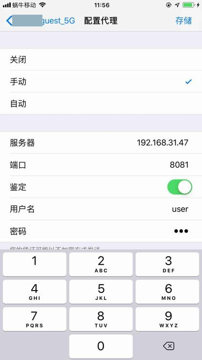

对应xml

```xml
<XCUIElementTypeCell type="XCUIElementTypeCell" value="0" enabled="true" visible="true" x="0" y="359" width="414" height="46">
    <XCUIElementTypeOther type="XCUIElementTypeOther" enabled="true" visible="true" x="0" y="404" width="414" height="1"/>
    <XCUIElementTypeStaticText type="XCUIElementTypeStaticText" value="鉴定" name="鉴定" label="鉴定" enabled="true" visible="true" x="20" y="359" width="323" height="46"/>
    <XCUIElementTypeSwitch type="XCUIElementTypeSwitch" value="0" name="鉴定" label="鉴定" enabled="true" visible="true" x="343" y="366" width="51" height="32"/>
</XCUIElementTypeCell>
```

已经可以用代码：

```python
newAuthenticateValue = newManualProxyValue["authenticate"]
authSwitchQuery = {"type":"XCUIElementTypeSwitch", "name": "鉴定", "enabled": "true"}
authSwitchQuery["parent_class_chains"] = [ parentCellClassChain ]
foundAuth, respInfo = self.findElement(authSwitchQuery, timeout=0.1)
```

找到 鉴定 对应的switch

但是获取其value值：

```python
authSwitchElement = respInfo
curAuthValue = authSwitchElement.value # '0'
```

竟然是：`'0'`

而不是真正实际的值：`'1'`

规避办法：

最后无奈只能改用别的方式（bs的find，获取到xml源码）去获取值

虽然速度慢点，但是至少值是准的：

```python
curAuthValueStr = ""
# curAuthValue = authSwitchElement.value # '0'
# curAuthValueStr = str(curAuthValue)
# Special: sometime wda element value is WRONG, actual is '1', but got '0'
# so change to bs find then get value from page source xml
curPageXml = self.get_page_source()
soup = CommonUtils.xmlToSoup(curPageXml)
authSwitchChainList = [
    {
        "tag": "XCUIElementTypeTable",
        "attrs": self.FullScreenAttrDict
    },
    {
        "tag": "XCUIElementTypeCell",
        "attrs": {"enabled":"true", "visible":"true", "x":"0", "width":"%s" % self.X}
    },
    {
        "tag": "XCUIElementTypeSwitch",
        "attrs": {"enabled":"true", "visible":"true", "name": "鉴定"}
    },
]
authSwitchSoup = CommonUtils.bsChainFind(soup, authSwitchChainList)
if authSwitchSoup:
    curAuthValue =  authSwitchSoup.attrs.get("value", None)
    if curAuthValue:
        curAuthValueStr = str(curAuthValue)
```

详见：

【已解决】facebook-wda获取鉴定的value值是错误的

## wda找到元素，但是无法用clear_text清除值value值

界面中：

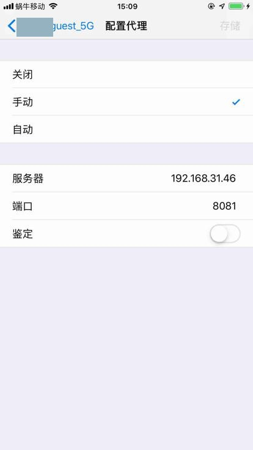

用代码已经找到 服务器 元素了：

```python
newServerValue = newManualProxyValue["server"]
serverFieldQuery = {"type":"XCUIElementTypeTextField", "name": "服务器", "enabled": "true"}
serverFieldQuery["parent_class_chains"] = [ parentCellClassChain ]
isFound, respInfo = self.findElement(query=serverFieldQuery)
logging.debug("isFound=%s, respInfo=%s", isFound, respInfo)
if isFound:
    curElement = respInfo
```

但是去清除当前的值

```python
curElement.clear_text()
```

却不起效果

最后无奈用`set_text()`传入多个`\b`，通过一个个删除字符的方式实现了删除输入的值的效果

```python
def iOSClearText(self, curElement):
    """iOS clear current element's text value
        Note: clear_text not working, so need use other workaround to do clear text

    Args:
        curElement (Element): wda element
    Returns:
    Raises:
    """
    # curElement.click()
    # curElement.clear_text()
    # curElement.tap_hold(2.0) # then try select All -> Delete
    backspaceChar = '\b'
    maxDeleteNum = 50
    curElement.set_text(maxDeleteNum * backspaceChar)
    return
```

调用：

```python
curElement = respInfo
if isNeedClear:
    # before set new value, clear current value
    self.iOSClearText(curElement)
curElement.set_text(text)
```

间接实现clear text的效果。

详见：

【已解决】facebook-wda中元素clear清除文本值无效

## 无法获取元素value值

类似于页面：

AppStore中，正在下载app

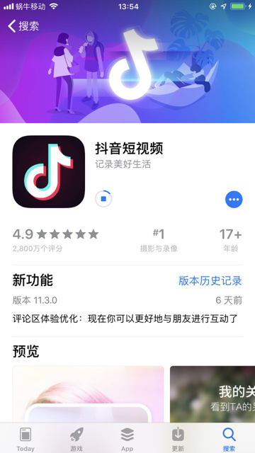

xml源码是：

```xml
<XCUIElementTypeButton type="XCUIElementTypeButton" value="18%" name="正在下载" label="正在下载" enabled="true" visible="true" x="154" y="308" width="74" height="30"/>
```

但是通过

文件：`/Users/limao/.pyenv/versions/3.8.0/Python.framework/Versions/3.8/lib/python3.8/site-packages/wda/__init__.py`

```python
@property
def value(self):
    # curValue = self._prop('attribute/value')
    curValue = self._prop('attribute/wdValue')
    if DEBUG:
        print("curValue=%s" % curValue)
    return curValue
```

对应着代码：

文件：`refer/WebDriverAgent/WebDriverAgentLib/Commands/FBElementCommands.m`

```python
    [[FBRoute GET:@"/element/:uuid/attribute/:name"] respondWithTarget:self action:@selector(handleGetAttribute:)],

+ (id<FBResponsePayload>)handleGetAttribute:(FBRouteRequest *)request
{
  FBElementCache *elementCache = request.session.elementCache;
  XCUIElement *element = [elementCache elementForUUID:request.parameters[@"uuid"]];
  if (nil == element) {
    return FBResponseWithStatus([FBCommandStatus staleElementReferenceErrorWithMessage:nil
                                                                             traceback:nil]);
  }
  id attributeValue = [element fb_valueForWDAttributeName:request.parameters[@"name"]];
  attributeValue = attributeValue ?: [NSNull null];
  return FBResponseWithObject(attributeValue);
}
```

却获取不到value值，始终是null：

```bash
20200609 01:49:34 connectionpool.py:428  DEBUG   http://localhost:8100 "POST /session/710DB6C7-3669-4677-B479-C006692CC3F6/element HTTP/1.1" 200 587
20200609 01:49:34 __init__.py:178  DEBUG   Return (213ms): {
      "value" : {
        "element-6066-11e4-a52e-4f735466cecf" : "32000000-0000-0000-4122-000000000000",
        "attribute\/visible" : true,
        "attribute\/name" : "正在下载",
        "attribute\/value" : null,
        "attribute\/accessible" : true,
        "text" : "正在下载",
        "label" : "正在下载",
        "rect" : {
          "y" : 308,
          "x" : 154,
          "width" : 74,
          "height" : 30
        },
        "type" : "XCUIElementTypeButton",
        "name" : "XCUIElementTypeButton",
        "ELEMENT" : "32000000-0000-0000-4122-000000000000"
      },
      "sessionId" : "710DB6C7-3669-4677-B479-C006692CC3F6"
    }

20200609 01:49:48 connectionpool.py:428  DEBUG   http://localhost:8100 "GET /session/710DB6C7-3669-4677-B479-C006692CC3F6/element/32000000-0000-0000-4122-000000000000/attribute/wdValue HTTP/1.1" 200 76
20200609 01:49:48 __init__.py:178  DEBUG   Return (204ms): {
      "value" : null,
      "sessionId" : "710DB6C7-3669-4677-B479-C006692CC3F6"
    }
```

详见：

【未解决】研究facebook-wda和WebDriverAgent中attribute/value始终是null无法获取有效值

## 偶尔页面中有内容刷新，动画进行中，则无法方便的获取到页面源码

详见：

【未解决】WebDriverAgent获取iPhone页面源码报错：Code 5 Error kAXErrorIPCTimeout getting snapshot for element

## 页面源码中，个别元素的最大x值超出屏幕

比如页面：

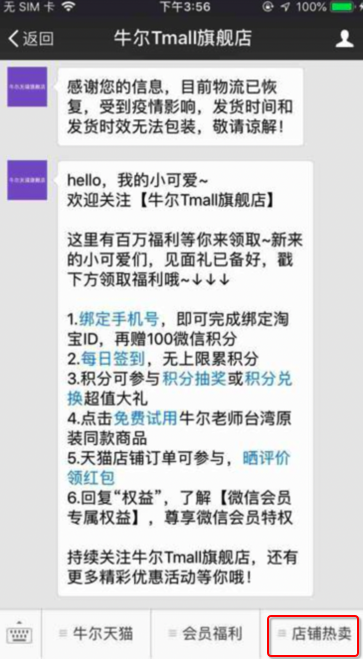

中的店铺热卖

相关部分xml是：

```xml
<XCUIElementTypeCell type="XCUIElementTypeCell" enabled="true" visible="true" x="44" y="617" width="111" height="50">
    <XCUIElementTypeButton type="XCUIElementTypeButton" name="牛尔天猫" label="牛尔天猫" enabled="true" visible="true" x="44" y="617" width="111" height="49"/>
    <XCUIElementTypeOther type="XCUIElementTypeOther" enabled="true" visible="true" x="59" y="666" width="96" height="1"/>
</XCUIElementTypeCell>
<XCUIElementTypeCell type="XCUIElementTypeCell" enabled="true" visible="true" x="154" y="617" width="111" height="50">
    <XCUIElementTypeButton type="XCUIElementTypeButton" name="会员福利" label="会员福利" enabled="true" visible="true" x="154" y="617" width="111" height="49"/>
    <XCUIElementTypeOther type="XCUIElementTypeOther" enabled="true" visible="true" x="169" y="666" width="96" height="1"/>
</XCUIElementTypeCell>
<XCUIElementTypeCell type="XCUIElementTypeCell" enabled="true" visible="true" x="264" y="617" width="112" height="50">
    <XCUIElementTypeButton type="XCUIElementTypeButton" name="店铺热卖" label="店铺热卖" enabled="true" visible="true" x="264" y="617" width="112" height="49"/>
    <XCUIElementTypeOther type="XCUIElementTypeOther" enabled="true" visible="true" x="279" y="666" width="97" height="1"/>
</XCUIElementTypeCell>
```

店铺热卖 的：x1=x0+width=264+112=376 大于 屏幕宽度375

导致原先代码逻辑判断出错：以为元素不在bottom底部区域，而被过滤掉，找不到菜单

最后是额外加了特殊处理，才可以保留和找到此菜单

详见：

【已解决】自动抓包iOS公众号：niuer-tmall中丢失部分主菜单

## 元素query时不完全支持visible属性

最新的结果也支持：有时候支持，有时候不支持

比如对于页面：

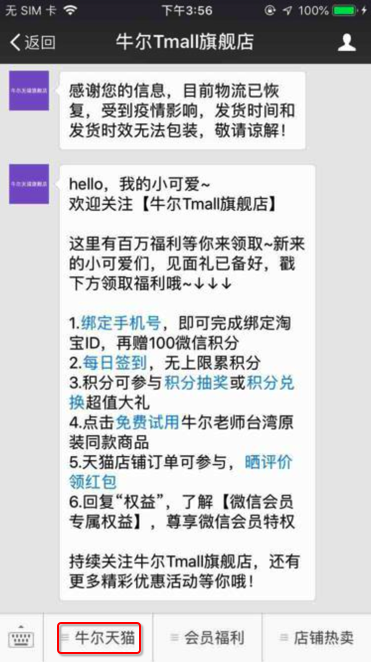

中，xml是：

```xml
<XCUIElementTypeButton type="XCUIElementTypeButton" name="牛尔天猫" label="牛尔天猫" enabled="true" visible="true" x="44" y="617" width="111" height="49"/>
```

query查询条件中，加了visible：

```bash
{'enabled': 'true', 'height': '49', 'label': '牛尔天猫', 'name': '牛尔天猫', 'type': 'XCUIElementTypeButton', 'width': '111', 'x': '44', 'y': '617', 'visible': 'true'}
```

就找不到，log是：

```log
[200430 17:00:39][__init__.py 164] Shell: curl -X POST -d '{"using": "class chain", "value": "**/XCUIElementTypeButton[`name == '\u725b\u5c14\u5929\u732b' AND label == '\u725b\u5c14\u5929\u732b' AND enabled == 1 AND visible == 1 AND rect.x == 44 AND rect.y == 617 AND rect.width == 111 AND rect.height == 49`]"}' 'http://localhost:8100/session/E91B12B7-E999-4945-BD4F-57E818C91EA4/element'
[200430 17:00:39][connectionpool.py 221] Starting new HTTP connection (1): localhost:8100
[200430 17:00:40][connectionpool.py 428] http://localhost:8100 "POST /session/E91B12B7-E999-4945-BD4F-57E818C91EA4/element HTTP/1.1" 404 6971
[200430 17:00:40][__init__.py 178] Return (175ms): {
      "value" : {
        "error" : "no such element",
        "message" : "unable to find an element using 'class chain', value '**\/XCUIElementTypeButton[`name == '牛尔天猫' AND label == '牛尔天猫' AND enabled == 1 AND visible == 1 AND rect.x == 44 AND rect.y == 617 AND rect.width == 111 AND rect.height == 49`]’",
。。。
```

去掉visible：

```bash
{'enabled': 'true', 'height': '49', 'label': '牛尔天猫', 'name': '牛尔天猫', 'type': 'XCUIElementTypeButton', 'width': '111', 'x': '44', 'y': '617'}
```

就能找到。

详见：

【已解决】Python中facebook-wda和WebDriverAgent中是否可以支持displayed以及是否能替换visible

【已解决】自动抓包iOS公众号：niuer-tmall定位主菜单失败

【已解决】合并最新版WebDriverAgent后测试是否支持元素的visible属性的query查询

## 偶尔代码无法运行，要看看服务端test manager是否正常

调试时发现偶尔卡死：

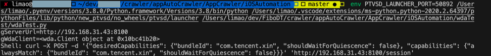

始终无法继续运行了。

以为代码改动出了问题。

后来发现是：服务端挂了：

```bash
Testing failed:
    WebDriverAgentRunner:
        testRunner encountered an error (Encountered a problem with the test runner after launch. (Underlying error: Lost connection to DTServiceHub))
** TEST FAILED **
```

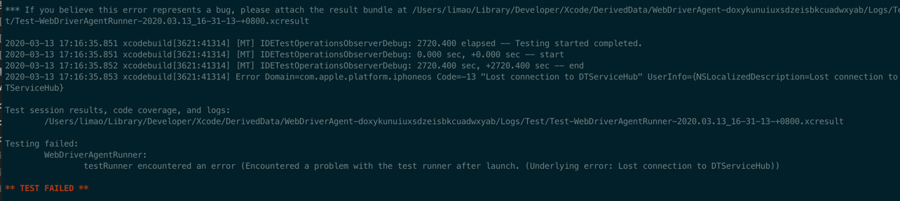

所以去重启服务：

```bash
xcodebuild -project WebDriverAgent.xcodeproj -scheme WebDriverAgentRunner -destination "id=$CUR_UDID" test
```

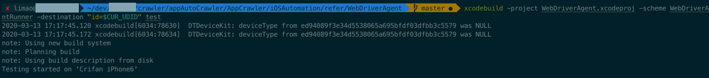

直到看到：

```bash
2020-03-13 17:17:57.615841+0800 WebDriverAgentRunner-Runner[725:273028] ServerURLHere->http://192.168.31.43:8100<-ServerURLHere
2020-03-13 17:17:57.659059+0800 WebDriverAgentRunner-Runner[725:273201] Using singleton test manager
```

即可。
