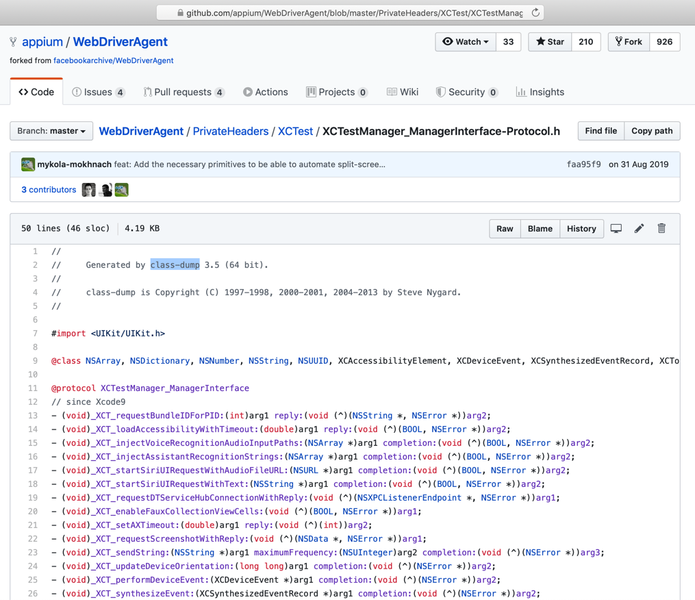
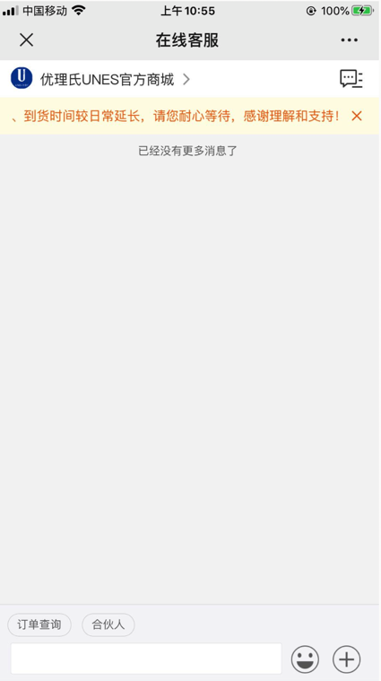

# 获取源码xml

iOS中最大的坑，就是获取页面源码xml期间，遇到的各种问题。

## 坑：即使查询条件和xml中内容正确匹配，也查询不到

对于页面：


xml是：

```xml
<XCUIElementTypeStaticText type="XCUIElementTypeStaticText" value="可申请(元) 200,000" name="可申请(元) 200,000" label="可申请(元) 200,000" enabled="true" visible="true" x="85" y="226" width="244" height="102"/>
```

去用：

```python
{'value': '可申请(元) 200,000', 'name': '可申请(元) 200,000', 'label': '可申请(元) 200,000', 'enabled': 'true', 'x': '85', 'y': '226', 'width': '244', 'height': '102', 'type': 'XCUIElementTypeStaticText'}
```

以及 去掉y的：

```python
{'value': '可申请(元) 200,000', 'name': '可申请(元) 200,000', 'label': '可申请(元) 200,000', 'enabled': 'true', 'x': '85', 'width': '244', 'height': '102', 'type': 'XCUIElementTypeStaticText'}
```

都查不到元素。

不过，去掉value，name，label后：

```python
{'enabled': 'true', 'x': '85', 'y': '226', 'width': '244', 'height': '102', 'type': 'XCUIElementTypeStaticText'}
```

是可以查询到元素的，所以很是诡异。

其原因，自己推测是此处的（value等）值有问题

但是具体的值是不是我猜测的

`可申请(元) 200000`

则无需，也懒得再去试了。

更重要的是，对于：

`可申请(元) 200,000`

页面上的内容的显示，是肉眼可见的分成了2部分

```bash
可申请(元)
200,000
```

且显示的样式都不同

-> 所以十分怀疑是：

iOS内部的元素和代码，其实本身就是这2部分是分开的

只不过是输出xml时，混在了一起

-> 导致通过value（name，label）才找不到元素的

-> 去掉value等值后，只用x、y等坐标值，就能找到：说明是对应着页面上的其中某一个元素

要么是 可申请(元)，或者是200,000

总之是：

iOS内部页面内容，和输出xml代码之间，一直做的很垃圾。

或者说故意做的很垃圾，让你很难自动化测试iOS。

详见：

【不去解决】自动抓包iOS的app恒易贷：找不到元素可申请元200000

## 坑：界面上按钮有文字，但是源码中没有文字

界面上：


本来希望去：写规则去查找button，且name是立即进入

结果源码中

```xml
<XCUIElementTypeOther type="XCUIElementTypeOther" enabled="true" visible="true" x="0" y="0" width="414" height="736">
    <XCUIElementTypeOther type="XCUIElementTypeOther" enabled="true" visible="true" x="0" y="0" width="414" height="736">
        <XCUIElementTypeScrollView type="XCUIElementTypeScrollView" enabled="true" visible="true" x="0" y="0" width="414" height="736">
            <XCUIElementTypeImage type="XCUIElementTypeImage" name="guide2" enabled="true" visible="true" x="0" y="0" width="414" height="736"/>
        </XCUIElementTypeScrollView>
        <XCUIElementTypeButton type="XCUIElementTypeButton" name="loading btn" label="loading btn" enabled="true" visible="true" x="141" y="628" width="132" height="30"/>
    </XCUIElementTypeOther>
</XCUIElementTypeOther>
```

没有我们希望的文字：立即进入

注：目测看起来，这个 立即进入 的button的文字 不是属于button图片本身，而是普通文字，只不过xml源码中，的确找不到

这样就影响了后续代码逻辑的判断，无法准确判断当前页面的按钮，是否是最后一页了。

详见：

【未解决】自动抓包iOS的app：左滑引导页进入首页

## 不爽的点：页面类似，但xml源码差异很大

对于页面：


但是对应xml：

```xml
<XCUIElementTypeOther type="XCUIElementTypeOther" enabled="true" visible="true" x="0" y="64" width="414" height="623">
    <XCUIElementTypeTable type="XCUIElementTypeTable" name="空列表" label="空列表" enabled="true" visible="false" x="0" y="64" width="414" height="623"/>
    <XCUIElementTypeOther type="XCUIElementTypeOther" enabled="true" visible="true" x="0" y="64" width="414" height="623">
        <XCUIElementTypeImage type="XCUIElementTypeImage" name="com_network_err" enabled="true" visible="false" x="152" y="164" width="110" height="110"/>
        <XCUIElementTypeStaticText type="XCUIElementTypeStaticText" value="网络不稳定" name="网络不稳定" label="网络不稳定" enabled="true" visible="true" x="0" y="287" width="414" height="17"/>
        <XCUIElementTypeButton type="XCUIElementTypeButton" name="刷新试试" label="刷新试试" enabled="true" visible="true" x="147" y="323" width="120" height="41"/>
    </XCUIElementTypeOther>
</XCUIElementTypeOther>
```

很明显，页面中的 刷新试试 明显是一个按钮，是没问题的

-> 后续就容易写规则去匹配和处理

但是后来遇到和上面很类似的页面：


可见页面上`再刷新下`也是一个按钮

但发现xml却是：

```xml
<XCUIElementTypeOther type="XCUIElementTypeOther" name="系统正在开小差，请稍后再试 再刷新下" label="系统正在开小差，请稍后再试 再刷新下" enabled="true" visible="true" x="0" y="64" width="414" height="672">
    <XCUIElementTypeOther type="XCUIElementTypeOther" name="系统正在开小差，请稍后再试 再刷新下" label="系统正在开小差，请稍后再试 再刷新下" enabled="true" visible="true" x="0" y="64" width="414" height="672">
        <XCUIElementTypeOther type="XCUIElementTypeOther" name="系统正在开小差，请稍后再试" label="系统正在开小差，请稍后再试" enabled="true" visible="true" x="114" y="240" width="186" height="136">
            <XCUIElementTypeImage type="XCUIElementTypeImage" enabled="true" visible="true" x="152" y="240" width="110" height="111"/>
            <XCUIElementTypeStaticText type="XCUIElementTypeStaticText" value="系统正在开小差，请稍后再试" name="系统正在开小差，请稍后再试" label="系统正在开小差，请稍后再试" enabled="true" visible="true" x="114" y="360" width="186" height="16"/>
        </XCUIElementTypeOther>
        <XCUIElementTypeOther type="XCUIElementTypeOther" name="再刷新下" label="再刷新下" enabled="true" visible="true" x="147" y="375" width="120" height="61">
            <XCUIElementTypeOther type="XCUIElementTypeOther" name="再刷新下" label="再刷新下" enabled="true" visible="true" x="147" y="395" width="120" height="41"/>
        </XCUIElementTypeOther>
    </XCUIElementTypeOther>
</XCUIElementTypeOther>
```

再刷新下 却是一个 XCUIElementTypeOther，而不是XCUIElementTypeButton

-> 后续代码去处理和写匹配逻辑，就显得很不顺，让人很不爽。

-> 如果也是和前面一样的XCUIElementTypeButton，就容易统一成一个逻辑去处理，更加通用，效率更高。

-> 现在没法统一，效率很低，逻辑上显得很冗余

总体结论：

页面上的元素，和xml源码内容，很多时候，对不上，甚至完全对不上，驴唇不对马嘴的感觉。

详见：

【未解决】自动抓包iOS的app京东金融：网络不稳定刷新试试

【未解决】自动抓包iOS的app京东金融：系统正在开小差再刷新下

## 坑：有些页面 获取到的源码实际上是空的 没有包含页面元素的源码

比如页面：


希望获取源码中包含弹框部分的内容

但是实际上获取到的是：

```xml
<?xml version="1.0" encoding="UTF-8"?>
<XCUIElementTypeApplication type="XCUIElementTypeApplication" name="益路同行" label="益路同行" enabled="true" visible="true" x="0" y="0" width="414" height="736">
  <XCUIElementTypeWindow type="XCUIElementTypeWindow" enabled="true" visible="true" x="0" y="0" width="414" height="736">
    <XCUIElementTypeOther type="XCUIElementTypeOther" enabled="true" visible="true" x="0" y="0" width="414" height="736">
      <XCUIElementTypeOther type="XCUIElementTypeOther" enabled="true" visible="true" x="0" y="0" width="414" height="736">
        <XCUIElementTypeOther type="XCUIElementTypeOther" enabled="true" visible="true" x="0" y="0" width="414" height="736">
          <XCUIElementTypeOther type="XCUIElementTypeOther" enabled="true" visible="true" x="0" y="0" width="414" height="736"/>
        </XCUIElementTypeOther>
      </XCUIElementTypeOther>
    </XCUIElementTypeOther>
  </XCUIElementTypeWindow>
  <XCUIElementTypeWindow type="XCUIElementTypeWindow" enabled="true" visible="false" x="0" y="0" width="414" height="736">
    <XCUIElementTypeOther type="XCUIElementTypeOther" enabled="true" visible="false" x="0" y="0" width="414" height="736"/>
  </XCUIElementTypeWindow>
  <XCUIElementTypeWindow type="XCUIElementTypeWindow" enabled="true" visible="false" x="0" y="0" width="0" height="0"/>
  <XCUIElementTypeWindow type="XCUIElementTypeWindow" enabled="true" visible="false" x="0" y="0" width="414" height="736">
    <XCUIElementTypeStatusBar type="XCUIElementTypeStatusBar" enabled="true" visible="false" x="0" y="0" width="414" height="20"/>
  </XCUIElementTypeWindow>
  <XCUIElementTypeWindow type="XCUIElementTypeWindow" enabled="true" visible="false" x="0" y="0" width="414" height="736">
    <XCUIElementTypeOther type="XCUIElementTypeOther" enabled="true" visible="false" x="0" y="0" width="414" height="736"/>
  </XCUIElementTypeWindow>
</XCUIElementTypeApplication>
```

即：

中间主体内容是空的

没有包含我们希望看到的 弹框部分

详见：

【未解决】自动抓包iOS的app益路同行：弹框退出游戏

## 坑：页面中图片明显可见，但是xml源码中visible=false表示不可见

页面中的中间部分的2个图片：


此处xml源码竟然是：

```xml
                    <XCUIElementTypeCell type="XCUIElementTypeCell" enabled="true" visible="true" x="0" y="280" width="414" height="320">
                      <XCUIElementTypeImage type="XCUIElementTypeImage" enabled="true" visible="false" x="15" y="290" width="384" height="181"/>
                      <XCUIElementTypeStaticText type="XCUIElementTypeStaticText" value="【善友筹】（已审核）父母懂事的孩子，成绩优异的班长，因白血病不得不离开学校和小伙伴，大家一起帮帮他渡过难关，定会滴水之恩，涌泉相报！" name="【善友筹】（已审核）父母懂事的孩子，成绩优异的班长，因白血病不得不离开学校和小伙伴，大家一起帮帮他渡过难关，定会滴水之恩，涌泉相报！" label="【善友筹】（已审核）父母懂事的孩子，成绩优异的班长，因白血病不得不离开学校和小伙伴，大家一起帮帮他渡过难关，定会滴水之恩，涌泉相报！" enabled="true" visible="true" x="15" y="475" width="384" height="60"/>
                      <XCUIElementTypeProgressIndicator type="XCUIElementTypeProgressIndicator" value="8%" name="进度" label="进度" enabled="true" visible="true" x="15" y="534" width="334" height="23"/>
                      <XCUIElementTypeStaticText type="XCUIElementTypeStaticText" value="发起人:邱嘉棋" name="发起人:邱嘉棋" label="发起人:邱嘉棋" enabled="true" visible="true" x="15" y="559" width="117" height="21"/>
                      <XCUIElementTypeStaticText type="XCUIElementTypeStaticText" value="认筹金额:1693" name="认筹金额:1693" label="认筹金额:1693" enabled="true" visible="true" x="117" y="559" width="150" height="21"/>
                      <XCUIElementTypeStaticText type="XCUIElementTypeStaticText" value="剩余:23天" name="剩余:23天" label="剩余:23天" enabled="true" visible="true" x="267" y="559" width="117" height="21"/>
                      <XCUIElementTypeStaticText type="XCUIElementTypeStaticText" value="8%" name="8%" label="8%" enabled="true" visible="true" x="334" y="534" width="100" height="21"/>
                    </XCUIElementTypeCell>
```

其中

```xml
<XCUIElementTypeImage type="XCUIElementTypeImage" enabled="true" visible="false" x="15" y="290" width="384" height="181"/>
```

即：

只有一个Image节点，（当前可能本身就是一张图，但是从app中看起来不像，还是像2张图）并且还是visible=false，即不可见！

你妹的，那还怎么解析出有效节点，根本没法提取有效节点，和后续抓取。

详见：

【未解决】自动抓包工具抓包iOS的app：善友筹

## 坑：app内部某一层的页面中的xml源码，竟然还保留（之前的几层）父级的元素

比如

某个二级页面：

康爱公社-二级页面-百万医保补充互助社.jpg


其中，正常的符合预期的是，页面xml源码中，有页面中的元素，比如

顶部的第二排的 互助公约 资助公示 本期分摊 联系客服 等

但是点击了 资助公示 后，进入 三级页面：

康爱公社-三级页面-资助公示-弹框提醒.jpg


竟然其中xml源码中，还有 前一页的页面元素：


```xml
    <XCUIElementTypeOther type="XCUIElementTypeOther" enabled="true" visible="true" x="218" y="280" width="67" height="45">
        <XCUIElementTypeStaticText type="XCUIElementTypeStaticText" value="本期分摊" name="本期分摊" label="本期分摊" enabled="true" visible="true" x="218" y="300" width="67" height="21"/>
    </XCUIElementTypeOther>
```

其中可见，不仅存在之前页面的元素的xml，且竟然是visible=true，即：

表示当前页面可见。但是实际上不可见，不可能看到，前面几级页面的内容。

-》导致后续的基于xml源码判断元素的逻辑，就不可用了。完全混乱了。

即：在第三级页面，也能找到第二级，甚至第一级页面的元素，以为是在第二级或第一级页面呢，无需返回，即可找到并点击相关元素，而实际上页面上，并不是第二级或第一级页面，屏幕上并没有这些元素。

使得后续页面跳转，完全失效。无法继续正常逻辑。

仔细去看xml源码中发现，有个特点：

会存在 `pages/xxx/xxx` 之类的元素：

```xml
<XCUIElementTypeOther type="XCUIElementTypeOther" name="pages/mutual/introduce/introduce[4]" label="pages/mutual/introduce/introduce[4]" enabled="true" visible="false" x="0" y="64" width="414" height="3058">
。。。
```


且不止一个：

```xml
<XCUIElementTypeOther type="XCUIElementTypeOther" name="pages/home/notice[5]" label="pages/home/notice[5]" enabled="true" visible="true" x="0" y="64" width="414" height="891">
。。。
```


其中有几个 `page/xxx`

-> 存在 当前页面 实际上 包含了 几个（前后一共几级的）页面的xml源码

详见：

【无法解决】iOS抓包app康爱公社：第三级页面中也能点击到第一级页面中的元素导致页面无法返回

【规避解决】iOS抓包app康爱公社：第三级别RestPage互助公约子页面无法返回

## 获取页面经常出现各种问题

比如：

【未解决】WebDriverAgent获取iPhone页面源码报错：Code 5 Error kAXErrorIPCTimeout getting snapshot for element

目前的结论是：

Apple方面，对于iOS设备的自动化测试，本身就是：从底层不太愿意支持

所以很多API接口，尤其是元素的是否可见的visible属性，就很难获取到

Appium的实现方式都是，想办法用第三方工具class-dump，RuntimeBrowser等从库中导出头文件，才看到有哪些API：

比如：

[WebDriverAgent/XCTestManager_ManagerInterface-Protocol.h at master · appium/WebDriverAgent](https://github.com/appium/WebDriverAgent/blob/master/PrivateHeaders/XCTest/XCTestManager_ManagerInterface-Protocol.h#L49)



然后利用这些私有的API，去实现想要的功能。

所以往往是：兼容性很差

尤其是iOS 升级到了13后，兼容性极其差，尤其是snapshot，即获取页面源码方面，会出现各种各样的问题，报各种各样的错

* Code 5 Error kAXErrorIPCTimeout getting snapshot for element
* Code=5 "Error -25216 getting snapshot for element
* Code=5 "Error kAXErrorServerNotFound getting snapshot for element

目前看来：

* 问题最多的：`iOS 13`
* 稍微好好一点的是：`iOS 12`或`iOS 11`

## 有些页面元素根本就无法获取到xml源码

比如：


相关部分源码是：

```xml
<XCUIElementTypeOther type="XCUIElementTypeOther" enabled="true" visible="false" x="5" y="2591" width="365" height="33"/>
<XCUIElementTypeOther type="XCUIElementTypeOther" enabled="true" visible="true" x="142" y="401" width="91" height="26">
  <XCUIElementTypeStaticText type="XCUIElementTypeStaticText" value="签到赢好礼" name="签到赢好礼" label="签到赢好礼" enabled="true" visible="true" x="142" y="400" width="91" height="28"/>
</XCUIElementTypeOther>
<XCUIElementTypeOther type="XCUIElementTypeOther" enabled="true" visible="true" x="82" y="445" width="211" height="47">
  <XCUIElementTypeStaticText type="XCUIElementTypeStaticText" value="立即签到" name="立即签到" label="立即签到" enabled="true" visible="true" x="155" y="456" width="65" height="24"/>
</XCUIElementTypeOther>
```

即：只有 签到赢好礼 和 立即签到

根本就找不到 弹框右上角的 x关闭 按钮的xml源码

-》导致无法定位按钮元素，无法点击关闭弹框

详见：

【未解决】自动抓包iOS公众号：小程序中可关闭弹框签到赢好礼

## 无法获取完整页面源码

比如：


现象是：

* 微信公众号搜索页 搜 unesunes后：
    * iOS 11的iPhone6P：获取不到完整源码
    * iOS 13的iPhone8P：能获取到源码
    * iOS 12的iPhone6：能获取到源码

其中iOS 11的iPhone6P获取源码期间，test manager能看到错误log

```log
    t =  4793.27s Find: Identity Binding
2020-04-29 10:26:17.325280+0800 WebDriverAgentRunner-Runner[1017:316917] Cannot take the snapshot of Window after 65 seconds
2020-04-29 10:26:17.325547+0800 WebDriverAgentRunner-Runner[1017:316917] Internal error: Error Domain=com.apple.dt.xctest.automation-support.error Code=5 "Error -25216 getting snapshot for element <AXUIElementRef 0x10ddae470> {pid=1148} {uid=[ID:9999 hash:0xf22fd45800000000]}" UserInfo={NSLocalizedDescription=Error -25216 getting snapshot for element <AXUIElementRef 0x10ddae470> {pid=1148} {uid=[ID:9999 hash:0xf22fd45800000000]}}
2020-04-29 10:26:17.325677+0800 WebDriverAgentRunner-Runner[1017:316917] Skipping source dump for 'Window' because its snapshot cannot be resolved
```

按道理，应该是换iOS 13的iPhone8P或iOS 12的iPhone6，但是之前又都是由于有各种问题，才换这个iOS 11的iPhone6P的：

* `iOS 13`的`iPhone8P`：
    * 优理氏的某个小程序的客服聊天页：获取源码，不仅是失败，而是会导致test manager崩溃
        * 不仅是崩溃，重启后也无效
            * 需要重新卸载后重新安装WebDriverAgentRunner-Runner才行
                * 但是依旧是获取源码导致崩溃，陷入死循环
* `iOS 12`的`iPhone6`：
    * 获取某些页面速度很慢
        * 竟然比（本身相对比较卡顿，不流畅的）iOS 11的iPhone6，还慢
    * 很久之前，更新WebDriverAgent代码之前
        * 动卡空间，点击 关注（还是进入）公众号
            * 会导致微信崩溃
        * 最新：合并最新WebDriverAgent代码后，目前暂时不崩溃了
            * 但是还是获取很多页面速度比较慢

总之是：

现在虽然有3个iPhone，不同硬件尺寸，不同iOS版本，竟然没有一个顺利运行的，各有各的问题

最终：

暂时只能换iPhone而规避解决：

换 iOS 13的iPhone8P 或 iOS 12的iPhone6，都可以：获取到完全的页面源码

详见：

【规避解决】自动抓包iOS公众号：获取微信公众号unesunes搜索结果页面源码失败

## 获取页面源码：偶尔会导致微信崩溃

最早的iPhone 6 + iOS 12.4.5，获取 动卡空间关注页 点击 关注（还是进入） 公众号后，结果微信崩溃

后来不崩溃了

可能的原因：更新了WebDriverAgent代码，内部解决或规避了之前的某个（WebDriverAgent或iOS或Xcode的API本身的）bug?

详见：

【记录】更新WebDriverAgent后测试iOS 12的iPhone6抓包微信公众号

## 获取页面源码：不仅无法获取源码，还会导致WebDriverAgent崩溃，要卸载后重新安装

WebDriverAgentRunner-Runner后才能重新使用

对于iOS 13.3.1的iPhone8P

去获取页面：



的源码时，会导致WebDriverAgent崩溃：

```bash
2020-04-28 10:49:13.283259+0800 WebDriverAgentRunner-Runner[3546:2307345] [xpc.exceptions] <NSXPCConnection: 0x282540240> connection to service on pid 336 named com.apple.testmanagerd: Exception caught during decoding of reply to message '_XCT_fetchSnapshotForElement:attributes:parameters:reply:', dropping incoming message and calling failure block.

Ignored Exception: Exception while decoding argument 0 (#1 of invocation):
<NSInvocation: 0x280fa4900>
return value: {v} void
target: {@?} 0x0 (block)
argument 1: {@} 0x0
argument 2: {@} 0x0

Exception: decodeObjectForKey: too many nested collections
(
    0   CoreFoundation                      0x00000001ba056a5c 7519E999-1053-3367-B9D5-8844F6D3BDC6 + 1227356
    1   libobjc.A.dylib                     0x00000001b9d7dfa4 objc_exception_throw + 56
    2   Foundation                          0x00000001ba5422d0 7B1733B1-74C9-3A33-8A58-853B0A029826 + 2339536
    3   Foundation                          0x00000001ba54264c 7B1733B1-74C9-3A33-8A58-853B0A029826 + 2340428
    4   Foundation                          0x00000001ba31be3c 7B1733B1-74C9-3A33-8A58-853B0A029826 + 85564
    5   XCTAutomationSupport                0x0000000105032104 -[XCAccessibilityElement initWithCoder:] + 120
    6   Foundation                          0x00000001ba542248 7B1733B1-74C9-3A33-8A58-853B0A029826 + 2339400
    7   Foundation                          0x00000001ba54264c 7B1733B1-74C9-3A33-8A58-853B0A029826 + 2340428
    8   Foundation                          0x00000001ba31ba7c 7B1733B1-74C9-3A33-8A58-853B0A029826 + 84604
    9   XCTAutomationSupport                0x000000010501bedc -[XCElementSnapshot initWithCoder:] + 120
    10  Foundation                          0x00000001ba542248 7B1733B1-74C9-3A33-8A58-853B0A029826 + 2339400
    11  Foundation                          0x00000001ba5426a4 7B1733B1-74C9-3A33-8A58-853B0A029826 + 2340516
    12  Foundation                          0x00000001ba559e9c 7B1733B1-74C9-3A33-8A58-853B0A029826 + 2436764
    13  Foundation                          0x00000001ba328024 7B1733B1-74C9-3A33-8A58-853B0A029826 + 135204
    14  Foundation                          0x00000001ba331470 7B1733B1-74C9-3A33-8A58-853B0A029826 + 173168
    15  Foundation                          0x00000001ba542248 7B1733B1-74C9-3A33-8A58-853B0A029826 + 2339400
    16  Foundation                          0x00000001ba54264c 7B1733B1-74C9-3A33-8A58-853B0A029826 + 2340428
    17  Foundation                          0x00000001ba31be3c 7B1733B1-74C9-3A33-8A58-853B0A029826 + 85564
    18  XCTAutomationSupport                0x000000010501c738 -[XCElementSnapshot initWithCoder:] + 2260
    19  Foundation                          0x00000001ba542248 7B1733B1-74C9-3A33-8A58-853B0A029826 + 2339400
    20  Foundation                          0x00000001ba5426a4 7B1733B1-74C9-3A33-8A58-853B0A029826 + 2340516
    21  Foundation                          0x00000001ba559e9c 7B1733B1-74C9-3A33-8A58-853B0A029826 + 2436764
    22  Foundation                          0x00000001ba328024 7B1733B1-74C9-3A33-8A58-853B0A029826 + 135204
    23  Foundation                          0x00000001ba331470 7B1733B1-74C9-3A33-8A58-853B0A029826 + 173168
    24  Foundation                          0x00000001ba542248 7B1733B1-74C9-3A33-8A58-853B0A029826 + 2339400
    25  Foundation                          0x00000001ba54264c 7B1733B1-74C9-3A33-8A58-853B0A029826 + 2340428
    26  Foundation                          0x00000001ba31be3c 7B1733B1-74C9-3A33-8A58-853B0A029826 + 85564
```

且重启WebDriverAgent也没用。

只能去iPhone中卸载掉之前的WebDriverAgentRunner-Runner后

重新安装WebDriverAgentRunner-Runner，才能继续使用。

但是本身上述页面，获取源码就导致崩溃，则无法解决。

经调试找到根本原因是：

`refer/WebDriverAgent/WebDriverAgentLib/Utilities/FBXCodeCompatibility.m`

中的

```cpp
- (XCElementSnapshot *)fb_cachedSnapshot
{
  static dispatch_once_t onceToken;
  static BOOL isUniqueMatchingSnapshotAvailable;
  dispatch_once(&onceToken, ^{
    isUniqueMatchingSnapshotAvailable = [self respondsToSelector:@selector(uniqueMatchingSnapshotWithError:)];
  });
。。。
```

的uniqueMatchingSnapshotWithError

-》属于Apple自己的API的bug，无法解决

详见：

【规避解决】XCode实时调试NSXPCConnection的_XCT_fetchSnapshotForElement:attributes:parameters:reply错误

【规避解决】WebDriverAgent获取页面源码报错：xpc.exceptions NSXPCConnection com.apple.testmanagerd _XCT_fetchSnapshotForElement

## 获取源码速度非常慢

之前是：

【已解决】wda用source()获取页面源码xml速度极其慢

算是：从30秒左右，不知道做了啥，变成了，优化成了，10秒多

期间：

合并了最新的WebDriverAgent的代码：

* 【已解决】把旧版WebDriverAgent自己优化改动合并到最新版代码中
* 【已解决】验证最新WebDriverAgent代码功能上是否正常
* 【已解决】XCode编译最新版WebDriverAgent

也并没有解决 获取源码速度慢的问题

后来是：

* 【已解决】用XCode实时调试WebDriverAgent希望找到并解决获取页面源码慢的原因
* 【已解决】尝试解决facebook-wda和WebDriverAgent的获取源码很慢的原因
* 【未解决】WebDriverAgent和wda获取源码提速：尝试shouldLoadSnapshotWithAttributes参数
* 【未解决】调节Appium的Capability的参数去提高facebook-wda和WebDriverAgent获取源码的速度
* 【未解决】WebDriverAgent获取源码慢尝试调节参数：shouldUseTestManagerForVisibilityDetection
* 【已解决】Xcode调试WebDriverAgent研究fb_waitUntilSnapshotIsStable含义希望提高获取源码速度
* 【已解决】WebDriverAgent报错：Internal error Error Domain com.apple.dt.xctest.automation-support.error Code 5 Error kAXErrorServerNotFound getting snapshot for element
* 【已解决】WebDriverAgent中fb_waitUntilSnapshotIsStable的作用和含义即为何加上

最终是：

* 【已解决】WebDriverAgent获取源码慢尝试调节参数：FB_ANIMATION_TIMEOUT

解决了：

从10秒多，优化成，1~5秒左右，对于个别页面元素多时，才需要10秒+
