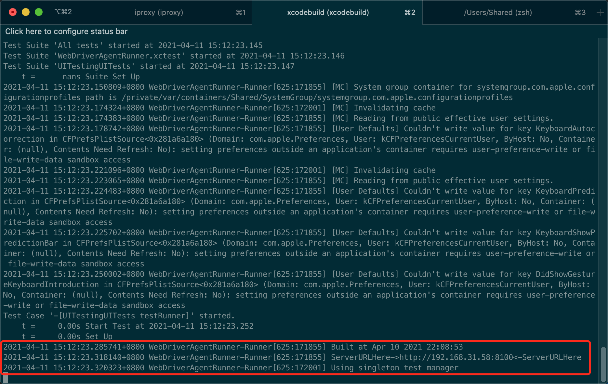
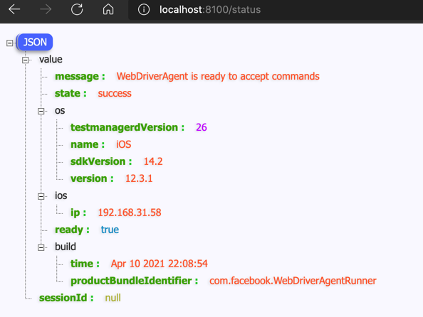
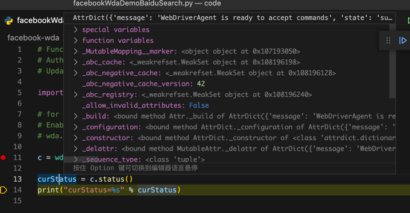

# 搭建环境

此处介绍如何用`facebook-wda`搭建iOS设备的自动化测试环境。

先介绍`facebook-wda`的架构流程图：

* 本地图片
  * 
* 在线网页查看
  * [facebook-wda架构流程图](https://www.processon.com/view/link/5eb3689e5653bb07215954bf)

## 开发环境概述

* 开发环境概述
  * `client`=`客户端`
      * 你要测试的`iOS`设备，比如`iPhone`
          * 给`iPhone`中安装`WebDriverAgentRunner-Runner`
  * `server`=`服务端`=`test manager`=`WebDriverAgent的服务`
      * 需要在`Mac`中启动`test manager`

## 首次：初始化

先介绍初始化需要做的事情，其中：

* 初始化 = 第一次 = 首次 = 只需要做一次，以后无需重复做

想要能自动化操作iPhone等iOS设备，需要

（1）先确保Mac环境OK

把相关后续要用到的工具都安装好：

```bash
brew update
brew uninstall --ignore-dependencies libimobiledevice
brew uninstall --ignore-dependencies usbmuxd
brew install --HEAD usbmuxd
brew unlink usbmuxd
brew link usbmuxd
brew install --HEAD libimobiledevice
```

再去安装wda的库：

```bash
pip install facebook-wda
```

（2）再去给`iPhone`中安装相关内容

先确保iPhone已正常连接：

把iOS设备（iPhone等）插入Mac后，用

```bash
idevice_id -l
```

确保可以找到iPhone设备。

再去给iPhone中安装：

* 客户端 = APP = `WebDriverAgentRunner-Runner`
  * 用于配合`Mac`中的`server端`的`test manager`

安装后的效果：


此处长按变待删除，才能看到app全名是：`WebDriverAgentRunner-Runner`：


## 给iPhone中安装WebDriverAgentRunner-Runner

核心思路，都是编译和安装app `WebDriverAgentRunner-Runner`到iPhone中：

* 确保Mac中已安装XCode

下载代码：

```bash
git clone https://github.com/appium/WebDriverAgent.git
```

切换目录：

```bash
cd WebDriverAgent
```

可以看到核心的入口文件，即Xcode项目文件：`WebDriverAgent.xcodeproj`

关于如何编译和安装，则有2种方式：

* 通过IDE`XCode`去编译和安装
  * `Xcode`->`Product`->`Test`
    * 注：准备工作包括
      * 用`XCode`打开`WebDriverAgent.xcodeproj`
      * 选择`Target`的APP是：`WebDriverAgentRunner`
      * 去选择`Team`，是自己（或别的可用的）`开发者账号`
      * 会触发自动`Code Signing`
      * 最后才是：`Product`->`Test`
* 在`终端`运行`xcodebuild`命令去编译和安装
  * `Terminal`中：运行`xcodebuild`的`test`

上述操作步骤，和后续的每次运行`test manager`的方式是一样的，所以细节放在后面介绍。

## 之后：每次调试之前

### 启动test manager服务

* `server`=`服务端`=`test manager`=`WebDriverAgent的服务`
  * 需要在`Mac`中启动`test manager`
    * 2种方式
      * XCode
        * `Xcode`->`Product`->`Test`
      * 终端
        * `Terminal`中：运行`xcodebuild`的`test`
          * 直接一步：
            ```bash
            xcodebuild -project WebDriverAgent.xcodeproj -scheme WebDriverAgentRunner -destination "id=`idevice_id -l | head -n1`" test
            ```
          * 或分2步
            * 先获取iOS设备的UDID：
              ```bash
              CUR_UDID=$(idevice_id -l | head -n1)
              ```
            * 再运行
              ```bash
              xcodebuild -project WebDriverAgent.xcodeproj -scheme WebDriverAgentRunner -destination "id=$CUR_UDID" test
              ```
          * 注：
            * 要在`WebDriverAgent`的目录中运行上述命令
            * `idevice_id -l`作用是列出当前连接到Mac中的所有iOS的设备（的UDID）
              * 详见：[idevice_id](https://book.crifan.com/books/apple_develop_summary/website/desktop/idevice_id.html)
            * `head -n1`作用是获取第一个（iOS设备的UDID）

* 输出正常的`ServerURLHere`和`Using singleton test manager`
  * 
  ```bash
  。。。
  Test Case '-[UITestingUITests testRunner]' started.
      t =     0.01s Start Test at 2020-02-20 10:50:59.818
      t =     0.01s Set Up
  2020-02-20 10:50:59.968359+0800 WebDriverAgentRunner-Runner[460:142725] Built at Feb 20 2020 10:50:08
  2020-02-20 10:51:00.119667+0800 WebDriverAgentRunner-Runner[460:142725] ServerURLHere->http://192.168.31.43:8100<-ServerURLHere
  2020-02-20 10:51:00.123946+0800 WebDriverAgentRunner-Runner[460:142853] Using singleton test manager
  ```
  * 即表示正常启动了`test manager`= `WDA的server` 了

### 第一次：确保wda服务运行正常

验证服务正常，环境搭建成功的方式：

* 用浏览器等访问status端口
  * （用浏览器）打开访问上述对应的地址，比如（类似的） http://192.168.31.58:8100/status
    * 或后续用`iproxy 8100 8100`端口转发后的：http://localhost:8100/status
  * 可以返回json状态信息
    * 
  * -》也说明服务启动正常，环境搭建正常了
* 用代码测试
  ```python
  import wda

  # for debug
  # Enable debug will see http Request and Response
  # wda.DEBUG = True

  c = wda.Client('http://localhost:8100')

  curStatus = c.status()
  print("curStatus=%s" % curStatus)
  ```
  * 确保能输出信息
    * 比如
      ```bash
      curStatus=AttrDict({'message': 'WebDriverAgent is ready to accept commands', 'state': 'success', 'os': {'testmanagerdVersion': 26, 'name': 'iOS', 'sdkVersion': '14.2', 'version': '12.3.1'}, 'ios': {'ip': '192.168.31.58'}, 'ready': True, 'build': {'time': 'Apr 10 2021 22:08:54', 'productBundleIdentifier': 'com.facebook.WebDriverAgentRunner'}, 'sessionId': None})
      ```
    * 
  * 表示环境搭建成功
