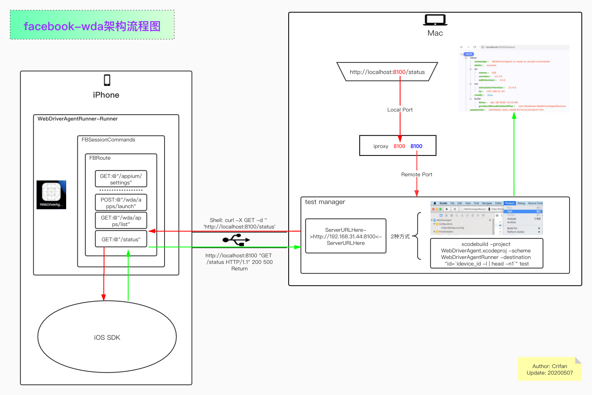
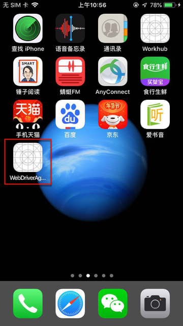

# 搭建环境

此处介绍如何用`facebook-wda`搭建iOS设备的自动化测试环境。

先介绍`facebook-wda`的架构流程图：

* 本地图片
  * 
* 在线网页查看
  * [facebook-wda架构流程图](https://www.processon.com/view/link/5eb3689e5653bb07215954bf)

## 开发环境概述

* 开发环境概述
  * `client`=`客户端`
      * 你要测试的`iOS`设备，比如`iPhone`
          * 给`iPhone`中安装`WebDriverAgentRunner-Runner`
  * `server`=`服务端`=`test manager`=`WebDriverAgent的服务`
      * 需要在`Mac`中启动`test manager`

## 首次：初始化

先介绍初始化需要做的事情，其中：

* 初始化 = 第一次 = 首次 = 只需要做一次，以后无需重复做

想要能自动化操作iPhone等iOS设备，需要先去给`iPhone`中安装：

* 客户端 = APP = `WebDriverAgentRunner-Runner`
  * 用于配合`Mac`中的`server端`的`test manager`

安装后的效果：



此处长按变待删除，才能看到app全名是：`WebDriverAgentRunner-Runner`：


## 给iPhone中安装WebDriverAgentRunner-Runner

核心思路，都是编译和安装app `WebDriverAgentRunner-Runner`到iPhone中：

* 确保Mac中已安装XCode

下载代码：

```bash
git clone https://github.com/appium/WebDriverAgent.git
```

切换目录：

```bash
cd WebDriverAgent
```

看到相关文件：

```bash
 ll
total 96
-rw-r--r--   1 limao  CORP\Domain Users   2.0K  2 13 17:40 CONTRIBUTING.md
-rw-r--r--   1 limao  CORP\Domain Users   111B  2 13 17:40 Cartfile
-rw-r--r--   1 limao  CORP\Domain Users    75B  2 13 17:40 Cartfile.resolved
drwxr-xr-x   3 limao  CORP\Domain Users    96B  2 13 17:40 Configurations
drwxr-xr-x   4 limao  CORP\Domain Users   128B  2 13 17:40 Fastlane
-rw-r--r--   1 limao  CORP\Domain Users   177B  2 13 17:40 Gemfile
-rw-r--r--   1 limao  CORP\Domain Users   4.3K  2 13 17:40 Gemfile.lock
-rw-r--r--   1 limao  CORP\Domain Users   1.5K  2 13 17:40 LICENSE
-rw-r--r--   1 limao  CORP\Domain Users   1.9K  2 13 17:40 PATENTS
drwxr-xr-x   7 limao  CORP\Domain Users   224B  2 13 17:40 PrivateHeaders
-rw-r--r--   1 limao  CORP\Domain Users   2.5K  2 13 17:40 README.md
drwxr-xr-x   5 limao  CORP\Domain Users   160B  2 13 17:40 Scripts
drwxr-xr-x   5 limao  CORP\Domain Users   160B  2 13 17:40 WebDriverAgent.xcodeproj
drwxr-xr-x  16 limao  CORP\Domain Users   512B  2 13 17:40 WebDriverAgentLib
drwxr-xr-x   4 limao  CORP\Domain Users   128B  2 13 17:40 WebDriverAgentRunner
drwxr-xr-x   6 limao  CORP\Domain Users   192B  2 13 17:40 WebDriverAgentTests
drwxr-xr-x   5 limao  CORP\Domain Users   160B  2 13 17:40 ci-jobs
-rw-r--r--   1 limao  CORP\Domain Users   666B  2 13 17:40 gulpfile.js
-rw-r--r--   1 limao  CORP\Domain Users   896B  2 13 17:40 index.js
drwxr-xr-x   9 limao  CORP\Domain Users   288B  2 13 17:40 lib
-rw-r--r--   1 limao  CORP\Domain Users   2.5K  2 13 17:40 package.json
drwxr-xr-x   5 limao  CORP\Domain Users   160B  2 13 17:40 test
```

其中核心的入口文件，即Xcode项目文件是：`WebDriverAgent.xcodeproj`

关于如何编译和安装，则有2种方式：

* 通过IDE`XCode`去编译和安装
  * `Xcode`->`Product`->`Test`
* 在`终端`运行`xcodebuild`命令去编译和安装
  * `Terminal`中：运行`xcodebuild`的`test`

上述操作步骤，和后续的每次运行`test manager`的方式是一样的，所以细节放在后面介绍。

## 之后：每次调试之前

### 启动test manager服务

* `server`=`服务端`=`test manager`=`WebDriverAgent的服务`
    * 需要在`Mac`中启动`test manager`
        * 2种方式
            * XCode
              * `Xcode`->`Product`->`Test`
            * 终端
              * `Terminal`中：运行`xcodebuild`的`test`
                  * 直接一步：
                      * ```xcodebuild -project WebDriverAgent.xcodeproj -scheme WebDriverAgentRunner -destination "id=`idevice_id -l | head -n1`" test```
                  * 或分2步
                      * 先获取iOS设备的UDID：
                          * `CUR_UDID=$(idevice_id -l | head -n1)`
                      * 再运行：
                          * `xcodebuild -project WebDriverAgent.xcodeproj -scheme WebDriverAgentRunner -destination "id=$CUR_UDID" test`
                  * 注：
                    * 要在`WebDriverAgent`的目录中运行上述命令
                    * `idevice_id -l`作用是列出当前连接到Mac中的所有iOS的设备（的UDID）
                      * 详见：[idevice_id](https://book.crifan.com/books/apple_develop_summary/website/desktop/idevice_id.html)
                    * `head -n1`作用是获取第一个（iOS设备的UDID）

最后能看到输出`ServerURLHere`和`Using singleton test manager`：

```bash
。。。
Test Case '-[UITestingUITests testRunner]' started.
    t =     0.01s Start Test at 2020-02-20 10:50:59.818
    t =     0.01s Set Up
2020-02-20 10:50:59.968359+0800 WebDriverAgentRunner-Runner[460:142725] Built at Feb 20 2020 10:50:08
2020-02-20 10:51:00.119667+0800 WebDriverAgentRunner-Runner[460:142725] ServerURLHere->http://192.168.31.43:8100<-ServerURLHere
2020-02-20 10:51:00.123946+0800 WebDriverAgentRunner-Runner[460:142853] Using singleton test manager
```

即表示正常启动了`test manager`= `WDA的server` 了。
