# 搭建环境期间常见问题和心得

下面整理一些搭建环境期间的常见问题和心得总结：

## XCode报错：A build only device cannot be used to run this target

XCode去编译，报错：

```bash
A build only device cannot be used to run this target.
No supported iOS devices are available. Connect a device to run your application or choose a simulated device as the destination.
```

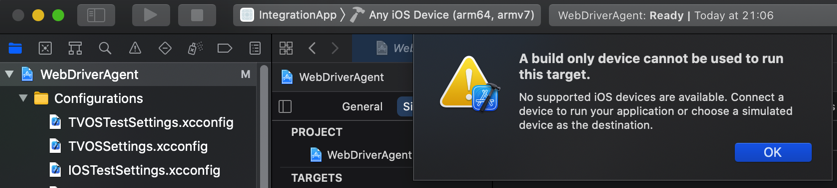

原因：没有插入iPhone，且选择对应的iPhone等iOS真机设备

解决办法：把此处的iPhone7插入Mac

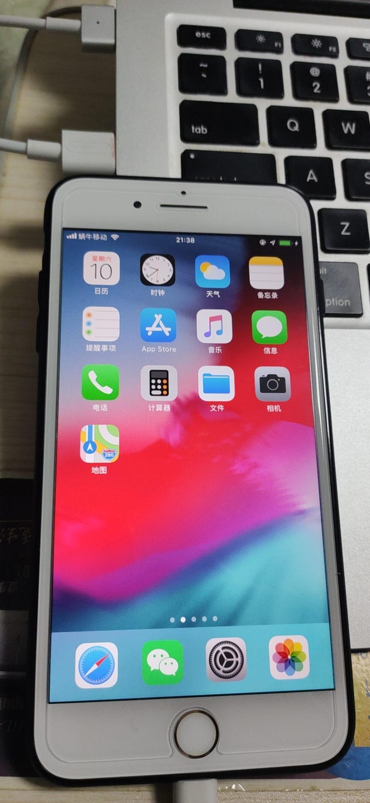

然后XCode中选择对应设备

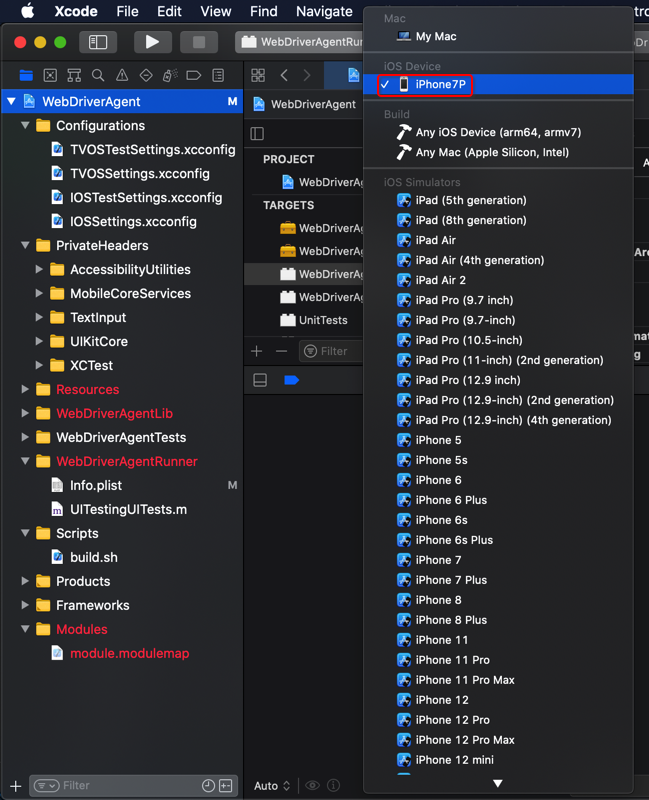

注：可以通过

```bash
idevice_id -l
```

确保能找到iOS设备，说明iPhone的确已连接上Mac了。

## XCode报错：Signing for requires a development team. Select a development team in the Signing & Capabilities editor

XCode去编译项目，报错：

```bash
Signing for "IntegrationApp" requires a development team. Select a development team in the Signing & Capabilities editor.

Showing All Messages
```

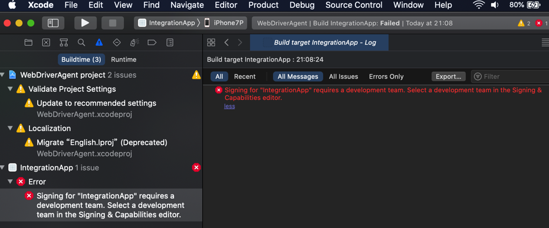

出错原因：把本身要编译的app搞错了，不是这个`IntegrationApp`，应该是`WebDriverAgentRunner`

解决办法：把要编译的app换成`WebDriverAgentRunner`

具体步骤：

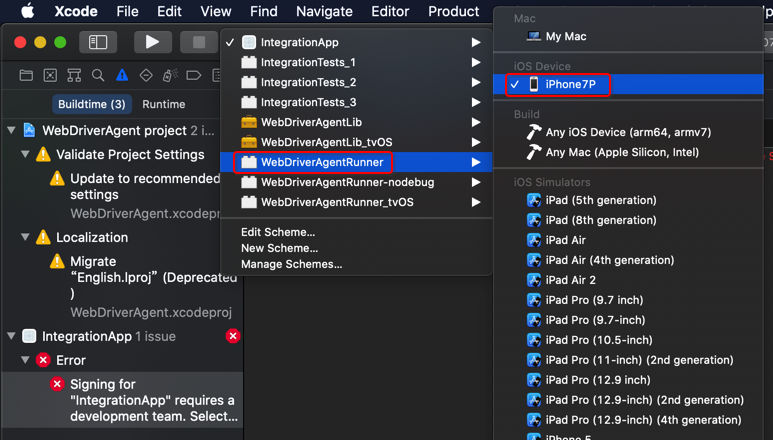

即可。

另外，需要去给`WebDriverAgentRunner`加上`code signing`

-》 此处是通过把`Team`从`None`改为`自己的值`，然后自动修复

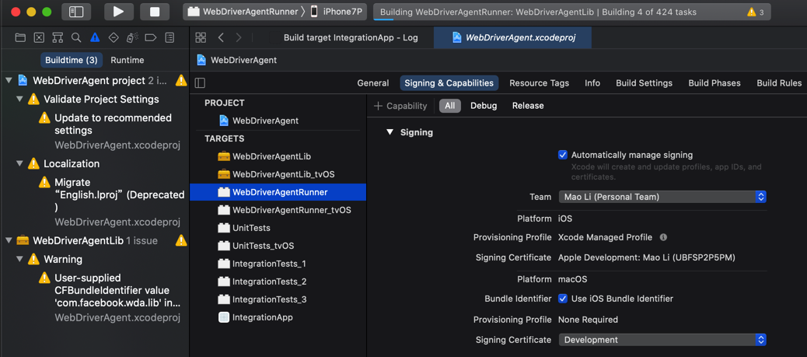

一般即可修复成功，最终加上code signing。

## XCode报错：Failed to register bundle identifier com.facebook.WebDriverAgentRunner

XCode中尝试编译WebDriverAgentRunner，当选择了Team后，自动Singing，结果报错：

```bash
Failed to register bundle identifier
The app identifier "com.facebook.WebDriverAgentRunner" cannot be registered to your development team because it is not available. Change your bundle identifier to a unique string to try again.
```

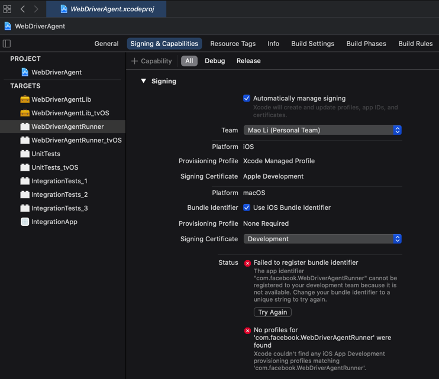

原因：估计是id重复了

解决办法：去更换id

具体步骤：

把`com.facebook.WebDriverAgentRunner`为别的值，比如：`com.facebook.WebDriverAgentRunner_Crifan`

最终是，对于`WebDriverAgentRunner`的`bundle Identifier`值，最后是在：

`WebDriverAgentRunner`的`属性`-》`Build Settings`-》`Packaging`-》`Product Bundle Identifier` 中去修改的

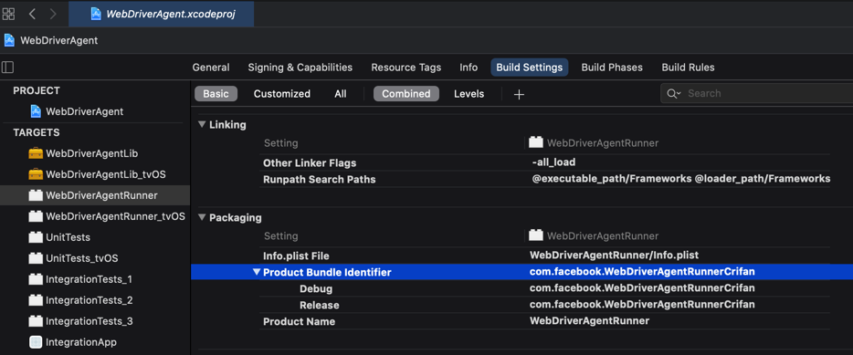


## xcodebuild报错：Signing certificate is invalid

xcodebuild编译报错：

```bash
 xcodebuild -project WebDriverAgent.xcodeproj -scheme WebDriverAgentRunner -destination "id=`idevice_id -l | head -n1`" test
Command line invocation:
    /Applications/Xcode.app/Contents/Developer/usr/bin/xcodebuild -project WebDriverAgent.xcodeproj -scheme WebDriverAgentRunner -destination id=3dc13714e21415898e8e2c2863d96990a4d69c97 test

note: Using new build system
note: Building targets in parallel
note: Planning build
note: Constructing build description
error: Signing certificate is invalid. Signing certificate "Apple Development: Mao Li (UBFSP2P5PM)", serial number "<DVTSigningCertificateSerialNumber: 0x7fc4c756db00>", is not valid for code signing. It may have been revoked or expired. (in target 'WebDriverAgentLib' from project 'WebDriverAgent')
error: Signing certificate is invalid. Signing certificate "Apple Development: Mao Li (UBFSP2P5PM)", serial number "<DVTSigningCertificateSerialNumber: 0x7fc4c756db00>", is not valid for code signing. It may have been revoked or expired. (in target 'WebDriverAgentRunner' from project 'WebDriverAgent')

Test session results, code coverage, and logs:
    /Users/crifan/Library/Developer/Xcode/DerivedData/WebDriverAgent-fkggltbnspxitwcqkcogpefhhvai/Logs/Test/Test-WebDriverAgentRunner-2021.04.13_21-02-33-+0800.xcresult

Testing failed:
    Signing certificate is invalid. Signing certificate "Apple Development: Mao Li (UBFSP2P5PM)", serial number "<DVTSigningCertificateSerialNumber: 0x7fc4c756db00>", is not valid for code signing. It may have been revoked or expired.
    Testing cancelled because the build failed.

** TEST FAILED **
```

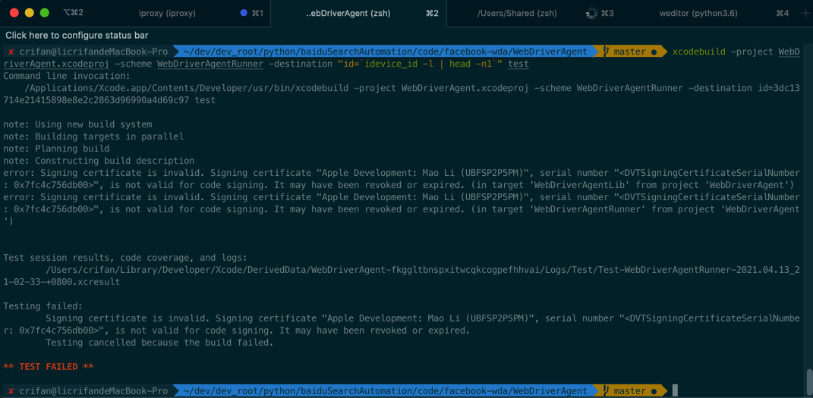

**原因**：自己的Apple苹果（开发者）账号过期了。不可用，没法给代码code sign了。

**解决办法**：花钱，给苹果开发者账号续费。价格：99美元/年。

### XCode中The certificate used to sign has either expired or has been revoked

其他类似的问题：

XCode中，报错

```bash
Unable to install "WebDriverAgentRunner-Runner"
The certificate used to sign "WebDriverAgentRunner-Runner" has either expired or has been revoked. An updated certificate is required to sign and install the application.
```

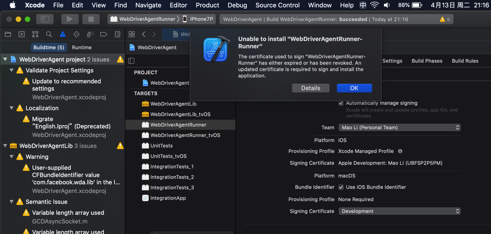

点击`Details`还可以看到详情：

```bash
Details

Unable to install "WebDriverAgentRunner-Runner"
Domain: com.apple.dt.MobileDeviceErrorDomain
Code: -402620392
Recovery Suggestion: The certificate used to sign "WebDriverAgentRunner-Runner" has either expired or has been revoked. An updated certificate is required to sign and install the application.
--
The identity used to sign the executable is no longer valid.
Domain: com.apple.dt.MobileDeviceErrorDomain
Code: -402620392
User Info: {
    DVTRadarComponentKey = 487925;
    MobileDeviceErrorCode = "(0xE8008018)";
    "com.apple.dtdevicekit.stacktrace" = (
     0   DTDeviceKitBase                     0x000000011d4bcc8f DTDKCreateNSErrorFromAMDErrorCode + 220
     1   DTDeviceKitBase                     0x000000011d4fb241 __90-[DTDKMobileDeviceToken installApplicationBundleAtPath:withOptions:andError:withCallback:]_block_invoke + 155
     2   DVTFoundation                       0x0000000101ba464b DVTInvokeWithStrongOwnership + 71
     3   DTDeviceKitBase                     0x000000011d4faf82 -[DTDKMobileDeviceToken installApplicationBundleAtPath:withOptions:andError:withCallback:] + 1440
     4   IDEiOSSupportCore                   0x000000011d36ba10 __118-[DVTiOSDevice(DVTiPhoneApplicationInstallation) processAppInstallSet:appUninstallSet:installOptions:completionBlock:]_block_invoke.292 + 3513
     5   DVTFoundation                       0x0000000101cd317e __DVT_CALLING_CLIENT_BLOCK__ + 7
     6   DVTFoundation                       0x0000000101cd4da0 __DVTDispatchAsync_block_invoke + 1191
     7   libdispatch.dylib                   0x00007fff6db306c4 _dispatch_call_block_and_release + 12
     8   libdispatch.dylib                   0x00007fff6db31658 _dispatch_client_callout + 8
     9   libdispatch.dylib                   0x00007fff6db36c44 _dispatch_lane_serial_drain + 597
     10  libdispatch.dylib                   0x00007fff6db375d6 _dispatch_lane_invoke + 363
     11  libdispatch.dylib                   0x00007fff6db40c09 _dispatch_workloop_worker_thread + 596
     12  libsystem_pthread.dylib             0x00007fff6dd8ba3d _pthread_wqthread + 290
     13  libsystem_pthread.dylib             0x00007fff6dd8ab77 start_wqthread + 15
);
}
--

System Information

macOS Version 10.15.7 (Build 19H2)
Xcode 12.4 (17801) (Build 12D4e)
Timestamp: 2021-04-13T21:17:10+08:00
```

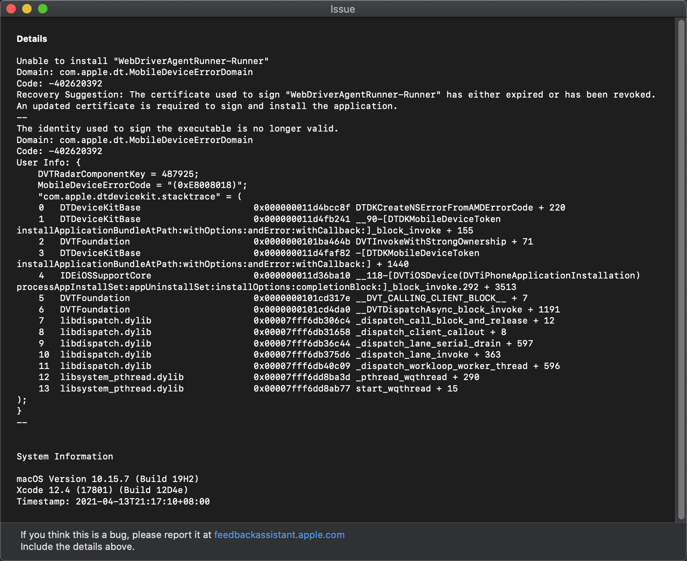

**原因**：苹果开发者账号过期了，没续费。导致证书不可用。

**解决办法**：同上，续费即可。

## xcodebuild报错：xcode-select error tool xcodebuild requires Xcode

如果运行xcodebuld报错：

```bash
xcode-select: error: tool 'xcodebuild' requires Xcode, but active developer directory '/Library/Developer/CommandLineTools' is a command line tools instance
```

* **原因**：没有安装XCode 或 虽然已安装XCode，但是没启用XCode的命令行
* **解决办法**：去安装并开启XCode的命令行
* **步骤**：
    * 文字
      * `Xcode`->`设置`->`Locations`->`Command Line Tools`，默认是**空**，下拉选择`Xcode 11.3.1(11C504)`
    * 截图
      * 

安装后，即可查看版本信息：

```bash
~  xcodebuild -version
Xcode 11.3.1
Build version 11C504
```

## xcodebuild报错：xcodebuild error missing value for key

如果没有iOS设备（如iPhone）插入到Mac中，则运行：

```xcodebuild -project WebDriverAgent.xcodeproj -scheme WebDriverAgentRunner -destination "id=`idevice_id -l | head -n1`" test```

会报错：

```bash
 ~/dev/xxx/crawler/appAutoCrawler/AppCrawler/iOSAutomation/refer/WebDriverAgent   master ●  xcodebuild -project WebDriverAgent.xcodeproj -scheme WebDriverAgentRunner -destination "id=`idevice_id -l | head -n1`" test
xcodebuild: error: missing value for key 'id' of option 'Destination'
```

#### 当前被测iOS设备详情

在启动`test manager`期间会输出当前被测设备的详细信息

举例：

(1) `iOS 12.4.5`的`iPhone6`

```bash
2020-05-07 09:20:31.198 xcodebuild[2440:2434041] [MT] IDETestOperationsObserverDebug: (B7957682-E70F-46C7-86C2-53AEE7C8993D) Beginning test session WebDriverAgentRunner-B7957682-E70F-46C7-86C2-53AEE7C8993D at 2020-05-07 09:20:31.194 with Xcode 11C504 on target 📱<DVTiOSDevice (0x7f8456759e30), Crifan iPhone6, iPhone, 12.4.5 (16G161), ed94089f3e34d5538065a695bfdf03dfbb3c5579> {
        deviceSerialNumber:         DNPND9S1G5MR
        identifier:                 ed94089f3e34d5538065a695bfdf03dfbb3c5579
        deviceClass:                iPhone
        deviceName:                 Crifan iPhone6
        deviceIdentifier:           ed94089f3e34d5538065a695bfdf03dfbb3c5579
        productVersion:             12.4.5
        buildVersion:               16G161
        deviceSoftwareVersion:      12.4.5 (16G161)
        deviceArchitecture:         arm64
        deviceTotalCapacity:        60058931200
        deviceAvailableCapacity:    38391648256
        deviceIsTransient:          NO
        ignored:                    NO
        deviceIsBusy:               NO
        deviceIsPaired:             YES
        deviceIsActivated:          YES
        deviceActivationState:      Activated
        isPasscodeLocked:           NO
        deviceType:                 <DVTDeviceType:0x7f845621d390 Xcode.DeviceType.iPhone>
        supportedDeviceFamilies:    (
    1
)
        applications:              (null)
        provisioningProfiles:      (null)
        hasInternalSupport:        NO
        hasWritableSystem:         NO
        isSupportedOS:             YES
        bootArgs:                  (null)
        nextBootArgs:              (null)
        connected:                 YES
        isWirelessEnabled:         NO
        connectionType:            direct
        hostname:                  (null)
        bonjourServiceName:        d4:f4:6f:0a:30:80@fe80::d6f4:6fff:fe0a:3080._apple-mobdev2._tcp.local.
        activeProxiedDevice:       (null)
        } (12.4.5 (16G161))
```

## USB端口转发

为了测试更方便，最好安装和启动端口转发

具体方式是，用`iproxy`或`mobiledevice`实现，把访问Mac本地的端口，转发到USB连接着的iOS设备中

命令：

对于只连接单个iOS设备，比如某个iPhone的话，只需要：

```bash
iproxy 8100 8100
```

或：

```bash
mobiledevice tunnel 8100 8100
```

更多解释和用法，详见：

[端口转发 · 苹果相关开发总结](https://book.crifan.com/books/apple_develop_summary/website/desktop/port_forward.html)

## 如何确认`test manager`服务已正常运行

可以去访问运行了`test manager`最后所输出的地址：

`http://192.168.31.43:8100`

加上`status`后是：

`http://192.168.31.43:8100/status`

> #### success:: 如果已端口转发则可以把IP换localhost
> 
> 如果用了端口转发，则可以把IP换成localhost：
> 
> `http://localhost:8100/status`

会输出当前状态信息：

```json
{
    "value": {
        "message": "WebDriverAgent is ready to accept commands",
        "state": "success",
        "os": {
            "name": "iOS",
            "version": "12.4.5",
            "sdkVersion": "13.0"
        },
        "ios": {
            "simulatorVersion": "12.4.5",
            "ip": "192.168.31.43"
        },
        "ready": true,
        "build": {
            "time": "Feb 20 2020 10:50:08",
            "productBundleIdentifier": "com.facebook.WebDriverAgentRunner"
        }
    },
    "sessionId": "38289A64-E467-4458-A0F1-8A3B2A6AAECE"
}
```


