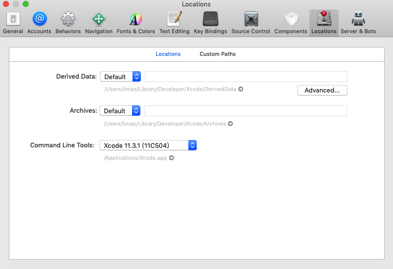
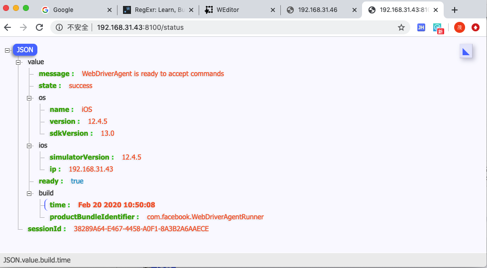

# 搭建环境期间常见问题和心得

下面整理一些搭建环境期间的常见问题和心得总结：

### xcodebuild报错：xcode-select error tool xcodebuild requires Xcode

如果运行xcodebuld报错：

```bash
xcode-select: error: tool 'xcodebuild' requires Xcode, but active developer directory '/Library/Developer/CommandLineTools' is a command line tools instance
```

* **原因**：没有安装XCode 或 虽然已安装XCode，但是没启用XCode的命令行
* **解决办法**：去安装并开启XCode的命令行
* **步骤**：
    * 文字
      * `Xcode`->`设置`->`Locations`->`Command Line Tools`，默认是**空**，下拉选择`Xcode 11.3.1(11C504)`
    * 截图
      * 

安装后，即可查看版本信息：

```bash
~  xcodebuild -version
Xcode 11.3.1
Build version 11C504
```

### xcodebuild报错：xcodebuild error missing value for key

如果没有iOS设备（如iPhone）插入到Mac中，则运行：

```xcodebuild -project WebDriverAgent.xcodeproj -scheme WebDriverAgentRunner -destination "id=`idevice_id -l | head -n1`" test```

会报错：

```bash
 ~/dev/xxx/crawler/appAutoCrawler/AppCrawler/iOSAutomation/refer/WebDriverAgent   master ●  xcodebuild -project WebDriverAgent.xcodeproj -scheme WebDriverAgentRunner -destination "id=`idevice_id -l | head -n1`" test
xcodebuild: error: missing value for key 'id' of option 'Destination'
```

#### 当前被测iOS设备详情

在启动`test manager`期间会输出当前被测设备的详细信息

举例：

(1) `iOS 12.4.5`的`iPhone6`

```bash
2020-05-07 09:20:31.198 xcodebuild[2440:2434041] [MT] IDETestOperationsObserverDebug: (B7957682-E70F-46C7-86C2-53AEE7C8993D) Beginning test session WebDriverAgentRunner-B7957682-E70F-46C7-86C2-53AEE7C8993D at 2020-05-07 09:20:31.194 with Xcode 11C504 on target 📱<DVTiOSDevice (0x7f8456759e30), Crifan iPhone6, iPhone, 12.4.5 (16G161), ed94089f3e34d5538065a695bfdf03dfbb3c5579> {
        deviceSerialNumber:         DNPND9S1G5MR
        identifier:                 ed94089f3e34d5538065a695bfdf03dfbb3c5579
        deviceClass:                iPhone
        deviceName:                 Crifan iPhone6
        deviceIdentifier:           ed94089f3e34d5538065a695bfdf03dfbb3c5579
        productVersion:             12.4.5
        buildVersion:               16G161
        deviceSoftwareVersion:      12.4.5 (16G161)
        deviceArchitecture:         arm64
        deviceTotalCapacity:        60058931200
        deviceAvailableCapacity:    38391648256
        deviceIsTransient:          NO
        ignored:                    NO
        deviceIsBusy:               NO
        deviceIsPaired:             YES
        deviceIsActivated:          YES
        deviceActivationState:      Activated
        isPasscodeLocked:           NO
        deviceType:                 <DVTDeviceType:0x7f845621d390 Xcode.DeviceType.iPhone>
        supportedDeviceFamilies:    (
    1
)
        applications:              (null)
        provisioningProfiles:      (null)
        hasInternalSupport:        NO
        hasWritableSystem:         NO
        isSupportedOS:             YES
        bootArgs:                  (null)
        nextBootArgs:              (null)
        connected:                 YES
        isWirelessEnabled:         NO
        connectionType:            direct
        hostname:                  (null)
        bonjourServiceName:        d4:f4:6f:0a:30:80@fe80::d6f4:6fff:fe0a:3080._apple-mobdev2._tcp.local.
        activeProxiedDevice:       (null)
        } (12.4.5 (16G161))
```

### USB端口转发

为了测试更方便，最好安装和启动端口转发

具体方式是，用`iproxy`或`mobiledevice`实现，把访问Mac本地的端口，转发到USB连接着的iOS设备中

命令：

对于只连接单个iOS设备，比如某个iPhone的话，只需要：

```bash
iproxy 8100 8100
```

或：

```bash
mobiledevice tunnel 8100 8100
```

更多解释和用法，详见：

[端口转发 · 苹果相关开发总结](https://book.crifan.com/books/apple_develop_summary/website/desktop/port_forward.html)

### 如何确认`test manager`服务已正常运行

可以去访问运行了`test manager`最后所输出的地址：

`http://192.168.31.43:8100`

加上`status`后是：

`http://192.168.31.43:8100/status`

> #### success:: 如果已端口转发则可以把IP换localhost
> 
> 如果用了端口转发，则可以把IP换成localhost：
> 
> `http://localhost:8100/status`

会输出当前状态信息：

```json
{
    "value": {
        "message": "WebDriverAgent is ready to accept commands",
        "state": "success",
        "os": {
            "name": "iOS",
            "version": "12.4.5",
            "sdkVersion": "13.0"
        },
        "ios": {
            "simulatorVersion": "12.4.5",
            "ip": "192.168.31.43"
        },
        "ready": true,
        "build": {
            "time": "Feb 20 2020 10:50:08",
            "productBundleIdentifier": "com.facebook.WebDriverAgentRunner"
        }
    },
    "sessionId": "38289A64-E467-4458-A0F1-8A3B2A6AAECE"
}
```


