# 如何用XCode编译`WebDriverAgent.xcodeproj`

对于下载到`WebDriverAgent`的源码中的`WebDriverAgent.xcodeproj`，第一次编译最好去用XCode编译。

因为往往涉及到配置`Team`和`自动签名`等事宜。

下面就来介绍，如何用`XCode`去配置和编译`WebDriverAgent.xcodeproj`

双击`WebDriverAgent.xcodeproj`

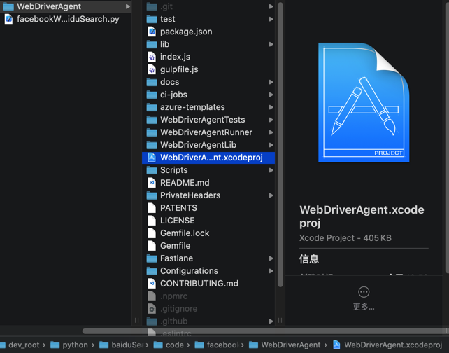

会自动用XCode打开：

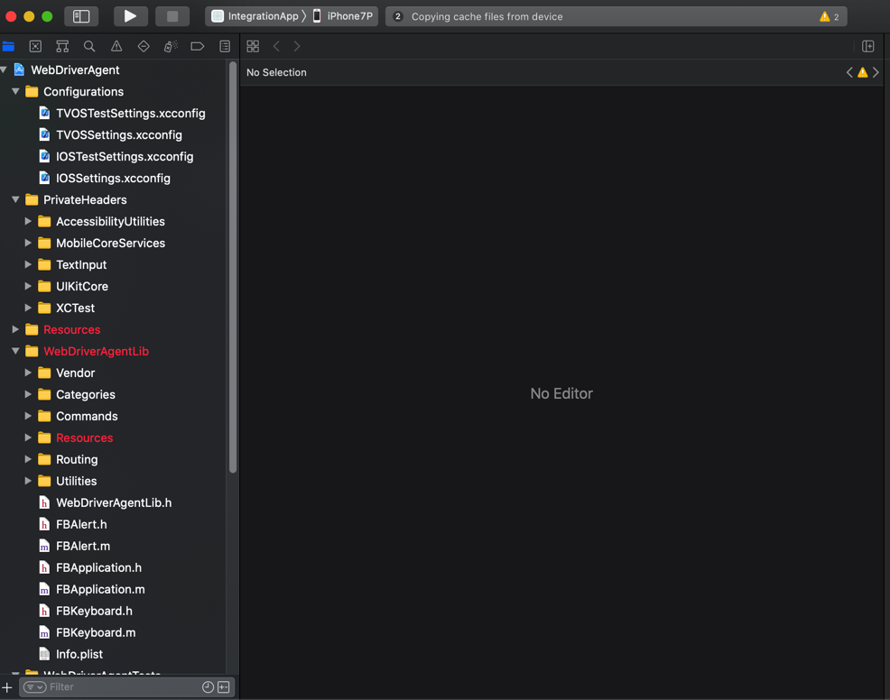

点击左上角的项目，进入项目属性，点击`TARGETS`中的`WebDriverAgentRunner`，切换到`Signing & Capabilities`：

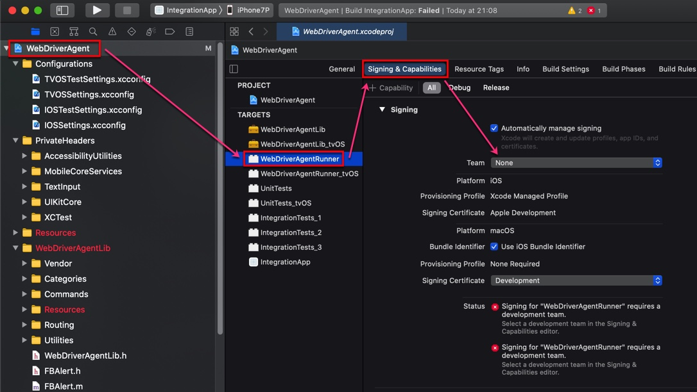

默认`Team`是`None`，需要去选择一个自己的苹果账号：

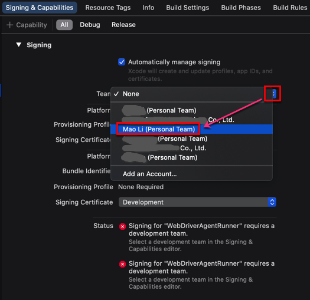

然后会触发自动修复，显示`Waiting to repair`：

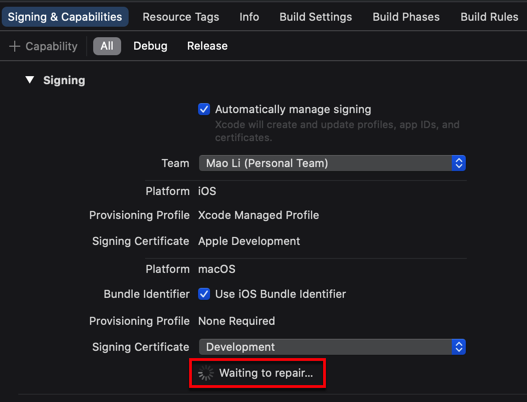

看到没有其他警告或错误，就表示自动创建签名和Profile等工作正常了：

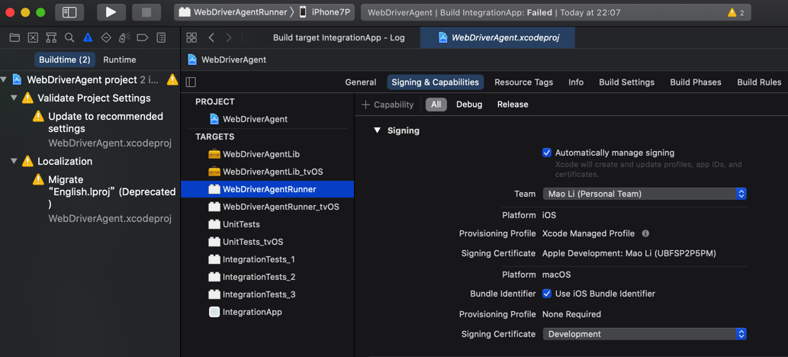

接着即可去编译了：点击左上角`▶️`按钮，即可触发编译，显示`Building ...`

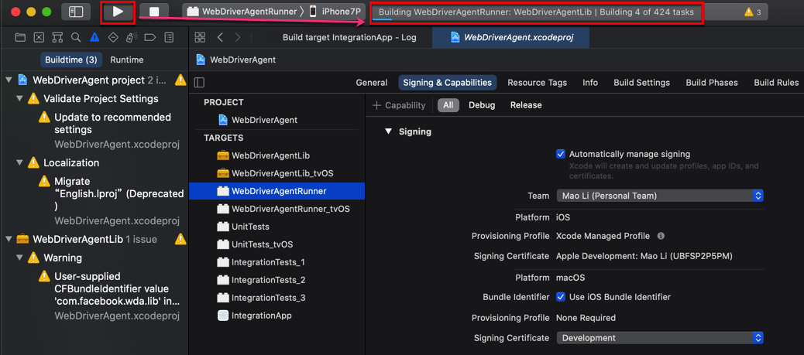

之后即可正常的`Product`->`Test`去测试，启动服务，供后续使用了。

## Failed to register bundle identifier

如果`Signing & Capablities`的自动修复后报错：

```bash
Failed to register bundle identifier
The app identifier "com.facebook.WebDriverAgentRunner" cannot be registered to your development team because it is not available. Change your bundle identifier to a unique string to try again.
```

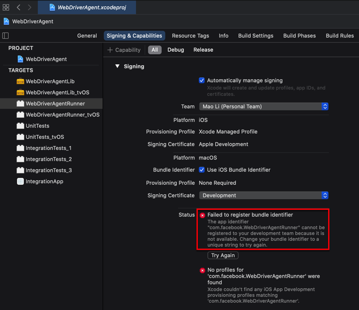

**原因**：（很可能是）默认的ID：`com.facebook.WebDriverAgentRunner`已存在，重复了，导致无法继续。

**解决办法**：修改为其他（独一无二的）值

**操作步骤**：

`WebDriverAgentRunner`的属性 -> `Build Settings` -> `Packaging` -> `Product Bundle Identifier`

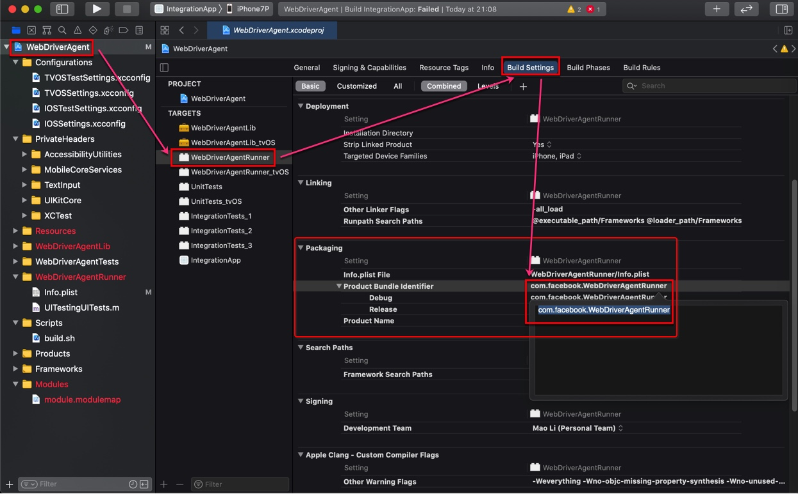

把值从默认的：`com.facebook.WebDriverAgentRunner`改为别的，确保不重复的值，比如我此处改为：`com.facebook.WebDriverAgentRunnerCrifan`

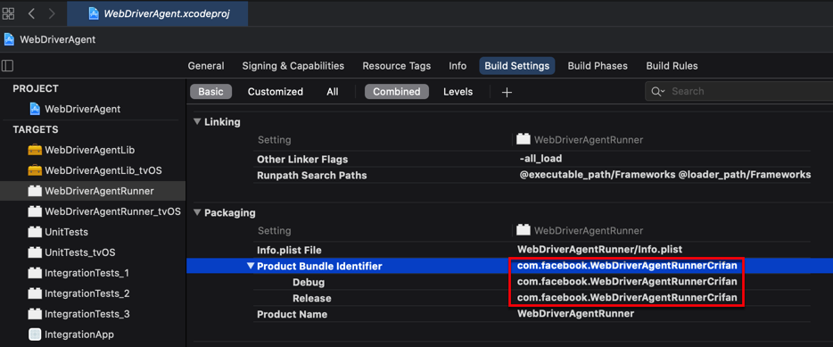

> #### info:: 别处调用到此处的`Product Bundle Identifier`
> 
> 后来注意到一个细节，别处会调用到此处的`Product Bundle Identifier`中的值
> 
> 比如：`Info`->`Key`->`Bundle Identifier`: `$(PRODUCT_BUNDLE_IDENTIFIER)`
> 
> 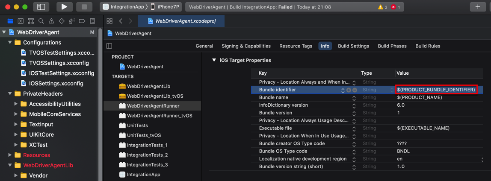

## A build only device cannot be used to run this target

如果编译期间报错：

```bash
A build only device cannot be used to run this target.
No supported iOS devices are available. Connect a device to run your application or choose a simulated device as the destination.
```

则说明是没有选择正确的设备。

此处是需要去确保iOS设备已连接，并选择目标设备为对应iOS设备。

此处iOS设备是：`iPhone7P`

先连接到Mac中：

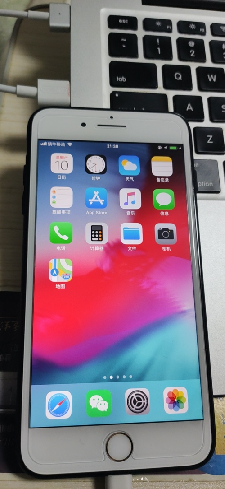

以及可以借助于`idevice_id`去确保能找到设备ID，说明设备的确已连接：

```bash
 idevice_id -l
3dc13714e21415898e8e2c2863d96990a4d69c97
```

然后去选择目标设备为`iPhone7P`

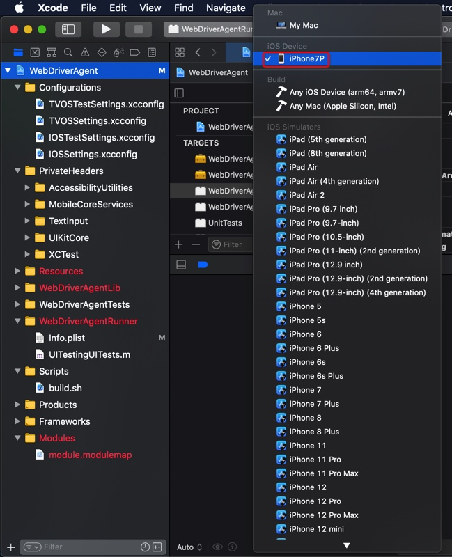

后续即可正常编译和测试。
