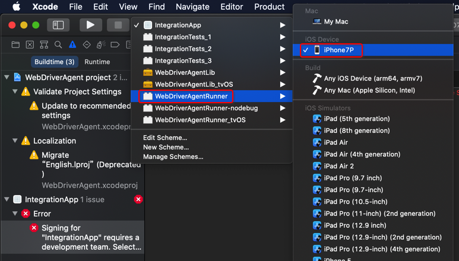
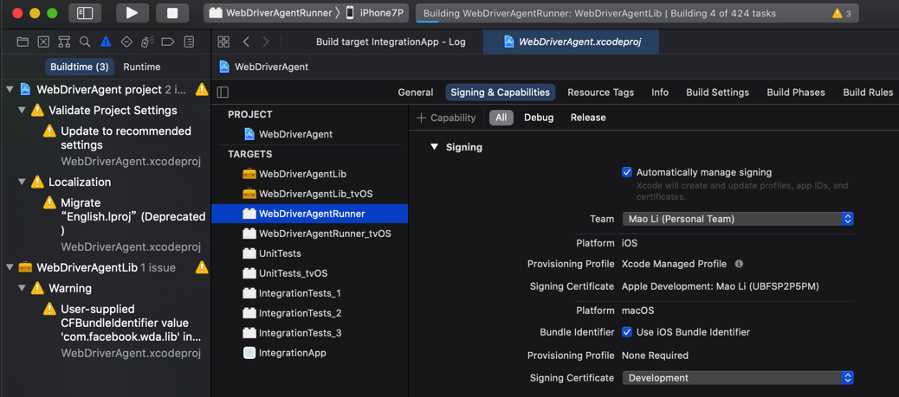
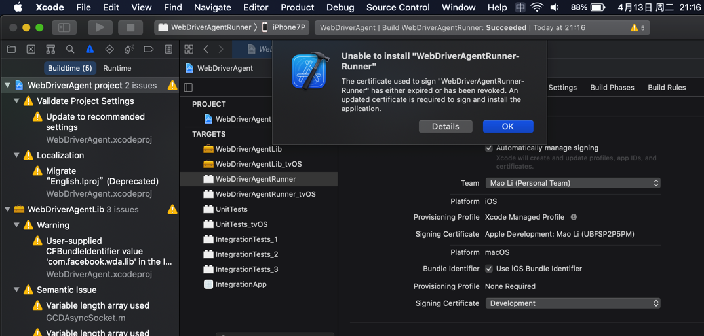

# 如何用XCode编译`WebDriverAgent.xcodeproj`

对于下载到`WebDriverAgent`的源码中的`WebDriverAgent.xcodeproj`，第一次编译最好去用XCode编译。

因为往往涉及到配置`Team`和`自动签名`等事宜。

下面就来介绍，如何用`XCode`去配置和编译`WebDriverAgent.xcodeproj`

双击`WebDriverAgent.xcodeproj`


会自动用XCode打开：


点击左上角的项目，进入项目属性，点击`TARGETS`中的`WebDriverAgentRunner`，切换到`Signing & Capabilities`：


默认`Team`是`None`，需要去选择一个自己的苹果账号：


然后会触发自动修复，显示`Waiting to repair`：


看到没有其他警告或错误，就表示自动创建签名和Profile等工作正常了：


接着即可去编译了：点击左上角`▶️`按钮，即可触发编译，显示`Building ...`


之后即可正常的`Product`->`Test`去测试，启动服务，供后续使用了。

## Failed to register bundle identifier

如果`Signing & Capablities`的自动修复后报错：

```bash
Failed to register bundle identifier
The app identifier "com.facebook.WebDriverAgentRunner" cannot be registered to your development team because it is not available. Change your bundle identifier to a unique string to try again.
```


**原因**：（很可能是）默认的ID：`com.facebook.WebDriverAgentRunner`已存在，重复了，导致无法继续。

**解决办法**：修改为其他（独一无二的）值

**操作步骤**：

`WebDriverAgentRunner`的属性 -> `Build Settings` -> `Packaging` -> `Product Bundle Identifier`


把值从默认的：`com.facebook.WebDriverAgentRunner`改为别的，确保不重复的值，比如我此处改为：`com.facebook.WebDriverAgentRunnerCrifan`


> #### info:: 别处调用到此处的`Product Bundle Identifier`
> 
> 后来注意到一个细节，别处会调用到此处的`Product Bundle Identifier`中的值
> 
> 比如：`Info`->`Key`->`Bundle Identifier`: `$(PRODUCT_BUNDLE_IDENTIFIER)`
> 
> 

## XCode报错：A build only device cannot be used to run this target

现象：编译期间报错

```bash
A build only device cannot be used to run this target.
No supported iOS devices are available. Connect a device to run your application or choose a simulated device as the destination.
```


原因：XCode中没有选择正确的目标设备

解决办法：插入iPhone，且选择对应的iPhone等iOS真机设备。

具体步骤：把此处的`iPhone7P`插入`Mac`


然后XCode中选择对应的目标设备，为`iPhone7P`


注：可以借助于`idevice_id`去列出当前已连接的iOS设备的ID：

```bash
 idevice_id -l
3dc13714e21415898e8e2c2863d96990a4d69c97
```

说明iOS设备的确已连接


## XCode报错：Signing for requires a development team. Select a development team in the Signing & Capabilities editor

XCode去编译项目，报错：

```bash
Signing for "IntegrationApp" requires a development team. Select a development team in the Signing & Capabilities editor.

Showing All Messages
```


出错原因：把本身要编译的app搞错了，不是这个`IntegrationApp`，应该是`WebDriverAgentRunner`

解决办法：把要编译的app换成`WebDriverAgentRunner`

具体步骤：



即可。

另外，需要去给`WebDriverAgentRunner`加上`code signing`

-》 此处是通过把`Team`从`None`改为`自己的值`，然后自动修复



一般即可修复成功，最终加上code signing。

## XCode报错：Failed to register bundle identifier com.facebook.WebDriverAgentRunner

XCode中尝试编译WebDriverAgentRunner，当选择了Team后，自动Singing，结果报错：

```bash
Failed to register bundle identifier
The app identifier "com.facebook.WebDriverAgentRunner" cannot be registered to your development team because it is not available. Change your bundle identifier to a unique string to try again.
```


原因：估计是id重复了

解决办法：去更换id

具体步骤：

把`com.facebook.WebDriverAgentRunner`为别的值，比如：`com.facebook.WebDriverAgentRunner_Crifan`

最终是，对于`WebDriverAgentRunner`的`bundle Identifier`值，最后是在：

`WebDriverAgentRunner`的`属性`-》`Build Settings`-》`Packaging`-》`Product Bundle Identifier` 中去修改的


## xcodebuild报错：Signing certificate is invalid

xcodebuild编译报错：

```bash
 xcodebuild -project WebDriverAgent.xcodeproj -scheme WebDriverAgentRunner -destination "id=`idevice_id -l | head -n1`" test
Command line invocation:
    /Applications/Xcode.app/Contents/Developer/usr/bin/xcodebuild -project WebDriverAgent.xcodeproj -scheme WebDriverAgentRunner -destination id=3dc13714e21415898e8e2c2863d96990a4d69c97 test

note: Using new build system
note: Building targets in parallel
note: Planning build
note: Constructing build description
error: Signing certificate is invalid. Signing certificate "Apple Development: Mao Li (UBFSP2P5PM)", serial number "<DVTSigningCertificateSerialNumber: 0x7fc4c756db00>", is not valid for code signing. It may have been revoked or expired. (in target 'WebDriverAgentLib' from project 'WebDriverAgent')
error: Signing certificate is invalid. Signing certificate "Apple Development: Mao Li (UBFSP2P5PM)", serial number "<DVTSigningCertificateSerialNumber: 0x7fc4c756db00>", is not valid for code signing. It may have been revoked or expired. (in target 'WebDriverAgentRunner' from project 'WebDriverAgent')

Test session results, code coverage, and logs:
    /Users/crifan/Library/Developer/Xcode/DerivedData/WebDriverAgent-fkggltbnspxitwcqkcogpefhhvai/Logs/Test/Test-WebDriverAgentRunner-2021.04.13_21-02-33-+0800.xcresult

Testing failed:
    Signing certificate is invalid. Signing certificate "Apple Development: Mao Li (UBFSP2P5PM)", serial number "<DVTSigningCertificateSerialNumber: 0x7fc4c756db00>", is not valid for code signing. It may have been revoked or expired.
    Testing cancelled because the build failed.

** TEST FAILED **
```


**原因**：自己的Apple苹果（开发者）账号过期了。不可用，没法给代码code sign了。

**解决办法**：花钱，给苹果开发者账号续费。价格：99美元/年。

### XCode报错：The certificate used to sign has either expired or has been revoked

其他类似的问题：

XCode中，报错

```bash
Unable to install "WebDriverAgentRunner-Runner"
The certificate used to sign "WebDriverAgentRunner-Runner" has either expired or has been revoked. An updated certificate is required to sign and install the application.
```



点击`Details`还可以看到详情：

```bash
Details

Unable to install "WebDriverAgentRunner-Runner"
Domain: com.apple.dt.MobileDeviceErrorDomain
Code: -402620392
Recovery Suggestion: The certificate used to sign "WebDriverAgentRunner-Runner" has either expired or has been revoked. An updated certificate is required to sign and install the application.
--
The identity used to sign the executable is no longer valid.
Domain: com.apple.dt.MobileDeviceErrorDomain
Code: -402620392
User Info: {
    DVTRadarComponentKey = 487925;
    MobileDeviceErrorCode = "(0xE8008018)";
    "com.apple.dtdevicekit.stacktrace" = (
     0   DTDeviceKitBase                     0x000000011d4bcc8f DTDKCreateNSErrorFromAMDErrorCode + 220
     1   DTDeviceKitBase                     0x000000011d4fb241 __90-[DTDKMobileDeviceToken installApplicationBundleAtPath:withOptions:andError:withCallback:]_block_invoke + 155
     2   DVTFoundation                       0x0000000101ba464b DVTInvokeWithStrongOwnership + 71
     3   DTDeviceKitBase                     0x000000011d4faf82 -[DTDKMobileDeviceToken installApplicationBundleAtPath:withOptions:andError:withCallback:] + 1440
     4   IDEiOSSupportCore                   0x000000011d36ba10 __118-[DVTiOSDevice(DVTiPhoneApplicationInstallation) processAppInstallSet:appUninstallSet:installOptions:completionBlock:]_block_invoke.292 + 3513
     5   DVTFoundation                       0x0000000101cd317e __DVT_CALLING_CLIENT_BLOCK__ + 7
     6   DVTFoundation                       0x0000000101cd4da0 __DVTDispatchAsync_block_invoke + 1191
     7   libdispatch.dylib                   0x00007fff6db306c4 _dispatch_call_block_and_release + 12
     8   libdispatch.dylib                   0x00007fff6db31658 _dispatch_client_callout + 8
     9   libdispatch.dylib                   0x00007fff6db36c44 _dispatch_lane_serial_drain + 597
     10  libdispatch.dylib                   0x00007fff6db375d6 _dispatch_lane_invoke + 363
     11  libdispatch.dylib                   0x00007fff6db40c09 _dispatch_workloop_worker_thread + 596
     12  libsystem_pthread.dylib             0x00007fff6dd8ba3d _pthread_wqthread + 290
     13  libsystem_pthread.dylib             0x00007fff6dd8ab77 start_wqthread + 15
);
}
--

System Information

macOS Version 10.15.7 (Build 19H2)
Xcode 12.4 (17801) (Build 12D4e)
Timestamp: 2021-04-13T21:17:10+08:00
```


**原因**：苹果开发者账号过期了，没续费。导致证书不可用。

**解决办法**：同上，续费即可。

## xcodebuild报错：xcode-select error tool xcodebuild requires Xcode

如果运行xcodebuld报错：

```bash
xcode-select: error: tool 'xcodebuild' requires Xcode, but active developer directory '/Library/Developer/CommandLineTools' is a command line tools instance
```

* **原因**：没有安装XCode 或 虽然已安装XCode，但是没启用XCode的命令行
* **解决办法**：去安装并开启XCode的命令行
* **步骤**：
  * 文字
    * `Xcode`->`设置`->`Locations`->`Command Line Tools`，默认是**空**，下拉选择`Xcode 11.3.1(11C504)`
  * 截图
    * 

安装后，即可查看版本信息：

```bash
~  xcodebuild -version
Xcode 11.3.1
Build version 11C504
```

## xcodebuild报错：xcodebuild error missing value for key

如果没有iOS设备（如iPhone）插入到Mac中，则运行：

```bash
xcodebuild -project WebDriverAgent.xcodeproj -scheme WebDriverAgentRunner -destination "id=`idevice_id -l | head -n1`" test
```

会报错：

```bash
 ~/dev/xxx/crawler/appAutoCrawler/AppCrawler/iOSAutomation/refer/WebDriverAgent   master ●  xcodebuild -project WebDriverAgent.xcodeproj -scheme WebDriverAgentRunner -destination "id=`idevice_id -l | head -n1`" test
xcodebuild: error: missing value for key 'id' of option 'Destination'
```
