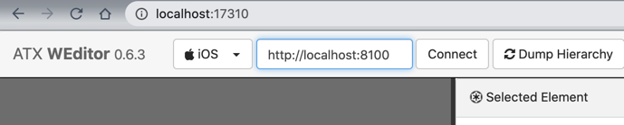
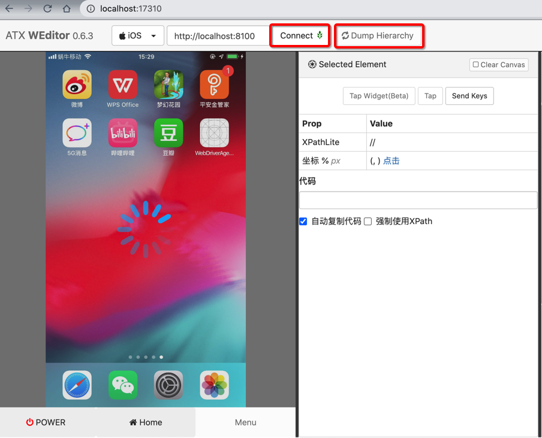
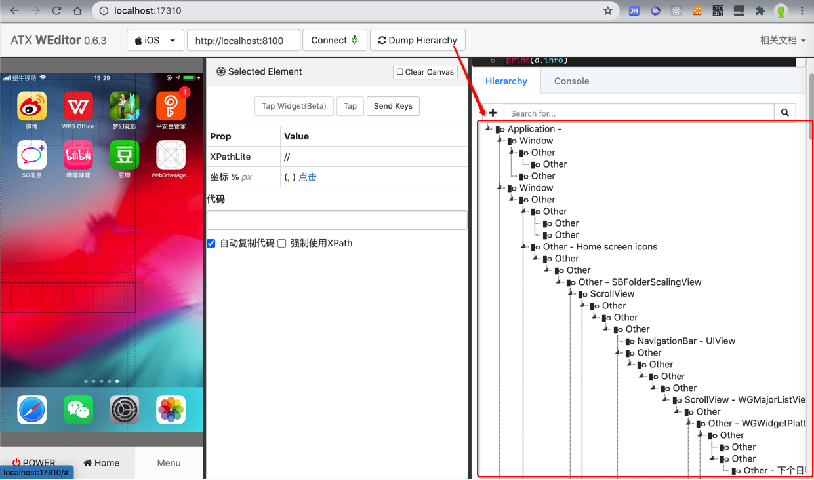
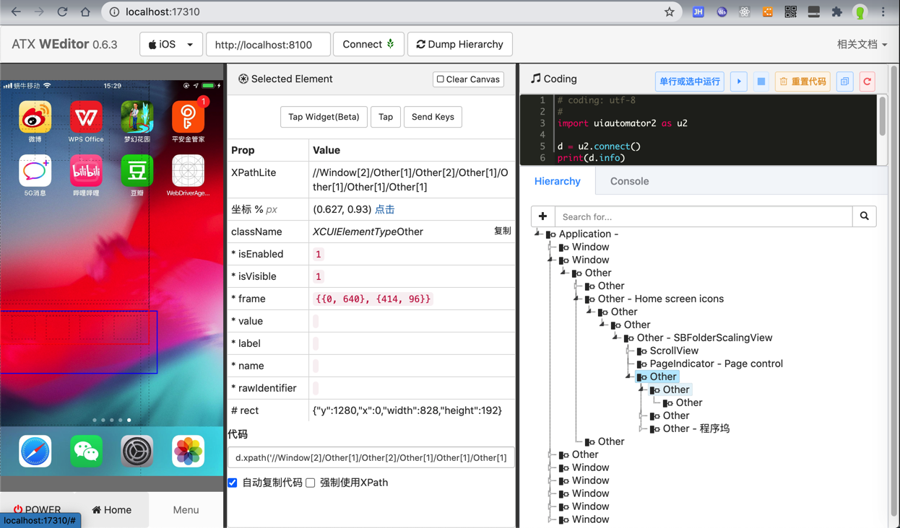

# weditor

`weditor`是`facebook-wda`的作者，为了方便调试移动端设备，除了`uiautomator2`所支持的`Android`设备之外，也支持iOS设备。

* `weditor`
  * 安装
    * `pip install -U weditor`
  * GitHub
    * alibaba/web-editor: web editor for atx
      * https://github.com/alibaba/web-editor

## 使用weditor调试iOS设备

启动weditor：

```bash
weditor
```

* 注：旧的运行方式是
    ```bash
    python -m weditor
    ```

然后会自动（调用浏览器）打开地址：

http://localhost:17310/

选择目标设备类型是：`iOS`

然后输入wda服务的地址，比如：

http://192.168.31.58:8100

* 注：如果之前已用`iproxy 8100 8100`端口转发，则可以直接输入`localhost`的地址

http://localhost:8100

再点击`Connect`



显示绿色（的红绿灯🚥标识），表示连上了，且能看到iOS设备的画面了：



注：想要看到iOS设备的实时画面，需要点击一次Dump Hierarchy，才能看到实时页面。

然后就是，对于weditor的使用了：

比如：

点击`Dump Hierarchy`，可以显示出页面元素结构：



以及点击元素，查看到属性：



